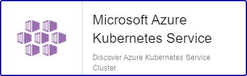

import Tabs from '@theme/Tabs';
import TabItem from '@theme/TabItem';

## Overview

Azure Kubernetes Service (AKS) simplifies deploying a managed Kubernetes cluster in Azure by offloading the operational overhead to Azure. As a hosted Kubernetes service, Azure handles critical tasks, like health monitoring and maintenance.

The Centreon Plugin *Azure Kubernetes Service* can rely on Azure API or Azure CLI to collect the metrics related to the *AKS* service.

## Pack Assets

### Templates

The Centreon Plugin Pack Azure Kubernetes Service brings a host template:

* Cloud-Azure-Compute-Aks-custom

It brings the following Service Templates:

| Service Alias         | Service Template                                  | Default |
| :-------------------- | :------------------------------------------------ | :------ |
| Allocatable-resources | Cloud-Azure-Compute-Aks-Allocatable-Resources-Api | X       |
| Cpu-Usage             | Cloud-Azure-Compute-Aks-Cpu-Usage-Api             | X       |
| Health                | Cloud-Azure-Compute-Aks-Health-Api                | X       |
| Storage               | Cloud-Azure-Compute-Aks-Storage-Api               | X       |
| Traffic               | Cloud-Azure-Compute-Aks-Traffic-Api               | X       |
| Unneeded-nodes        | Cloud-Azure-Compute-Aks-Unneeded-Nodes-Api        | X       |

### Discovery rules

The Centreon Plugin-Pack *Azure Kubernetes Service* includes a Host Discovery provider to
automatically discover the Azure Kubernetes Service Clusters of a given subscription and add them to the Centreon configuration. This provider is named **Microsoft Azure Kubernetes Service**:



> This discovery feature is only compatible with the 'api' custom mode. 'azcli' is not supported.

More information about the Host Discovery module is available in the Centreon documentation: [Host Discovery](../../../monitoring/discovery/hosts-discovery)

### Collected metrics & status

<Tabs groupId="sync">
<TabItem value="Allocatable-resources" label="Allocatable-resources">

| Metric Name                                  | Unit  |
| :------------------------------------------- | :---- |
| *instance*#aks.node.allocatable.cpu.cores    | Count |
| *instance*#aks.node.allocatable.memory.bytes | B     |

</TabItem>
<TabItem value="Cpu-Usage" label="Cpu-Usage">

| Metric Name                                    | Unit |
| :--------------------------------------------- | :--- |
| *instance*#aks.node.cpu.utilization.percentage | %    |

</TabItem>
<TabItem value="Health" label="Health">

| Metric Name | Unit   |
| :---------- | :----- |
| Status      | String |

</TabItem>
<TabItem value="Storage" label="Storage">

| Metric Name                               | Unit |
| :---------------------------------------- | :--- |
| *instance*#aks.node.disk.usage.percentage | %    |
| *instance*#aks.node.disk.usage.bytes      | B    |

</TabItem>
<TabItem value="Traffic" label="Traffic">

| Metric Name                           | Unit |
| :------------------------------------ | :--- |
| *instance*#aks.node.traffic.in.bytes  | B    |
| *instance*#aks.node.traffic.out.bytes | B    |

</TabItem>
<TabItem value="Unneeded-nodes" label="Unneeded-nodes">

| Metric Name                                      | Unit  |
| :----------------------------------------------- | :---- |
| *instance*#aks.cluster.autoscaler.unneeded.nodes | Count |

</TabItem>
</Tabs>

## Prerequisites

To get data from Azure Services, the following methods are available:

* Azure API ('api')
* Azure CLI ('azcli')

Centreon recommends to use the API instead of the CLI for the following reasons:

 * the API is much more efficient because it avoids CLI binary execution.
 * the API supports application authentication and does not require a dedicated service account.

<Tabs groupId="sync">
<TabItem value="Azure Monitor API" label="Azure Monitor API">

To use the 'api' custom mode, make sure to obtain the required information using the 
how-to below. Keep it safe until including it in a Host or Host Template definition.

* Create an *application* in Azure Active Directory:
  - Log in to your Azure account.
  - Select *Azure Active directory* in the left sidebar.
  - Click on *App registrations*.
  - Click on *+ Add*.
  - Enter Centreon as the application name (or any name of your choice), select application type (api) and sign-on-url.
  - Click on the *Create* button.

* Get *Subscription ID*
  - Log in to your Azure account.
  - Select *Subscriptions* in the left sidebar.
  - Select whichever subscription is needed.
  - Click on *Overview*.
  - Copy the Subscription ID.

* Get *Tenant ID*
  - Log in to your Azure account.
  - Select *Azure Active directory* in the left sidebar.
  - Click on *Properties*.
  - Copy the directory ID.

* Get *Client ID*
  - Log in to your Azure account.
  - Select *Azure Active directory* in the left sidebar.
  - Click on *Enterprise applications*.
  - Click on *All applications*.
  - Select the application previously created.
  - Click on *Properties*.
  - Copy the Application ID.

* Get *Client secret*
  - Log in to your Azure account.
  - Select *Azure Active directory* in the left sidebar.
  - Click on *App registrations*.
  - Select the application previously created.
  - Click on *All settings*.
  - Click on *Keys*.
  - Enter the key description and select the duration.
  - Click on *Save*.
  - Copy and store the key value. **You won't be able to retrieve it after you leave this page**.

Please make sure to assign the **Monitoring Reader** role to the application.

</TabItem>
<TabItem value="Azure AZ CLI" label="Azure AZ CLI">

To use the 'azcli' custom mode, install the required packages on every Centreon poller expected to monitor Azure Resources using CLI:

- The CLI needs at least Python version 2.7 
  (<https://github.com/Azure/azure-cli/blob/dev/doc/install_linux_prerequisites.md>).

On RPM-Based distributions, use the command below to install it using *root* or 'sudo':

```shell
sudo rpm --import https://packages.microsoft.com/keys/microsoft.asc
sudo echo -e "[azure-cli]\nname=Azure CLI\nbaseurl=https://packages.microsoft.com/yumrepos/azure-cli\nenabled=1\ngpgcheck=1\ngpgkey=https://packages.microsoft.com/keys/microsoft.asc" > /etc/yum.repos.d/azure-cli.repo
sudo yum install azure-cli-2.29.2-1.el7
```

Then, use the **centreon-engine** account to obtain a token using the command below:

```shell
su - centreon-engine
az login
```

The shell will output this message including an authentication code:

	*To sign in, use a web browser to open the page https://microsoft.com/devicelogin*
	*and enter the code CWT4WQZAD to authenticate.*

Go to <https://microsoft.com/devicelogin> and enter the code, then log in with the dedicated monitoring service account.

As a result, the shell should prompt the information below:

```shell
	[
	  {
		"cloudName": "AzureCloud",
		"id": "0ef83f3a-d83e-2039-d930-309df93acd93d",
		"isDefault": true,
		"name": "N/A(tenant level account)",
		"state": "Enabled",
		"tenantId": "0ef83f3a-03cd-2039-d930-90fd39ecd048",
		"user": {
		  "name": "email@mycompany.onmicrosoft.com",
		  "type": "user"
		}
	  }
	]
```

Credentials are now stored locally in the **accessTokens.json** file so the Plugin can use it.

</TabItem>
</Tabs>

## Setup

<Tabs groupId="sync">
<TabItem value="Online License" label="Online License">

1. Install the Centreon Plugin package on every Centreon poller expected to monitor **Azure Kubernetes Service** resources:

```bash
yum install centreon-plugin-Cloud-Azure-Compute-Aks-Api
```

2. On the Centreon Web interface, install the **Azure Kubernetes Service** Centreon Plugin Pack on the **Configuration > Plugin Packs** page.

</TabItem>
<TabItem value="Offline License" label="Offline License">

1. Install the Centreon Plugin package on every Centreon poller expected to monitor **Azure Kubernetes Service** resources:

```bash
yum install centreon-plugin-Cloud-Azure-Compute-Aks-Api
```

2. Install the **Azure Kubernetes Service** Centreon Plugin Pack RPM on the Centreon Central server:

 ```bash
yum install centreon-pack-cloud-azure-compute-aks
 ```

3. On the Centreon Web interface, install the **Azure Kubernetes Service** Centreon Plugin Pack on the **Configuration > Plugin Packs** page.

</TabItem>
</Tabs>

## Configuration

### Host

* Log into Centreon and add a new Host through **Configuration > Hosts**.
* In the **IP Address/FQDN** field, set the following IP address: '127.0.0.1'.
* Select the **Cloud-Azure-Compute-Aks-custom** template to apply to the Host.
* Once the template is applied, some mandatory Macros as shown below have to be set according to the custom mode used.

> Two methods can be used to set the Macros:
>
> * full ID of the Resource (```/subscriptions/<subscription_id>/resourceGroups/<resourcegroup_id>/providers/Microsoft.ContainerService/ManagedClusters/<resource_name>```)
>   in *AZURERESOURCE*
> * Resource Name in *AZURERESOURCE* associated with Resource Group (in *AZURERESOURCEGROUP*).

| Mandatory | Name               | Description                                        |
| --------- | ------------------ | -------------------------------------------------- |
| X         | AZURECUSTOMMODE    | Custom mode 'api'                                  |
| X         | AZURESUBSCRIPTION  | Subscription ID                                    |
| X         | AZURETENANT        | Tenant ID                                          |
| X         | AZURECLIENTID      | Client ID                                          |
| X         | AZURECLIENTSECRET  | Client secret                                      |
| X         | AZURERESOURCE      | ID or AKS cluster name                             |
|           | AZURERESOURCEGROUP | Associated Resource Group if resource name is used |

| Mandatory | Name               | Description                                        |
| --------- | ------------------ | -------------------------------------------------- |
| X         | AZURECUSTOMMODE    | Custom mode 'azcli'                                |
| X         | AZURESUBSCRIPTION  | Subscription ID                                    |
| X         | AZURERESOURCE      | ID or AKS cluster name                             |
|           | AZURERESOURCEGROUP | Associated Resource Group if resource name is used |

## How to check in the CLI that the configuration is OK and what are the main options for? 

Once the plugin is installed, log into your Centreon Poller CLI using the **centreon-engine** user account and test the Plugin by running the following command:

```bash
/usr/lib/centreon/plugins//centreon_azure_compute_aks_api.pl \
    --plugin=cloud::azure::compute::aks::plugin \
    --mode=storage \
    --custommode='api' \
    --resource='' \
    --resource-group='' \
    --subscription='' \
    --tenant='' \
    --client-id='' \
    --client-secret='' \
    --proxyurl='' \
    --filter-metric='' \
    --timeframe='900' \
    --interval='PT5M' \
    --warning-storage-used='' \
    --critical-storage-used='' \
    --warning-storage-percent='90' \
    --critical-storage-percent='95' \
    --use-new-perfdata 
```

The expected command output is shown below:

```bash
OK:Instance 'CLUSTER90' Statistic 'average' Metrics Storage Percent: 38.54%, Storage Used: 11.17GB | 'CLUSTER90~average#aks.node.disk.usage.percentage'=38.54%;0:90;0:95;0; 'CLUSTER90~average#aks.node.disk.usage.bytes'=11989825262.93B;;;0;
```

This command would trigger a WARNING alarm if the *storage usage* is reported as over 90% (`--warning-storage-percent='90'`) and a CRITICAL alarm over 95% (`--critical-storage-percent='95'`).

All available options for a given mode can be displayed by adding the `--help` parameter to the command:

```bash
/usr/lib/centreon/plugins//centreon_azure_compute_aks_api.pl \
    --plugin=cloud::azure::compute::aks::plugin \
    --mode=storage \
    --help
```

All available options for a given mode can be displayed by adding the`--list-mode` parameter to the command:

```bash
/usr/lib/centreon/plugins//centreon_azure_compute_aks_api.pl \
    --plugin=cloud::azure::compute::aks::plugin \
    --list-mode
```

### Troubleshooting

Please find all the troubleshooting documentation for the API-based Plugins in the [dedicated chapter](../tutorials/troubleshooting-plugins#http-and-api-checks) of the Centreon documentation.