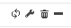

Custom views are dashboards created with widgets. You can share views with other users. See also our [tutorial](../getting-started/create-custom-view.md) on custom views.

## Creating a custom view
 
1. Go to **Home > Custom Views**.

2. Click the **Show/Hide edit mode** icon in the top right corner of the page: 

    The control bar appears:

    

3. Click **Add view**: a pop-up window is displayed.

    

4. Select **Create new view**:
    - enter a name
    - select the number of columns you want (i.e. the number of widgets displayed horizontally)
    - Select **Public** to [share your view](#sharing-custom-views) in read-only mode with other users.
    
5. Click **Submit**. The view is displayed (it is empty).

6. Click **Add widget**: 
    - enter a title (it will be displayed above the widget) 
    - select the type of widget you want.

7. Click **Submit**. The widget appears. Some widgets require extra configuration (e.g., selecting a poller): click the wrench icon in the top right corner of the widget to [edit](#editing-a-widget) it.

8. Once you have created the view and added all the widgets you want, click the **Show/Hide edit mode** icon again : 

## Editing a custom view

On the control bar, click **Edit**. 

You can rename the view, change the layout of the columns, and [share the view](#sharing-a-custom-view) in read-only mode with other users. You can also edit or move widgets.

### Editing a widget

To edit a widget, click the wrench icon in the top right corner of the widget: 

### Rearranging widgets

To move a widget, click the title bar of the widget and drag it to the place you want.

## Sharing custom views

You can share a custom view in different ways:

- In read-only mode: 
    - Select **Public** when you [create the view](#creating-a-custom-view) or when you [edit](#editing-a-custom-view) it.
    - Share the view with "locked users" or "locked user groups". All subsequent changes will be inherited by the shared views.

- Make the view editable:
    - Share the view with "unlocked users" or "unlocked user groups". Unlocked users will become the "owner" of their copy of the view and no
    changes they make will be applied to the original view. In the same manner, no change made by the user who created the view will affect the copies.
    
To share a view with "locked"/"unlocked users" :

1. On the control bar, click **Share view**.
2. Select the options you want (see above).
3. Click **Share**.

> Although the fields are called "locked users"/"unlocked users", strictly speaking the *view* will be locked or unlocked, not the users.

## Displaying a custom view users have shared with you

1. On the **Home > Custom Views** page, click the **Show/Hide edit mode** icon in the top right corner of the page: 

    The control bar appears:

    

2. Click **Add view**, then select **Load from existing view**. A dropdown list shows all the views that other users have shared with you. 

3. Select a view, then click **Submit**. The view is displayed.

## Configuring the rotation of views

Once you have created several custom views, you can make all views be displayed in turn.

1. On the control bar, click **Rotation**. 
2. Use the slider to define the number of seconds that each view must be displayed for, then click **Apply**.

## Defining a default view

You can choose which view to display when you access the **Home > Custom Views** page.

1. Click on the view you want.
2. On the control bar, click **Set default**.

## List of widgets

| Widget                   | Description                                                                                                                                                                                                                                                                                                    |
|--------------------------|----------------------------------------------------------------------------------------------------------------------------------------------------------------------------------------------------------------------------------------------------------------------------------------------------------------|
| Engine status            | Display the statistics for a poller. (Select a poller in the settings.)                                                                                                                                                                                                                                         |
| Global health            |  Displays a pie chart showing the status of hosts.                                                                                                                                                                                                                                                                                              |
| Graph monitoring         | Displays the RRD graph for a service. You must select a service that uses performance data. You can define the timeperiod and the refresh time for the graph in the settings.                                                                                 |
| Grid-map                 | Display services as coloured squares. To configure this widget, select a hostgroup and fill in the "Name services" field, using commas between services (do not use special characters, e.g. slashes, in this widget). |
| Host monitoring          | Displays the list of hosts as well as their status and related information. You can filter the list using the criteria you want.                                                                                                                                                                                                                                                                                   |
| Hostgroup monitoring     | Displays host groups. It can show a detailed view of services.                                                                                                                                                                                                                    |
| HTTP loader              | Displays a web page.                                                                                                                                                                                                                                                                                                               |
| Live top 10 CPU usage    | Displays the top 10 hosts by CPU usage. Check that the value of the parameter Metric Name matches the name of the metric used by the CPU service.                                                                                                                   |
| Live top 10 memory usage | Displays the top 10 hosts by memory usage.                                                                                                                                                                                                                                                                                               |
| Service monitoring       | Displays a list of services. Lots of options are available (sort by severity, filters, columns, etc..)                                                                                                                                             |
| Servicegroup monitoring  |  Displays a list of service groups.                                                                                                                                                                                                                                                                                                              |
| Tactical overview        | Displays the details for the hosts or services. By default hosts are displayed.                                                                                                                                                              |
