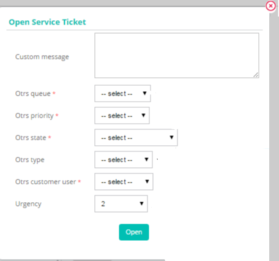
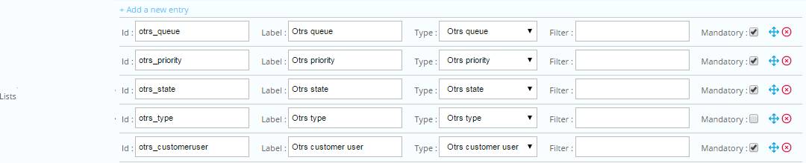
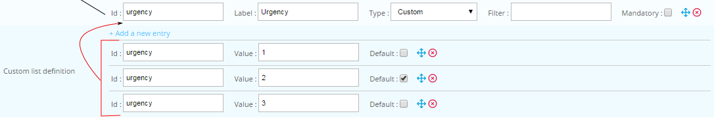

## Lists 

When a ticket is being added, a popup is shown where you can choose between various options. One of these options can be a list. 

There are 3 **types** of lists:
- **Provider** lists (data from the ticketing software directly)
- **Centreon** lists (for example **Host group**)
- **Custom** lists (data from **Custom list definition** 

:::note

When using custom lists, **Id** fields must be identical.

:::

In this example, the popup contains a number of lists, with a custom list (`urgency`) at the end:

## Lists

For each entry in **Lists**, you can define:

| Item | Description | Comment |  
|---|---|---|
| **Id** | Alphanumeric value identifying the list. | Must be unique. |
| **Label** | Display label. | Shown in the popup instead of the **Id**. |
| **Type**  | Type of list. |  (`Provider`/ `Centreon`/ `Custom`) |
| **Mandatory** | Makes the option mandatory. | A value most be selected from the list when creating the ticket. |

## Create a custom list

To create a custom list: 

1. Open your provider 
2. Find the **Custom list definition** section

3. For each item in the custom list: 
   1. Click **Add a new entry**
   2. Enter the custom list **Id**
   3. Enter a value
4. Check the box next to the item in the custom list to make default value.

## Using list in [Smarty](https://www.smarty.net/) 

The list selection is stored as an array, which can be used in [Smarty](https://www.smarty.net/) template, for example in the **body** or **mapping ticket arguments** section.

There are 3 fields ():

- `{$select.<LIST_ID>.id}`
- `{$select.<LIST_ID>.value}`
- `{$select.<LIST_ID>.label}`

:::note

Replace **<LIST\_ID>** with the appropriate **Id** for the list

:::

