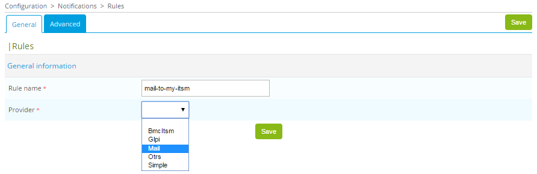

## Chaining rules

As rules can be chained, you can create additional rules and refer to them from other rules, creating a chain of rules to perform more complex actions. 

For example: 

To add a rule that sends an email when a ticket is added:

1. Open the menu **Configuration > Notifications > Open Tickets > Rules** 

2. Click **Add**

4. Add a **Rule name**  (`emailme`)
5. Select the **Provider**  (`Mail`)

A dialog is shown where you can configure the provider.

6. Open your provider in the list of rules
7. Open the **Advanced** configuration tab
8. Find the **Chain Rules** section
9. Click **Add a new entry**
10. Select your `emailme` from the dropdown list
12. Click **Save**
