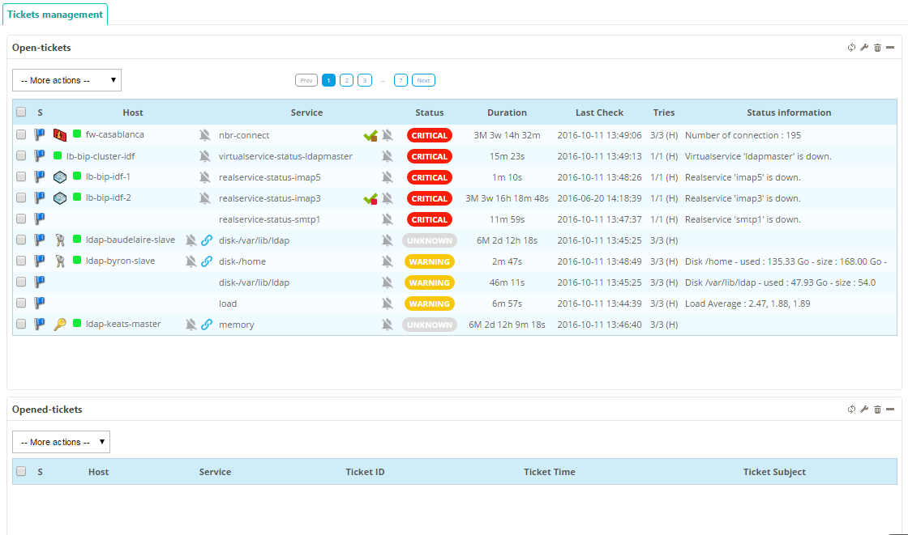
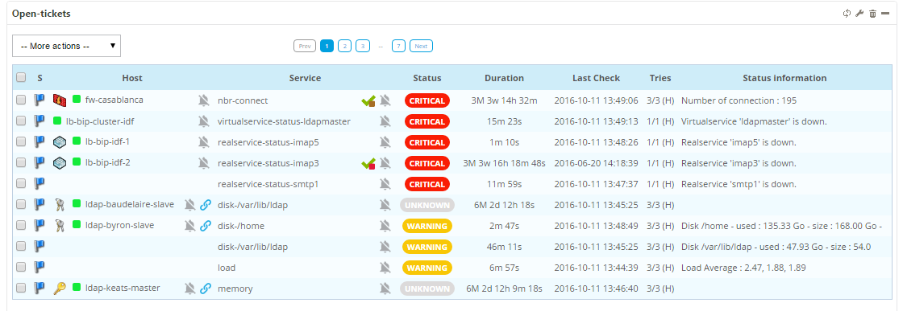
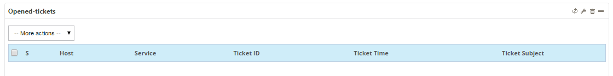

## Widgets for Open Tickets

To use the Open Tickets widget you have to add it to a **custom view**. 

To create two widgets based for Open Tickets: 

1. Open the **Home > Custom Views** menu 
2. Open your view from the list
3. Click **Add widget**
4. Enter a widget title (`Add Tickets`) 
5. Select **Open Tickets** 
6. Enter a widget title (`Current Tickets`) 
5. Select **Open Tickets** 

You now have two widgets: `Add Tickets` and `Current Tickets`.

### Add tickets widget

1. Find the **Add Tickets** widget:

2. Click the **Configuration** button:

3. Select the **Rule** previously defined
4. *Uncheck* the box **Opened Tickets**
5. Select **Other Filters**
4. *Uncheck* these boxes
   1. **Display Ticket ID**
   2. **Display Ticket Time**

### Show tickets widget

3. Find the **Current Tickets** widget:

2. Click the **Configuration** button:
3. Select the **Rule** previously defined
4. Check the box **Opened Tickets**
5. Select **Other Filters**
6. Check these boxes:
   1. **Display Ticket ID**
   2. **Display Ticket Time**

