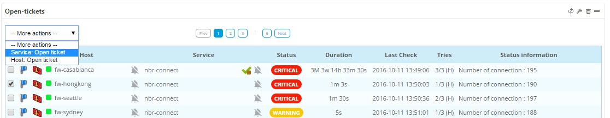
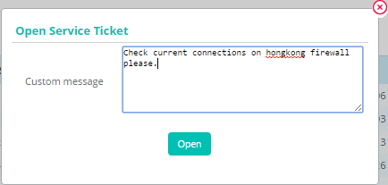
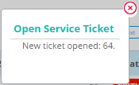
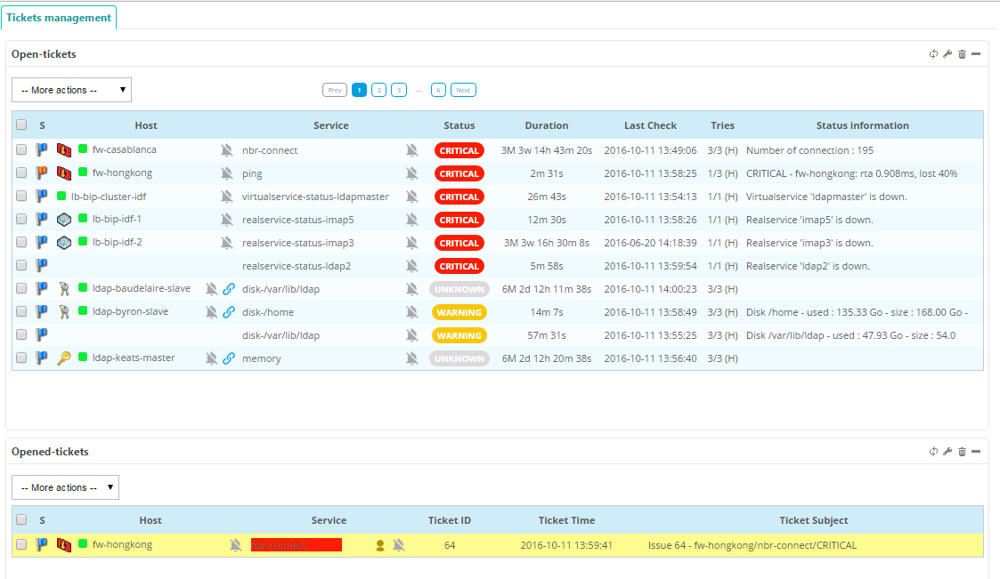

## Add a ticket

To add a ticket:

1. Select the item(s) you want to view by checking boxes in the list 
2. Open the **-- More actions --** menu 
3. Select  **Open ticket** (either for host or service)

The add comment popup is shown:

4. Add a *comment* to the ticket.
5. Click **Open**  

The ticket is created and the popup displays the new ticket ID:

The item used to create the ticket is no longer visible in the widget:

