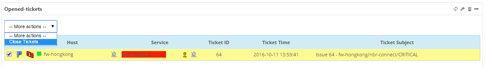
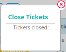
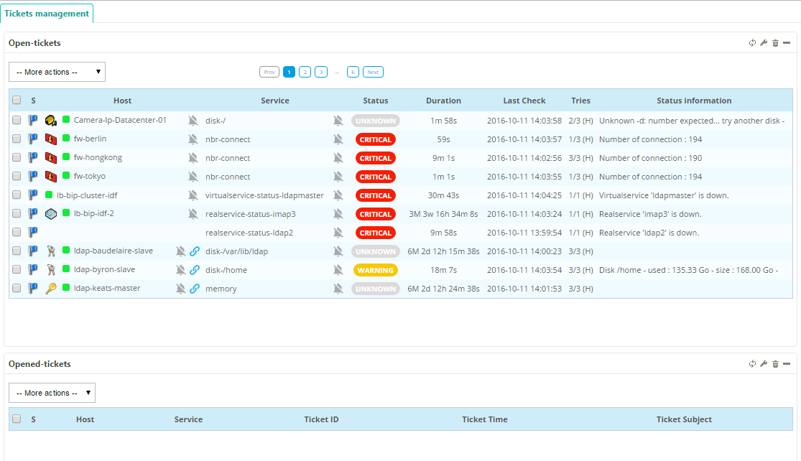

### Close a ticket

To close a ticket:

1. Select the item(s) you want to remove by checking boxes in the list 
2. Open the **-- More actions --** menu 
3. Select  **Close tickets**

A popup is shown:

:::note

The ticket is now closed in Centreon.

:::

4. Close the popup.

The select objects are removed, and are no longer visible in the widget:

