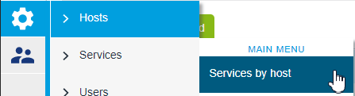
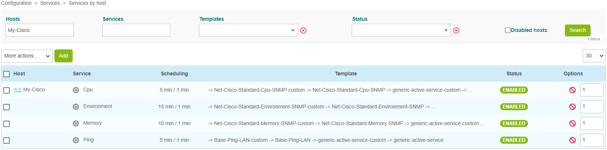
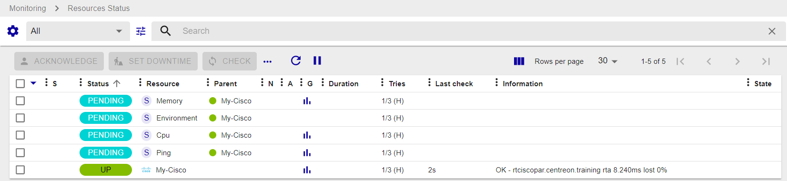
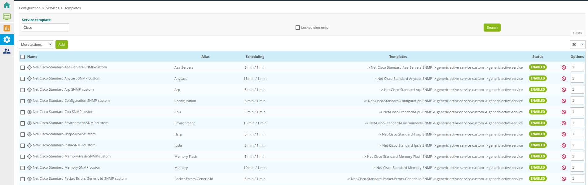
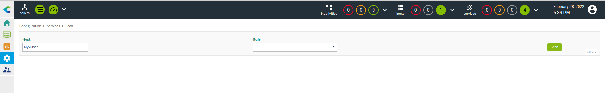
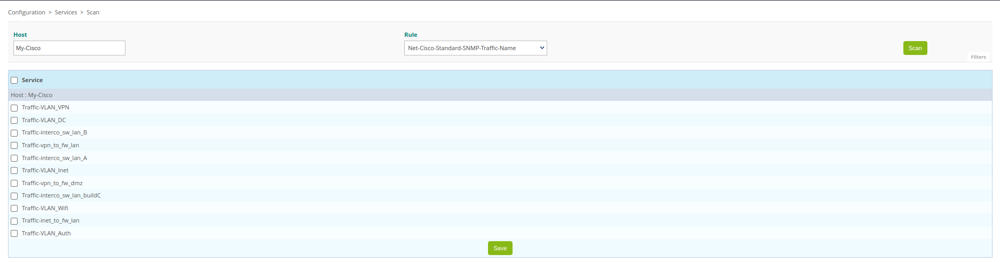
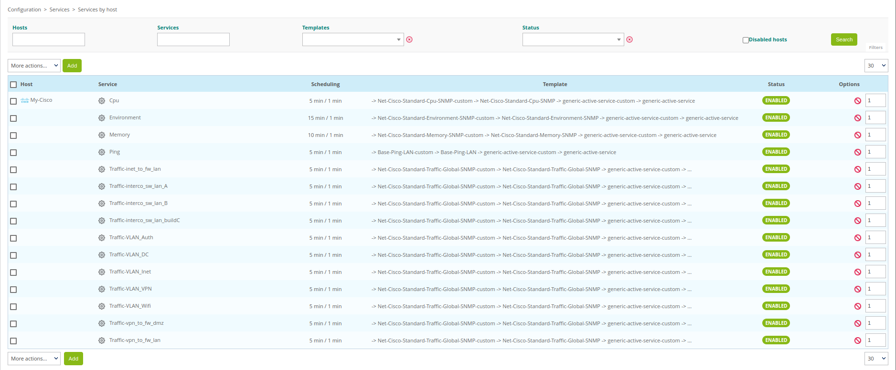

## Monitoring a Cisco Router with SNMP


In this tutorial, we're assuming that your Centreon platform is installed and running well, and that you have at least a [Centreon IT 100 Edition](it100.md) that provides Centreon Plugin Packs (your [license](../administration/licenses.md) is already set up).

Your Cisco router will be monitored using the [Cisco standard plugin pack](../integrations/plugin-packs/procedures/network-cisco-standard-snmp.md). (More about Plugin Packs [here](../monitoring/pluginpacks.md)). 


## Prerequisites

### On the Cisco router you want to monitor


The first step is to activate and configure an SNMP service on your Cisco device.
Please refer to the documentation of your Cisco device to know how to configure the SNMP service. The monitoring procedure for the [Cisco standard plugin pack](../integrations/plugin-packs/procedures/network-cisco-standard-snmp.md) includes an example.


### Network flow

The target device must be reachable from the Centreon Poller on the UDP/161 SNMP port.

### On the poller

Connect to your poller using SSH and install the Cisco standard plugin (see the [monitoring procedure for the **Cisco standard** Plugin Pack](../integrations/plugin-packs/procedures/network-cisco-standard-snmp.md) for more information):

```shell
yum install centreon-plugin-Network-Cisco-Standard-Snmp
```

### On the central server

In the web interface, go to **Configuration > Plugin Packs**, search for the **Cisco standard** Plugin Pack and install it:


## Configure the host and deploy the configuration

1. Go to the **Configuration > Hosts > Hosts** menu and click on **Add**:

  

2. Fill in the following information:

  * The name of the router (1)
  * A description of the router (2)
  * The IP address of the router (3)
  * The SNMP version and community (4)
  * Select the poller that will monitor the device (keep "Central" if you have no other poller) (5)

3. Click on **+ Add a new entry** in the **Templates** field (6), then select the **Net-Cisco-Standard-SNMP-custom** template (7) from the list:

  

4. Click on **Save** (8). Your equipment has been added to the list of hosts:

  

5. Go to **Configuration > Services > Services by host**. A set of indicators has been created automatically.

  

  You can also use the shortcut beside the host's name to go directly to **Configuration > Services > Services by host**. The list will be filtered by the name of the host:

  

  

6. [Deploy the configuration](first-supervision.md#deploying-a-configuration).

7. Go to **Monitoring > Resources Status** and select **All** from the **Resource status** filter. At first, the resources appear with the status **Pending**, which means that no checks have been executed yet:

   

   After a few minutes, the first results of the monitoring appear:

   

   If not all services are in an OK state, check what causes the error and fix the problem.

### To go further

The **Cisco Standard** Plugin Pack provides several monitoring templates. Go to **Configuration > Services > Templates** to know the complete list:

   

With **Centreon IT Edition** you can add very quickly and very simply the monitoring of your network interfaces using the [Service Discovery](../monitoring/discovery/services-discovery.md) functionality.

1. Go to **Configuration > Services > Scan**. Start writing the name of the host and the web interface automatically completes the name:

   

2. Select the discovery command to run from the list that has just appeared below the **Rule** field. Then click on the **Scan** button and wait during the discovery. The result is displayed. Select items to add to the monitoring and click on the **Save** button:

   

The item was added. You can select another discovery command below **Rule** and repeat the process.

3. The services are added and can be displayed in the **Configuration > Services > Services by host** menu:

   

4. [Deploy the configuration](first-supervision.md#deploying-a-configuration).

