## Monitoring a Windows server with SNMP

In this tutorial, we're assuming that your Centreon platform is installed and running well, and that you have at least a [Centreon IT 100 Edition](IT100.html) that provides Centreon Plugin Packs (your [license](../administration/licenses.html) is already set up).

Your Windows server will be monitored using the [Windows SNMP Plugin Pack](../integrations/plugin-packs/procedures/operatingsystems-windows-snmp.html). (More about Plugin Packs [here](../monitoring/pluginpacks.html)). 

## Prerequisites

### On the Windows server you want to monitor

The first step is to install and configure the SNMP service on your monitored windows host.
Please refer to the documentation of your Windows distribution to know how to configure the SNMP service.

Find below some steps to install and configure SNMP on Windows 10.

#### Installing SNMP on Windows 10

You have several ways to enable SNMP: from settings or by using PowerShell.

<!--DOCUSAURUS_CODE_TABS-->

<!--From settings-->

1. Go to the menu Settings > Apps & features > Optional features

2. Click on Add a feature and search for snmp

	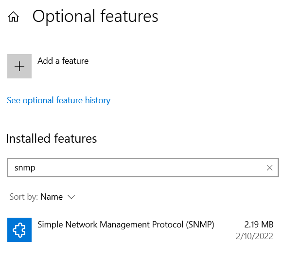

3. Select Simple Network Management Protocol (SNMP) and click on Install.

<!--By using PowerShell-->

Press Windows and write PowerShell. Choose Run as Administrator.

1. Check if the SNMP service is installed

	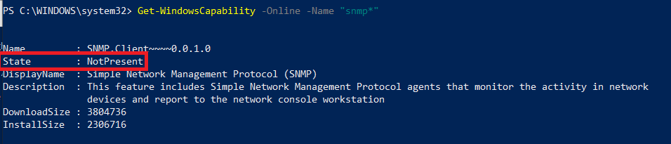


2. To install the SNMP service from Microsoft's servers, run the following command:

	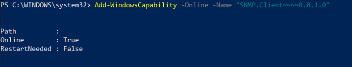

3. Check if the SNMP service has been installed successfully

	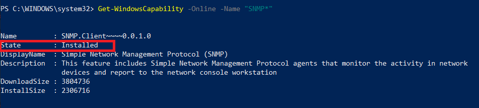

<!--END_DOCUSAURUS_CODE_TABS-->

#### Configuring SNMP on Windows 10

After installing SNMP, you need to configure it.
In the search bar, type services.msc and press Enter to launch the Services panel.

1. Look for SNMP service in the list.

	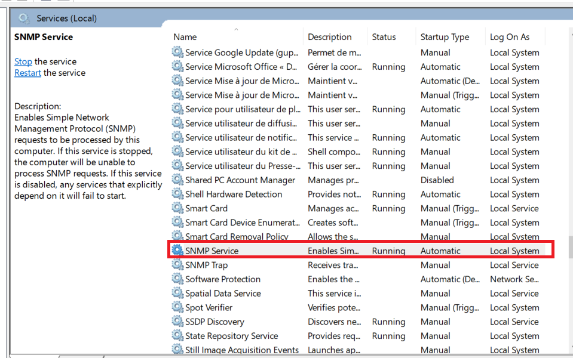

2. In the Agent tab, fill in the parameter Contact and Location. Then in the Service section, check the boxes for services from which you want to collect data for forwarding it to the Centreon Poller which will monitor the host.

	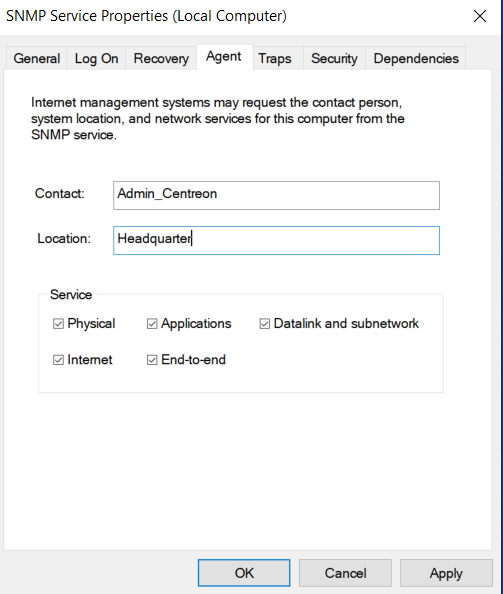

3. In the Security tab, write the SNMP community in the Accepted community names section and choose the READ ONLY option.
Then select the Accept SNMP packets from these hosts radio button and add the Centreon Poller IP Address.

	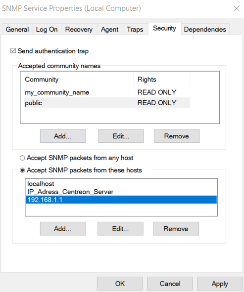

4. Restart the SNMP Service

	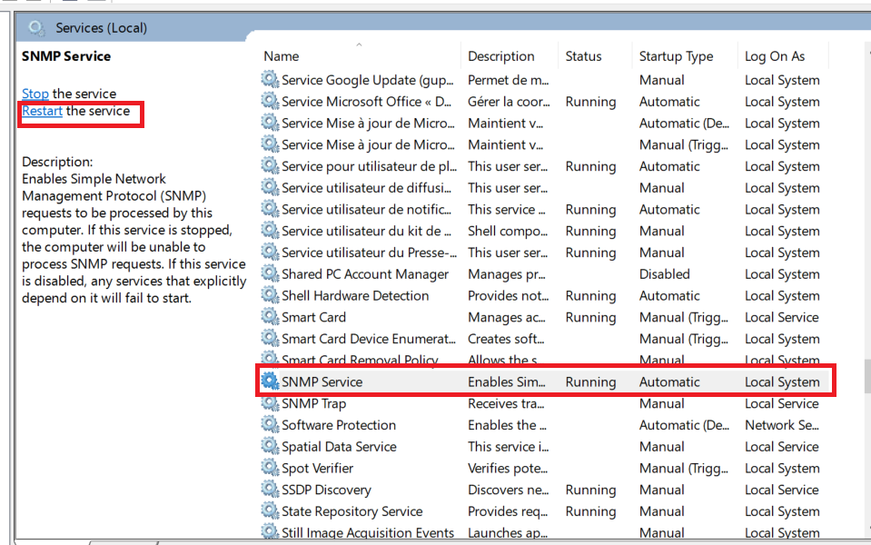

### On the Centreon poller

1. Connect to your poller in SSH and install the Windows SNMP plugin (see the [monitoring procedure for the **Windows SNMP** Plugin Pack](../integrations/plugin-packs/procedures/operatingsystems-windows-snmp.html) for more information):

   ```shell
   yum install centreon-plugin-Operatingsystems-Windows-Snmp
   ```

2. In the web interface, go to **Configuration > Plugin Packs** and install the **Windows SNMP** Plugin Pack:

   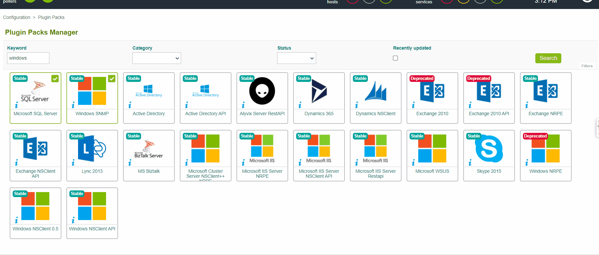


## Configure the host and deploy the configuration

1. Go to **Configuration > Hosts > Hosts** and click on **Add**:

	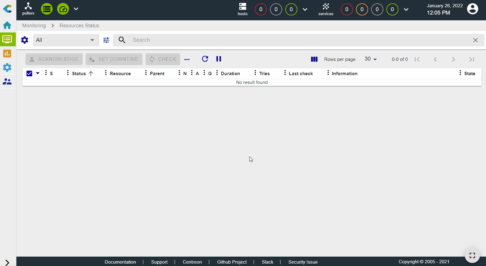

2. Fill in the following information:

   * The name of the server (1)
   * A description of the server (2)
   * The IP address (3)
   * The SNMP version and community (4)
   * Select the monitoring poller (keep "Central" if you have no other poller) (5)

3. Click on **+ Add a new entry** in the **Templates** field (6), then select the **OS-Windows-SNMP-custom** template (7) from the list. Then click on **Save**.

   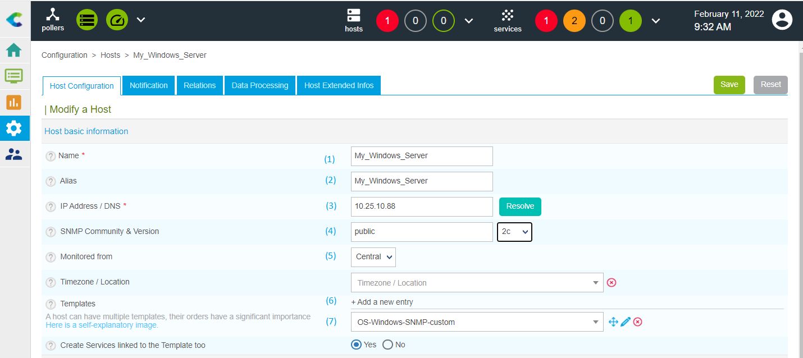

4. Your equipment has been added to the monitoring configuration:

   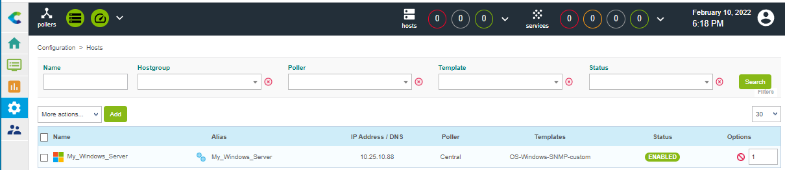

5. Go to **Configuration > Services > Services by host**. A set of indicators has been automatically deployed:

   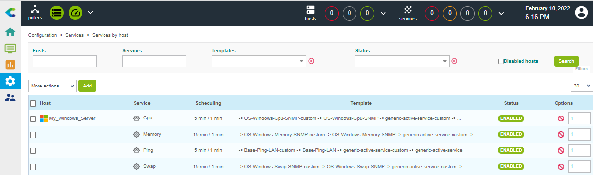

6. [Deploy the configuration](first-supervision.html#deploying-a-configuration).

7. Go to **Monitoring > Resources Status**. Click the Search options icon :

	

A pop-in window appears and lists the criteria. Then select **service** in the field **Resource**. 

   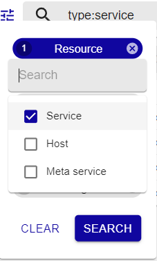

At first, the resources appear with the status **Pending**, which means that no checks have been executed yet:

   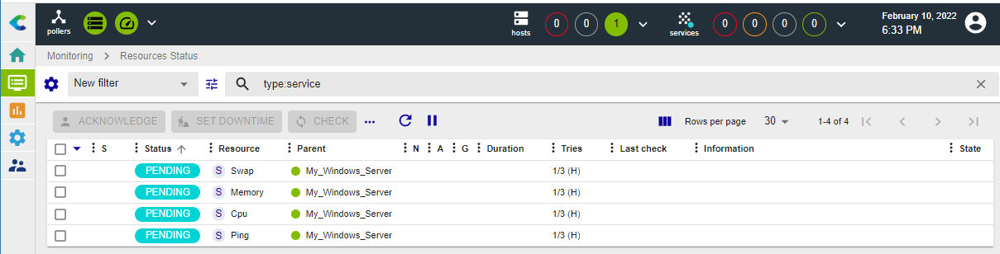

   After a few minutes, the first results of the monitoring appear:

   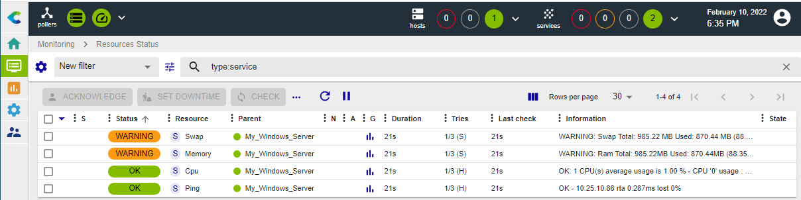

   If not all services are in an OK state, check what causes the error and fix the problem.

### To go further

The **Windows SNMP** Plugin Pack provides several monitoring templates. Go to  **Configuration > Services > Templates** menu to know the complete list:

   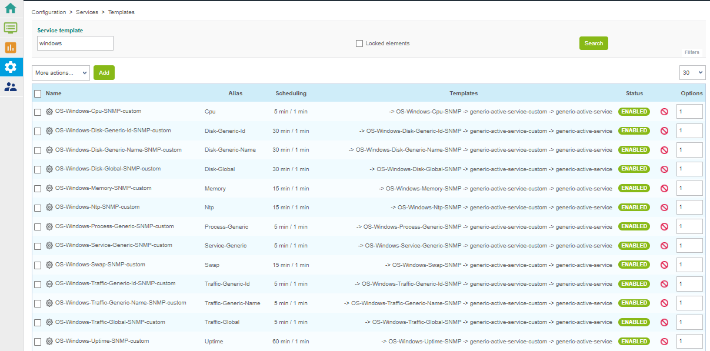

With **Centreon IT Edition** you can add very quickly and very simply the monitoring of your network cards, partition, processes and services using the [Service Discovery](../monitoring/discovery/services-discovery.html) functionality.

1. Go to the **Configuration > Services > Scan** menu. Start to write the name of host and the web interface automatically complete the name:

	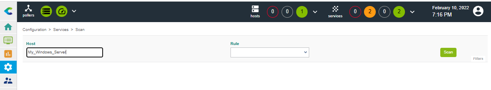

2. Select the discovery command to run from the list that has just appeared below the **Rule** field. Then click on the Scan button and wait during the discovery. The result is displayed. Select items to add to the monitoring and click on the Save button:

	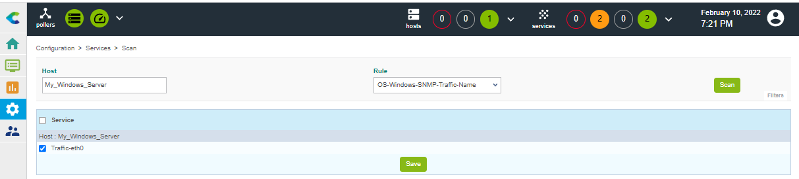

The item was added. You can select another discovery command below **Rule** and repeat the process.

3. The services were added and can be displayed in the menu **Configuration > Services > Services by host**:

	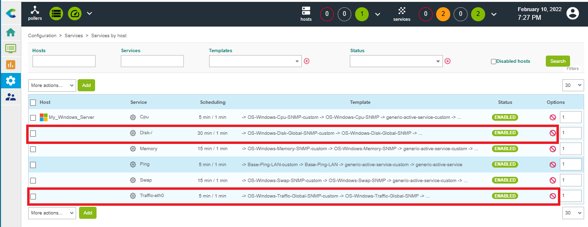

4. [Deploy the configuration](first-supervision.html#deploying-a-configuration).

	