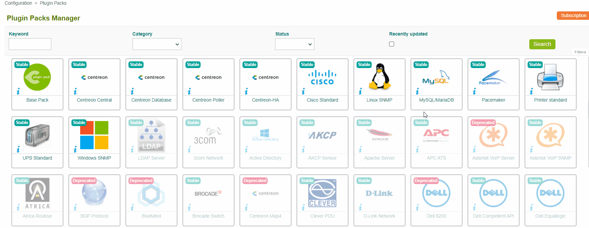
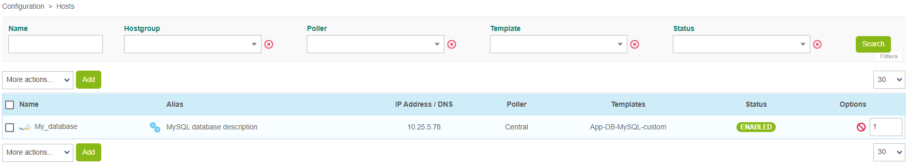

### Monitor a MySQL or MariaDB database

The objective of this tutorial is to supervise a Mysql/MariaDB database. We assume that you have a database to supervise.
In order to be able to collect the necessary information from the database, a database user with specific privileges will be needed:
```
# grant ALL PRIVILEGES on *.* to 'centreon'@'IP_POLLER' identified by 'password'
```
### Adding the Plugin Pack

The database will be supervised using the **MySQL/MariaDB** Plugin Pack
Go to the menu **Configuration > Plugin Packs** and install the **MySQL/MariaDB** Plugin Pack:



### Set up the host and deploy the configuration

To add a host to the supervision, go to the menu **Configuration > Hosts > Hosts** and click on the **Add** button:


Fill in the following information:

* The name of your server
* A description of your server
* Its IP address
* Select the appropriate Poller (leave "Central" if you have no other Poller)
* Click on the **+ Add New Entry** button for the **Templates** field and select the template **App-DB-MySQL-custom**


A list of macros matching the template will appear:


Fill in the value of following macros:

* **MYSQLUSERNAME**: the name of the user to connect to the database.
* **MySQLPASSWORD**: the password associated with the user.
* **MySQLPORT**: the listening port of the database, by default 3306.

Then click on the **Save** button.

Your equipment has been added to the supervision configuration:



Go to Configuration > Services > Services by host menu. A set of indicators has been automatically deployed:


It is now time to [deploy the supervision](#deploying-a-configuration).

Then go to the **Monitoring > Status Details > Services** menu and select **All** value for the **Service Status**
filter. After a few minutes, the first results of the monitoring appear:


