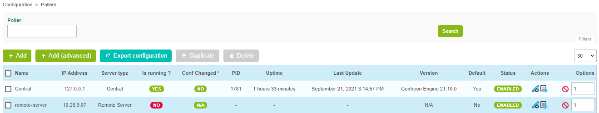

import Tabs from '@theme/Tabs';
import TabItem from '@theme/TabItem';


## Prerequisites

Install the remote server (either [using the ISO](../../installation/installation-of-a-remote-server/using-centreon-iso), or [using packages](../../installation/installation-of-a-remote-server/using-packages)).

## Step 1: Configure a new Remote Server

As of Centreon version 18.10, a new wizard has been added for defining a new
Remote Server on the Centreon platform.

1. Go to the **Configuration > Pollers > Pollers** menu and click on **Add** to configure a new Remote Server.

2. Select **Add a Centreon Remote Server** and click on **Next**:

    

3. Select the option you want:

    - If you enabled the **Remote Server** option when installing your server, select
  the option **Select a Remote Server**, then select your server and fill in the
  form:

    

    - Otherwise, select the **Create new Remote Server** option and fill in the form:

      

      The **Database username** and **Database password** are the credentials defined
      during the installation of the Remote Server.

      The **Server IP address** field is of the following form:
      [(http|https)://]@IP[:(port)]. If your Remote Server is only available on
      HTTPS, it is mandatory to define the HTTP method and the TCP port if it is
       not the default one.

      The **Do not check SSL certificate validation** option allows to connect to the
      Remote Server using a self-signed SSL certificate.

      The **Do not use configured proxy to connect to this server** allows to connect
      to the Remote Server without using the proxy configuration of the Centreon
      Central server.

4. Click on **Next**.

5. Select the poller(s) to be linked to this Remote Server, then click on
**Apply**:

  

  The wizard will configure your new server:

  

  The Remote Server is now configured:

  

## Step 2: Enable communication

The communication between the Central server and a Remote Server  is ensured by Gorgone
and can be done using ZMQ (with a Gorgone running on the Remote Server,
recommended) or using SSH protocol.

<Tabs groupId="sync">
<TabItem value="Using ZMQ" label="Using ZMQ">

1. Select the communication type:

    Edit the newly created Remote Server configuration, and select **ZMQ** as
    **Gorgone connection protocol**. Define the suitable **port** (port **5556**
    is recommended).

    

    Click on **Save**.

    > Note that the *SSH Legacy port* is not used anymore and will be removed.
    >
    > If you were using it in custom scripts, consider changing to use
    > Gorgone communication system.

2. Copy the Gorgone configuration:

    From the Pollers listing, click on the **Display Gorgone configuration** action
    icon on the line corresponding to your Remote Server 

    A pop-in will show the configuration to copy into the **Remote Server
    terminal**.
    Click on **Copy to clipboard**.

    

    Paste the content of the clipboard directly into the **Remote Server terminal**
    as it contains the following content, and will fill the right file:

    ```shell
    cat <<EOF > /etc/centreon-gorgone/config.d/40-gorgoned.yaml
    name: gorgoned-My Remote Server
    description: Configuration for remote server My Remote Server
    gorgone:
      gorgonecore:
        id: 3
        external_com_type: tcp
        external_com_path: "*:5556"
        authorized_clients:
          - key: Np1wWwpbFD2I0MdeHWRlFx51FmlYkDRZy9JTFxkrDPI
        privkey: "/var/lib/centreon-gorgone/.keys/rsakey.priv.pem"
        pubkey: "/var/lib/centreon-gorgone/.keys/rsakey.pub.pem"
      modules:
        - name: action
          package: gorgone::modules::core::action::hooks
          enable: true

        - name: cron
          package: "gorgone::modules::core::cron::hooks"
          enable: true
          cron: !include cron.d/*.yaml

        - name: nodes
          package: gorgone::modules::centreon::nodes::hooks
          enable: true

        - name: proxy
          package: gorgone::modules::core::proxy::hooks
          enable: true

        - name: legacycmd
          package: gorgone::modules::centreon::legacycmd::hooks
          enable: true
          cmd_file: "/var/lib/centreon/centcore.cmd"
          cache_dir: "/var/cache/centreon/"
          cache_dir_trap: "/etc/snmp/centreon_traps/"
          remote_dir: "/var/cache/centreon/config/remote-data/"

        - name: engine
          package: gorgone::modules::centreon::engine::hooks
          enable: true
          command_file: "/var/lib/centreon-engine/rw/centengine.cmd"

        - name: statistics
          package: "gorgone::modules::centreon::statistics::hooks"
          enable: true
          broker_cache_dir: "/var/cache/centreon/broker-stats/"
          cron:
            - id: broker_stats
              timespec: "*/5 * * * *"
              action: BROKERSTATS
              parameters:
                timeout: 10
            - id: engine_stats
              timespec: "*/5 * * * *"
              action: ENGINESTATS
              parameters:
                timeout: 10

    EOF
    ```

    Hit the *Enter* key for the command to be applied.

    > You can copy the configuration in a custom file by copying the content from
    > the pop-in.

3. Restart the Gorgone daemon:

    From the Remote Server, run the following command to restart the Gorgone service:

    ```shell
    systemctl restart gorgoned
    ```

    Make sure it is started by running the following command:

    ```shell
    systemctl status gorgoned
    ```

    It should result as follows:

    ```shell
    ● gorgoned.service - Centreon Gorgone
      Loaded: loaded (/etc/systemd/system/gorgoned.service; enabled; vendor preset: disabled)
      Active: active (running) since Wed 2020-03-24 19:45:00 CET; 6s ago
    Main PID: 30902 (perl)
      CGroup: /system.slice/gorgoned.service
              ├─30902 /usr/bin/perl /usr/bin/gorgoned --config=/etc/centreon-gorgone/config.yaml --logfile=/var/log/centreon-gorgone/gorgoned.log --severity=info
              ├─30916 gorgone-nodes
              ├─30917 gorgone-dbcleaner
              ├─30924 gorgone-proxy
              ├─30925 gorgone-proxy
              ├─30938 gorgone-proxy
              ├─30944 gorgone-proxy
              ├─30946 gorgone-proxy
              ├─30959 gorgone-engine
              ├─30966 gorgone-action
              └─30967 gorgone-legacycmd

    Mar 24 19:45:00 localhost.localdomain systemd[1]: Started Centreon Gorgone.
    ```

4. **To force the Central's Gorgone daemon to connect to the Remote Server**, restart
it with the following command from the **Central server**:

  ```shell
  systemctl restart gorgoned
  ```

</TabItem>
<TabItem value="Using SSH (Deprecated)" label="Using SSH (Deprecated)">

> **Deprecated** 
>
> This mode should not be used anymore as it does not allow data
> synchronisation between Central and Remote Server UI.

## Step 3: Export the configuration

1. From the Pollers listing, select the Remote Server and click on **Export
configuration**.

2. Then check the three first boxes and click on **Export**:

    

3. Finally, from the Remote Server, start/restart the collect processes:

    ```shell
    systemctl restart cbd centengine
    ```

    The Remote Server's Broker and Engine will then start and connect to the
    Central Broker.

    

</TabItem>
</Tabs>

## Getting started

Go to the [Getting Started](../../getting-started/installation-first-steps#start-to-monitor-your-first-host)
chapter to configure your first monitoring.
