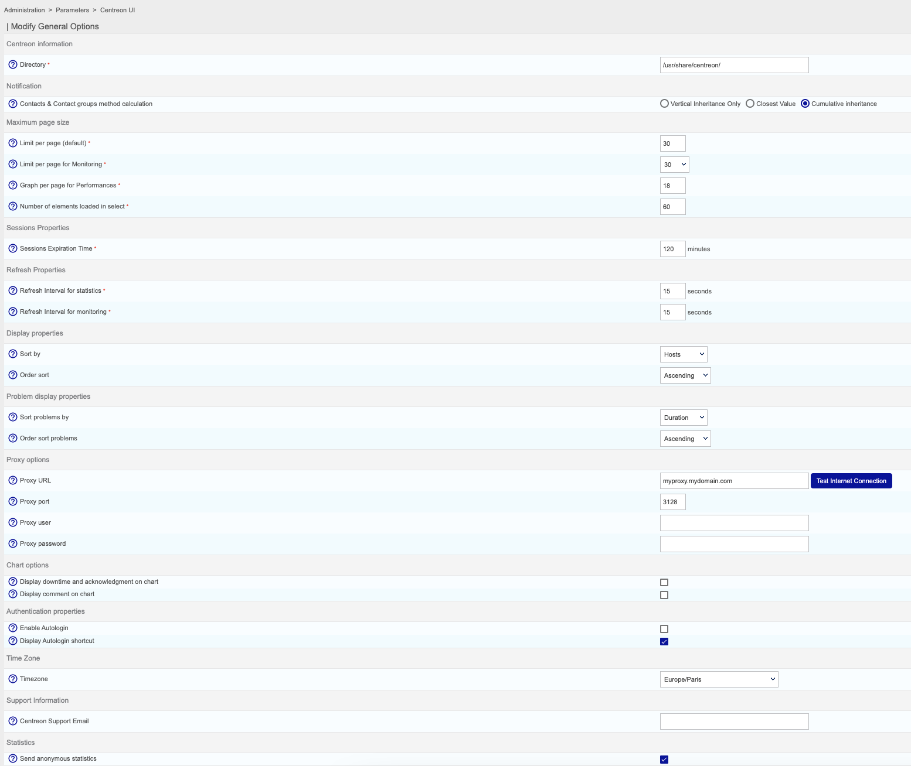
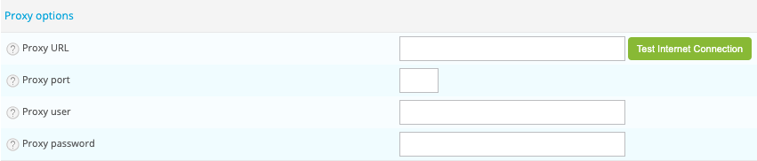

This part covers the configuration of the general options of the Centreon web
interface.

Go to **Administration > Parameters > Centreon UI**.

## General options

- **Directory** indicates the directory where Centreon is installed
- **Centreon Web Directory** field indicates the web directory on which
Centreon is installed
- **Contacts & Contact groups method calculation** allows to define how
notification inheritance for hosts and services will be calculated.
- **Limit per page (default)** field defines the number of objects displayed
per **Configuration** page
- **Limit per page for Monitoring** field defines the number of objects
displayed per page in the **Monitoring** menu
- **Graph per page for Performances** field defines the maximum number of
displayed charts on **Performance** page
- **Number of elements loaded in select** field defines the maximum number in
select box
- **Sessions Expiration Time** field, expressed in minutes, indicates the
maximum session duration
- **Refresh Interval for statistics** field, expressed in seconds, indicates
the refreshment interval for the statistics page
- **Refresh Interval for monitoring** field, expressed in seconds, indicates
the refreshment interval for the objects on the monitoring page
- **Sort problems by** field is used to choose how to sort the incidents in
the **Monitoring** menu
- **Order sort problems** field indicates the display order for incidents, by
rising or falling order of gravity
- **Display downtime and acknowledgment on chart** allows to display downtime
and acknowledgment on chart
- **Display comment on chart** allows to display comment from service on chart
- **Timezone** field indicates timezone of your monitoring server.
- **Centreon Support Email** field indicates the e-mail address of the
**Customer’s service support centre** for the Centreon platform. This e-mail
address will be displayed at the bottom of the page on the link **Centreon
Support**
- **Send anonymous statistics** box defines wether or not the platform will
send anonymous information for the **Centreon Customer Experience Improvement**

## Proxy configuration

The proxy configuration is mandatory to use Centreon IT Edition.

Define needed information:

- **Proxy URL**
- **Proxy port**
- **Proxy user**
- **Proxy password**

Once you defined settings, test your configuration by clicking on the **Test Internet Connection** button.

To validate the configuration, click on the **Test Internet Connection** button. If the message
**Connection Successful** appears, your configuration is valid, otherwise modify your parameters.

## Autologin

See [Configuring Autologin](../../connect/autologin).

## SSO

See [Configuring an SSO connection](../../connect/sso). 

## OpenId Connect

See [Configuring connection via OpenId Connect](../../connect/openid).