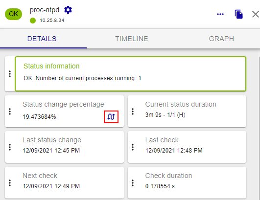
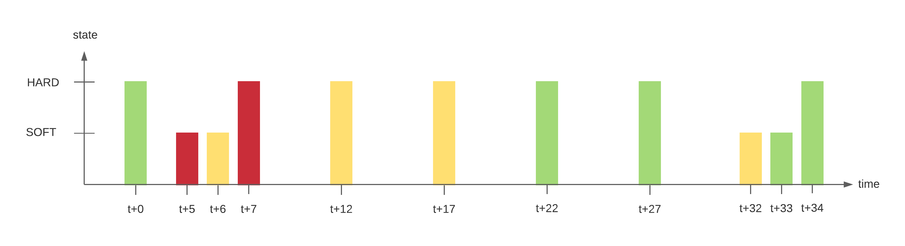

Statuses show the availability of a host, and the availability or performance of a service. Each status has a
precise meaning for the resource. 
* The statuses and states of a resource
can be seen on page [Resources Status](resources-status.md). You can filter the page according to these statuses and to certain states.
* Some statuses are determined according to user-defined thresholds.

### Host status

The table below summarizes all the possible statuses for a host.

| Status                                             | Description                                                                                   |
|----------------------------------------------------|-----------------------------------------------------------------------------------------------|
| UP          | The host is available and reachable                                                           |
| DOWN        | The host is unavailable                                                                       |
| UNREACHABLE | The host is unreachable: it [depends](notif-dependencies.md) on a host whose status is **DOWN**  |
| PENDING     | The host has just been created and has not been checked yet by the monitoring engine |

### Service status

The table below summarizes all the possible statuses for a service.

| Status                                          | Description                                                               |
|-------------------------------------------------|---------------------------------------------------------------------------|
| OK       | The service presents no problem                                           |
| WARNING  | The service has reached the warning threshold                             |
| CRITICAL | The service has reached the critical threshold                            |
| UNKNOWN  | The status of the service cannot be checked (e.g.: SNMP agent down, etc.) |
| PENDING  | The service has just been created and has not been checked yet by the monitoring engine |

## States

In addition to their status, resources can be in several states:

-   Acknowledged: indicates that the incident on the service or on the host
    has been taken into account by a user. (See [Acknowledging a problem](acknowledge.md).)
-   In downtime: indicates that notifications are temporarily stopped. A [downtime](downtimes.md) can be [planned in advance](downtimes.md#recurrent-downtimes) to avoid receiving alerts during maintenance periods, or be set following an incident.

-   [Flapping](notif-flapping.md): indicates that the status change
    percentage of the resource is very high. This percentage is obtained
    from calculations performed by the network monitoring engine.  Flapping resources have the following icon in their **Details** panel:
    

## Status types

The status of a resource can have one of these 2 types:

-   SOFT: Signifies that an incident has just been detected and that it
    has to be confirmed.
-   HARD: Signifies that the status of the incident is confirmed. Once
    the status is confirmed, the notification process is engaged
    (sending of an email, SMS, etc.).

You can filter the view on the [Resources Status](resources-status.md) page according to the status type.

### Explanation

An incident (Not-OK status) is confirmed as soon as the number of
validation attempts has reached its end. The configuration of a resource
(host or service) requires a regular check interval, a number of
attempts to confirm a Not-OK status and an irregular check interval. As
soon as the first incident is detected, the state is "SOFT" until its
confirmation into "HARD", triggering the notification process.

Example:

A service has the following check settings:

-   Max check attempts: 3
-   Normal check interval: 5 minutes
-   Retry check interval: 1 minute

Let us imagine the following scenario:

| Time | Check attempt | Status   | Status type | State change | Note                                                                                                                                                                                                          |
|------|---------------|----------|-------|--------------|---------------------------------------------------------------------------------------------------------------------------------------------------------------------------------------------------------------|
| t+0  | 1/3           | OK       | HARD  | No           | Initial state of the service                                                                                                                                                                                  |
| t+5  | 1/3           | CRITICAL | SOFT  | Yes          | First detection of a non-OK state. Event handlers execute.                                                                                                                                                    |
| t+6  | 2/3           | WARNING  | SOFT  | Yes          | Service continues to be in a non-OK state. Event handlers execute.                                                                                                                                            |
| t+7  | 3/3           | CRITICAL | HARD  | Yes          | Max check attempts has been reached, so service goes into a HARD state. Event handlers execute and a problem notification is sent out. Check # is reset to 1 immediately after this happens.                  |
| t+12 | 3/3           | WARNING  | HARD  | Yes          | Service changes to a HARD WARNING state. Event handlers execute and a problem notification is sent out.                                                                                                       |
| t+17 | 3/3           | WARNING  | HARD  | No           | Service stabilizes in a HARD problem state. Depending on what the notification interval for the service is, another notification might be sent out.                                                           |
| t+22 | 1/3           | OK       | HARD  | Yes          | Service experiences a HARD recovery. Event handlers execute and a recovery notification is sent out.                                                                                                          |
| t+27 | 1/3           | OK       | HARD  | No           | Service is still OK.                                                                                                                                                                                          |
| t+32 | 1/3           | UNKNOWN  | SOFT  | Yes          | Service is detected as changing to a SOFT non-OK state. Event handlers execute.                                                                                                                               |
| t+33 | 2/3           | OK       | SOFT  | Yes          | Service experiences a SOFT recovery. Event handlers execute, but notification are not sent, as this wasn't a "real" problem. State type is set HARD and check # is reset to 1 immediately after this happens. |
| t+34 | 1/3           | OK       | HARD  | No           | Service stabilizes in an OK state.                                                                                                                                                                            |