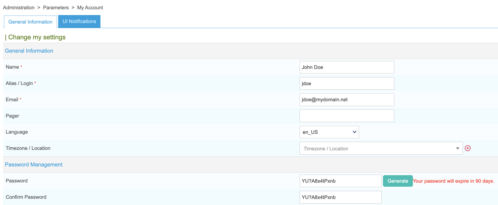
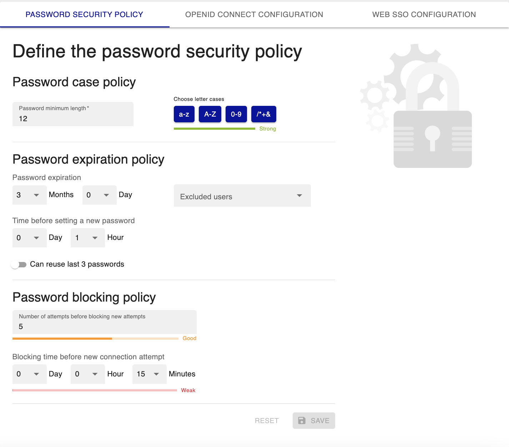

## Authorise users to access Centreon

1. To authorize a [user](../monitoring/basic-objects/contacts) to access the Centreon web interface, go to
**Configuration > Users > Contacts/Users** and click on the user you want.

2. On the **Centreon Authentication** tab, set **Reach Centreon Front-end** to **Yes**.

3. Fill in the **Password** and
**Confirm Password** fields: the password must comply with the [password security policy](#configure-a-local-password-security-policy) that has been defined. You can use the **Generate** button to generate a random string based on this
local password security policy.

Users can change their password by clicking on the profile icon in the top right corner of the page and then clicking **Edit profile**.
On this screen, the password expiration time is displayed:

## Configure a local password security policy

Since Centreon 22.04, a **local password security policy** has been implemented.
This policy makes it possible to strengthen the security of local account passwords by forcing the user to enter a
complex password, to give passwords a lifespan and to block brute force attempts.

Go to **Administration > Authentication> Password Security Policy**:

### Password case policy

- Define the **Minimum password length**.
- Define which characters the password must contain to make it stronger (lower case letters, upper case letters, numbers, special characters).

### Password expiration policy

Configure when passwords will expire:

- **Password expires after**: Once the password expires, the user will be redirected to a
  [dedicated page](../getting-started/interface.md#reset-your-password-when-expired) to update their password.
- **Minimum time between password changes**: When a password has just been changed, how much time must elapse before it can be changed again.
- **Last 3 passwords can be reused**: Use this option to allow users to reuse one of their 3 old passwords when renewing.
- **Excluded users**: Select user accounts for which the password expiration policy will not apply (for instance, the **admin** account, or technical accounts accessing APIs). The passwords for these accounts will never expire.

### Password blocking policy

To block brute force type attacks, use the following fields:
- **Number of attempts before user is blocked** 
- **Time that must pass before new connection is allowed**: when a user is blocked, they will have to wait that amount of time before they can try connecting again.
