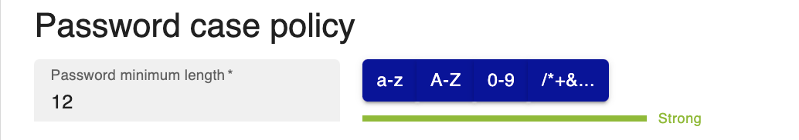
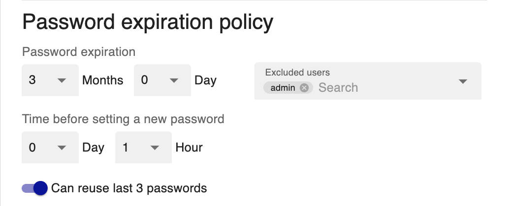

> Since Centreon 22.04, a **local password security policy** has been implemented.

## Configure local password security policy

### Password complexity policy

Go to **Administration > Authentication** page and select **password minimum length** as well as **password complexity**:

### Password expiration policy

Configure expiration policy:

- **Password expiration**: Once the password expires, the user will be redirected to a dedicated page to update their
  password.
- **Time before setting a new password**: Delays between two changes of passwords.
- **Can reuse last 3 passwords**: This option allows the user not to reuse one of his 3 old passwords when renewing.
- **Excluded users**: This option makes it possible to exclude user accounts, in particular accounts accessing APIs
  from the password expiration policy.

### Password Password blocking policy

To block brute force type attacks, you can define the number of failed attempts before to block the users before new
connection attempt:

## Authorise users to access to Centreon

To authorize a [user](../monitoring/basic-objects/contacts) to access the Centreon web interface, go to the
**Configuration > Users > Contacts/Users** page and click on the user you want. 

On the **Centreon Authentication** tab, set **Reach Centreon Front-end** to **Yes**, then Fill in the **Password** and
**Confirm Password** fields. You can use the **Generate** button to generate a random string based on the
**local password security policy**:

Users can change their password by clicking on the profile icon in the top right corner of the page and then clicking **Edit profile**.
Moreover, the password expiration time is now displayed:

