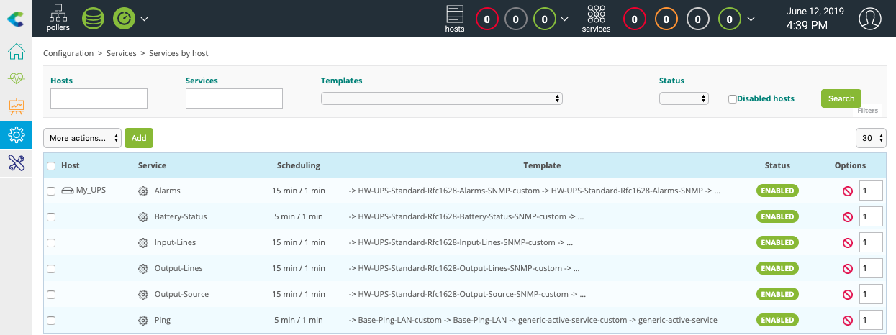
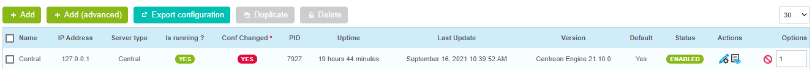

## Basic principles of monitoring

Before starting to monitor, let's take a look at some basic concepts:

* A **host** is any device that has an IP address and that one wishes to monitor. For example, a physical server, a
  virtual machine, a temperature probe, an IP camera, a printer or a storage space.
* A **service** is a check point, or indicator, to be monitored on a host. This can be the CPU usage rate, temperature,
  motion detection, bandwidth usage rate, disk I/O, and so on.
* In order to collect each indicator value, monitoring **plugins** are used which are periodically executed by a
  collection engine called Centreon Engine.
* To be executed, a plugin needs a set of arguments that define, for example, which host to connect to or through which protocol.
  The plugin and its associated arguments form a **command**.

For example, to monitor a host with Centreon is to configure all the commands needed to measure the desired indicators,
and then deploy that configuration to the collection engine so that these commands are run periodically.

Nevertheless, to drastically simplify the configuration, we will rely on monitoring templates:

* A **host template** defines the configuration of the indicators for a given type of equipment.
* It relies on **service templates** that define the configuration of the commands needed to collect these indicators.
* Centreon provides downloadable **Plugins Packs** to install on its monitoring platform: each Plugin Pack includes host
  and services templates to configure the monitoring of a particular device in a few clicks.

This quick start guide proposes to install the monitoring templates supplied free of charge with the Centreon solution
and then to implement them to monitor your first equipment.

> To go further with templates, please read the [templates chapter](../monitoring/templates.md#definition).

> If you have a license for it, you can use our [Auto Discovery](../monitoring/discovery/introduction.md) feature to find and configure hosts easily. See also our tutorial on [how to detect AWS EC2 instances](autodisco-aws.md).

### Installation of basic monitoring templates

Go to the **Configuration \> Plugin Packs** menu.

> [Configure the proxy](../administration/parameters/centreon-ui.md#proxy-configuration) to allow the Centreon server to access the internet.

Install the **Base Generic** Plugin Pack (if it is not already installed) by moving your cursor on it and by clicking on the **+** icon (it is a prerequisite
to the installation of any other Plugin Packs):

You can also click on the Plugin Pack in order to know its content before installing it:

Install other Plugin Packs you probably need for your environment, for example **Linux SNMP** and **Windows SNMP** available
for free:

Now you have the basic templates and plugins to start monitoring hosts!

## Start to monitor your first host

### Monitor Printer equipment with SNMP

Go to the **Configuration \> Plugin Packs** menu and install **Printer Standard** Plugin Pack:

Go to the **Configuration \> Hosts \> Hosts** menu and click on **Add**:

Fill in the following information:

* The name of the server
* A description of the server
* The IP address
* The SNMP version and community

Click on **+ Add a new entry** button in **Templates** field, then select the **HW-Printer-standard-rfc3805-custom**
template in the list.

Click on **Save**.

Your equipment has been added to the monitoring configuration:

Go to **Configuration \> Services \> Services by host** menu. A set of indicators has been automatically deployed:

It is now time to [deploy the supervision](#deploying-a-configuration).

Then go to the **Monitoring \> Status Details \> Services** menu and select **All** value for the **Service Status**
filter. After a few minutes, the first results of the monitoring appear:

### Monitor UPS equipment with SNMP

Go to the **Configuration \> Plugin Packs** menu and install **UPS Standard** Plugin Pack:

Go to the **Configuration \> Hosts \> Hosts** menu and click on **Add**:

Fill in the following information:

* The name of the server
* A description of the server
* The IP address
* The SNMP version and community

Click on **+ Add a new entry** button in **Templates** field, then select the **HW-UPS-Standard-Rfc1628-SNMP-custom**
template in the list.

Click on **Save**.

Your equipment has been added to the monitoring configuration:

Go to **Configuration \> Services \> Services by host** menu. A set of indicators has been automatically deployed:

It is now time to [deploy the supervision](#deploying-a-configuration).

Then go to the **Monitoring \> Status Details \> Services** menu and select **All** value for the **Service Status**
filter. After a few minutes, the first results of the monitoring appear:

## Deploying a configuration

On creation/deletion/change of objects via the configuration interface, the changes performed are not applied
automatically to the monitoring engine. To apply the changes performed, it is necessary to follow the procedure below.

1. Go to **Configuration \> Pollers > Pollers**.
2. Select the pollers whose configuration you want to export.
3. Click on **Export configuration**.

    

4. Check the following boxes:
    - **Generate Configuration Files**
    - **Run monitoring engine debug (-v)**
    - **Move Export Files**
    - **Restart Monitoring Engine**.

5. Click **Export**.

    

6. Check that no errors appear during generation.
