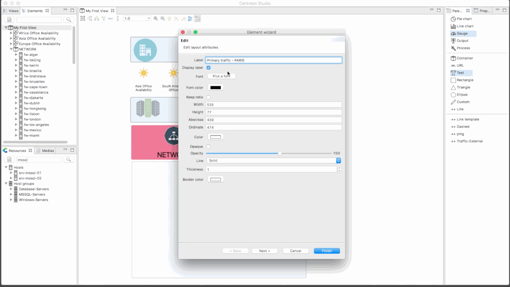
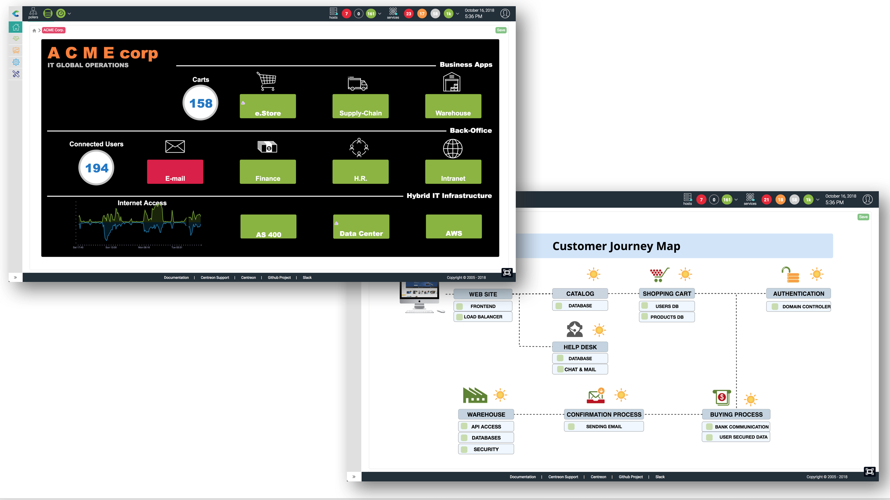

The graphical view capabilities in Centreon relies on the Centreon MAP
module.

Centreon MAP is a data-mapping and visualization tool designed for IT
Operations management (ITOM) administrators and developers. It is
capable of displaying efficient graphic insights and mapping correlated
data in customized user-relevant views.

You can benefit from Centreon MAP by using it in two modes:
- [Centreon Map4](#centreon-map4) which requires a desktop client installation.
- [Centreon MAP Web](#centreon-map-web) which is a web interface version.

Main features are available in the two modes. However, some items such as using system commands or granting access rights were not necessary or had to be reworked in the MAP Web version.

## Centreon Map4

> Centreon MAP is a Centreon **extension** that requires a valid [license](../administration/licenses.md).
> To purchase one and retrieve the necessary repositories, contact
> [Centreon](mailto:sales@centreon.com).

Use the following procedures to use and administrate Centreon MAP Legacy:
- Use MAP Legacy:
  - [Create a standard view](create-standard-view.md) using the Map-4 desktop client. This topic also describes best practices and limitations.
  - [Create a geo view](create-geo-views.md) using the web interface. This procedure explains how to display your resources across a defined geographical area.
  - [Display views](display-view.md) from the web interface. This topic also describes dedicated features.
  - [Share a view](share-view.md) allows you to share views to a limited audience.

- Administrate Map4:
  - [Install Centreon MAP extension](install.md) describes prerequisites and procedures to install the Map4 desktop client.
  - [Update the extension](update.md) describes the update process of Map4.
  - [Upgrade the extension](upgrade.md) describes the update process of Map4.
  - [Migrate the extension](migrate.md) describes how to move the MAP server to another server.
  - [Configure](configuration.md) explains how to administrate users rights and describes customization settings.
  - [Install on a remote server](remote-server.md) explains how to install Map4 on a remote server.
  - [Advanced configuration](advanced-configuration.md) describes advanced procedures to configure Map4.
  - [Known issues](known-issues.md) is a list of issues you may encounter using Map4.
  - [Troubleshooting MAP](troubleshooter.md) helps you to solve some issues occuring in Map4.

Here is an overview of MAP Legacy. You need first to create logical views using the Desktop client:

Then you can visualize them directly in your browser:

You can also use the geographical view to display resources in the way your IT is spread
over a city, country or world:

Both types of views may be displayed in the same Centreon web user interface:

- Either from the Centreon MAP dedicated user interface, which also includes a
  search facility.
- Or within a Custom View, using the dedicated Centreon MAP widget.

## Centreon MAP Web

Use the following procedures to use and administrate Centreon MAP Legacy:
- Use MAP Legacy:
  - [Manage maps on MAP Web](map-web-manage.md)
  - [Use the map editor](map-web-editor.md)

- Administrate MAP Legacy:
  - [Install MAP Web](map-web-install.md)
  - [Install MAP Web on a remote server](map-web-install-remote.md)
  - [Update MAP Web](map-web-update.md)
  - [Import legacy maps into MAP Web](import-into-map-web.md)
  - [Install on a remote server](remote-server.md)
  - [Manage access rights on MAP Web](map-web-manage.md)
  - [MAP Web known issues](map-web-known-issues.md)
  - [MAP Web troubleshooting](map-web-troubleshooting.md)
