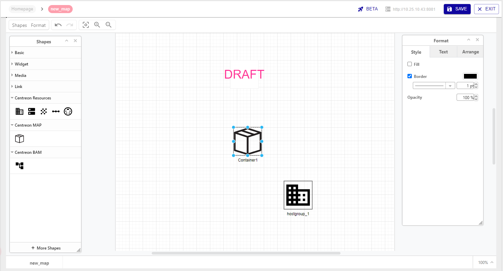

## MAP Web editor overview

- Toolbar
- Panels (Shapes/Format)
- Page tabs

## View mode / Editing mode

## Build your map

### Use basic elements

In the **Shapes** panel:
- Basic
- Widget
- Media
- Link

### Use Centreon elements

In the **Shapes** panel:
- Centreon resources
- Centreon MAP
- Centreon BAM

- Create links between elements
- Arrange elements on the map

### Customize your elements

In the **Format** panel:
- Style
- Text
- Arrange

