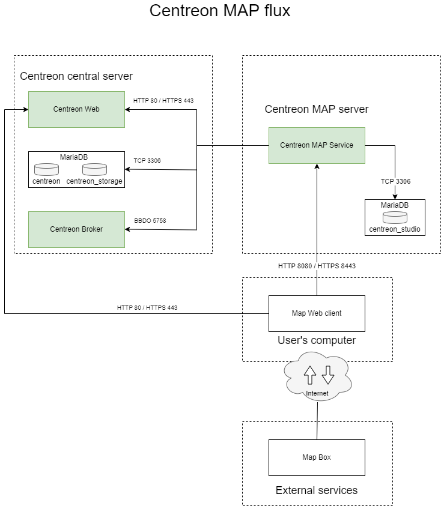
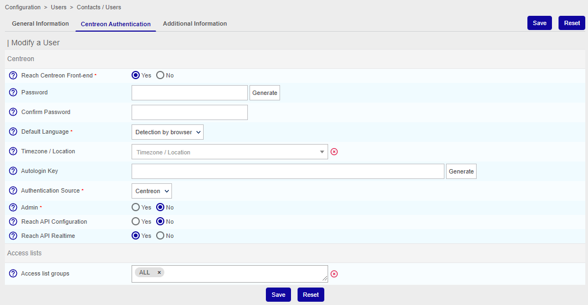
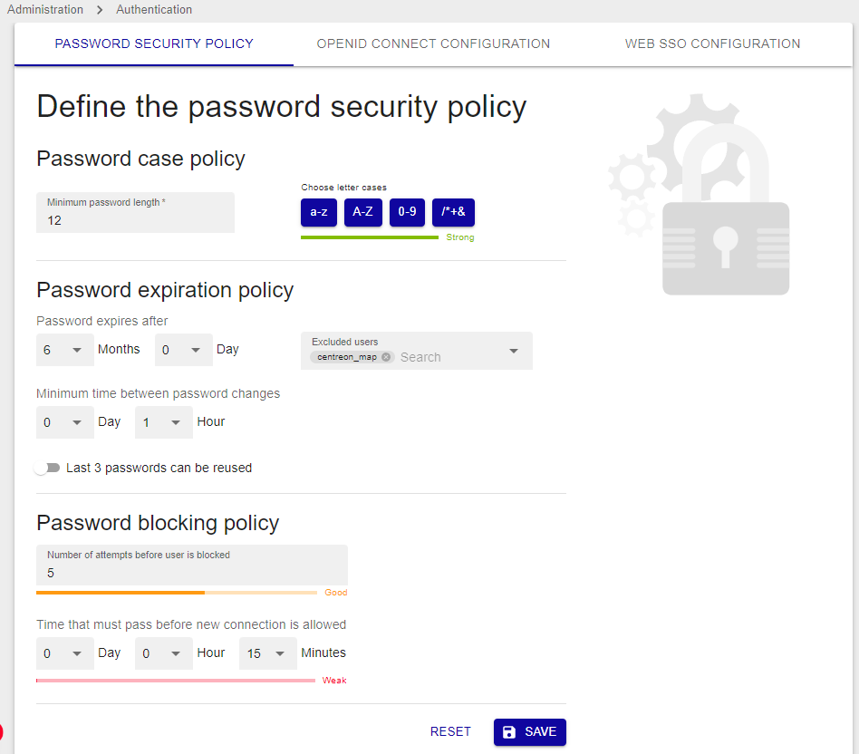

import Tabs from '@theme/Tabs';
import TabItem from '@theme/TabItem';

This chapter describes how to install Centreon MAP. It is recommended to install MAP on the central server. However, if you have large volumes of data, you can install it on your legacy MAP server. The MAP module does not use the **centreon_studio** database.

### License

If you need an additional license for Centreon MAP, please contact the support [Centreon support
team](https://centreon.force.com/) to get and install your license key.

## Architecture

The diagram below summarizes the MAP architecture:



**Table of network flow**

| Application    | Source     | Destination               | Port      | Protocol   | Purpose                                             |
|----------------|------------|---------------------------|-----------|------------|-----------------------------------------------------|
| Map Server     | Map server | Centreon central broker   | 5758      | TCP        | Get real-time status updates                        |
| Map Server     | Map server | Centreon MariaDB database | 3306      | TCP        | Retrieve configuration and other data from Centreon |
| Map Server     | Map server | Map server database       | 3306      | TCP        | Store all views and data related to Centreon MAP (Legacy)    |
| Web            | Map server | Centreon central          | 80/443    | HTTP/HTTPS | Authentication & data retrieval                     |
| Web interface  | User       | Map server                | 8081/9443 | HTTP/HTTPS | Retrieve views & content                            |
| Web interface  | User       | Internet\* (Mapbox)       | 443       | HTTPS      | Retrieve Mapbox data                                |

\* *With or without a proxy*

## Prerequisites

### Centreon MAP Server

#### License

The server requires the license to be available and valid on Centreon's central
server. To do this, you must contact the support [Centreon support
team](https://centreon.force.com/) to get and install your license key.

#### Software

- OS: CentOS 7 or Redhat 7 / 8
- DBMS: MariaDB 10.5
- Firewall: Disabled
- SELinux: Disabled

#### Information required during configuration

- Centreon web login with administration rights.

> Even with a correctly sized server, you should have in mind the best
> practices and recommendations when creating views so you do not face
> performance issues.

### Centreon MAP web interface

#### License

The web interface requires the license to be available and valid on Centreon's
central server. To do this, you must contact the support [Centreon support
team](https://centreon.force.com/) to get and install your license key.

#### Compatibility

The Centreon MAP web interface is compatible with the following web browsers:

* Google Chrome (latest version at the time of Centreon software release and above).  Please visit the [Google Chrome FAQ](https://support.google.com/chrome/a/answer/188447?hl=en) for a description of the Chrome support policy. 
* Mozilla Firefox (latest version at the time of Centreon software release and above).  Please visit the [Mozilla FAQ](https://www.mozilla.org/en-US/firefox/organizations/faq/) for a description of the Firefox support policy.
* Apple Safari (latest version at the time of Centreon software release and above).
* Microsoft Edge Chromium (latest version at the time of Centreon software release and above).

If an update to those supported browsers was to cause an incompatibility, Centreon would work on a fix in the shortest possible time (for supported Centreon versions). Though other browsers may work, Centreon will not attempt to resolve problems with browsers other than those listed above.

Your screen resolution must be at least 1280 x 768.

### Network requirements

Centreon MAP Server machine must access:

- Centreon Central broker, usually on Centreon Central machine, using TCP
  port 5758.
- Centreon Database, usually on Centreon Central machine, using TCP port 3306.
- Centreon MAP database, usually on localhost, using TCP port 3306.

All the ports above are default values and can be changed if needed.

- Centreon MAP central, using HTTP port 80 or HTTPS port 443.

Ports 8081 and 9443 are recommended default values, but other
configurations are possible.

## Server installation

### Centreon MAP interface

You must provide to Centreon MAP server a dedicated user
**who has access to all resources** through the appropriate [access list groups](../administration/access-control-lists.md). 
Since the password will be stored in human-readable form in a 
configuration file, you should not use a Centreon admin user account.

Provide this user with access to the Centreon web real time API:



Exclude the user from the password expiration policy on page **Administration > Authentication**: their password will never expire.



### Centreon central server

Create a user in the mysql instance hosting 'centreon' and 'centreon_storage'
databases:

```sql
CREATE USER 'centreon_map'@'<IP_SERVER_MAP>' IDENTIFIED BY 'centreon_map';
GRANT SELECT ON centreon_storage.* TO 'centreon_map'@'<IP_SERVER_MAP>';
GRANT SELECT, INSERT ON centreon.* TO 'centreon_map'@'<IP_SERVER_MAP>';
```

The INSERT privilege will only be used during the installation process
in order to create new Centreon Broker output. It will be revoked later.

### Centreon MAP server

If you installed your Centreon MAP server from a "fresh CentOS installation"
you need to install the `centreon-release` package:

<Tabs groupId="sync">
<TabItem value="Alma / RHEL / Oracle Linux 8" label="Alma / RHEL / Oracle Linux 8">

> You need to install an EPEL repository before you start the procedure.

```shell
dnf install -y https://yum.centreon.com/standard/22.04/el8/stable/noarch/RPMS/centreon-release-22.04-3.el8.noarch.rpm
```

</TabItem>
<TabItem value="CentOS 7" label="CentOS 7">

> Ensure a version of Java 17 or later is installed before you start the procedure.

```shell
yum install -y https://yum.centreon.com/standard/22.04/el7/stable/noarch/RPMS/centreon-release-22.04-3.el7.centos.noarch.rpm
```

</TabItem>
<TabItem value="Debian 11" label="Debian 11">

Install the following dependencies:

```shell
apt update && apt install lsb-release ca-certificates apt-transport-https software-properties-common wget gnupg2
```

To install the Centreon repository, execute the following command:

```shell
echo "deb https://apt.centreon.com/repository/22.04/ $(lsb_release -sc) main" | tee /etc/apt/sources.list.d/centreon.list
```

Then import the repository key:

```shell
wget -O- https://apt-key.centreon.com | gpg --dearmor | tee /etc/apt/trusted.gpg.d/centreon.gpg > /dev/null 2>&1
```

</TabItem>
</Tabs>

> If the URL does not work, you can manually find this package in the folder.

Install Centreon MAP repository, you can find it on the
[support portal](https://support.centreon.com/s/repositories).

Then install Centreon MAP server using the following command:

<Tabs groupId="sync">
<TabItem value="Alma / RHEL / Oracle Linux 8" label="Alma / RHEL / Oracle Linux 8">

```shell
dnf install centreon-map-server
```

</TabItem>
<TabItem value="CentOS 7" label="CentOS 7">

```shell
yum install centreon-map-server
```

</TabItem>
<TabItem value="Debian 11" label="Debian 11">

```shell
apt update
apt install centreon-map-server
```

</TabItem>
</Tabs>

When installing Centreon MAP server, it will automatically install java
(OpenJDK 11) if needed.

> You need to have a MariaDB database to store Centreon MAP data, whether
> it's on localhost or somewhere else.

To install MariaDB, execute the following command:

<Tabs groupId="sync">
<TabItem value="Alma / RHEL / Oracle Linux 8" label="Alma / RHEL / Oracle Linux 8">

```shell
dnf install mariadb-client mariadb-server
```

</TabItem>
<TabItem value="CentOS 7" label="CentOS 7">

```shell
yum install mariadb-client mariadb-server
```

</TabItem>
<TabItem value="Debian 11" label="Debian 11">

```shell
apt install mariadb-client mariadb-server
```

</TabItem>
</Tabs>

### Configuration

Make sure the database that stores Centreon MAP data is optimized
(automatically added by the RPM in `/etc/my.cnf.d/map.cnf`):

```text
max_allowed_packet = 20M
innodb_log_file_size = 200M
```

Then, restart MariaDB:

```shell
systemctl restart mariadb
```

#### Secure the database

Since MariaDB 10.5, it is mandatory to secure the database's root access before installing Centreon. If you are using a local database, run the following command on the central server:

```shell
mysql_secure_installation
```

* Answer **yes** to all questions except "Disallow root login remotely?".
* It is mandatory to set a password for the **root** user of the database. You will need this password during the [web installation](../installation/web-and-post-installation.md).

> For more information, please see the [official MariaDB documentation](https://mariadb.com/kb/en/mysql_secure_installation/).

#### Configure.sh script

Execute the Centreon MAP server configuration script. Two modes are available:
interactive or automatic.

- interactive *(no option/default mode)*: Several questions will be asked to
  interactively fill in the installation variables.
- automatic *(--automatic or -a)*: The installation will be done automatically
  from the values set in `/etc/centreon-studio/vars.sh` file

If it's your first installation, we advise you to use the standard mode
(interactive) and choose **No** when asked for advanced installation mode:

```shell
/etc/centreon-studio/configure.sh
```

If you have just installed Centreon 22.04, be aware that the platform now uses the new BBDO v3 protocol. For MAP to work properly,
edit the following file: **/etc/centreon-studio/studio-config.properties**

```text
broker.pb.message.enabled=true
```

Then restart the **centreon-map** service:

```shell
systemctl restart centreon-map
```

### Central server

> Before restarting Broker you must export the configuration from the Centreon
> web interface.

Restart Centreon Broker on the Central server:

```shell
systemctl restart cbd
```

Remove the INSERT privilege from user centreon_map:

```sql
REVOKE INSERT ON centreon.* FROM 'centreon_map'@'<IP_SERVER_MAP>';
```

### Centreon MAP server

Check your configuration:

```shell
/etc/centreon-studio/diagnostic.sh
```

If configuration is correct, the centreon-map service can be
started from the Centreon MAP (Legacy) server:

```shell
systemctl restart centreon-map
```

Enable the service to start up automatically on server boot:

```shell
systemctl enable centreon-map
```

Centreon Map server is now started and enabled, let's install
the interface part of the extension.

## Installation

### Step 1: Install the business and beta repositories

Install Centreon MAP repository, you can find it on the
[support portal](https://support.centreon.com/s/repositories).

Then execute the following commands:

<Tabs groupId="sync">
<TabItem value="Alma / RHEL / Oracle Linux 8" label="Alma / RHEL / Oracle Linux 8">

  - For the business repository:

    ```shell
    sudo dnf install https://yum.centreon.com/centreon-business/1a97ff9985262bf3daf7a0919f9c59a6/21.10/el8/stable/noarch/RPMS/centreon-business-release-21.10-5.el8.noarch.rpm
    ```

  - For the beta repository:

    ```shell
    sudo dnf install https://yum.centreon.com/centreon-beta/09a7da422206046393db5d3d18ff44922023935f507f56aa5d05e6cf2c618844/21.10/el8/stable/noarch/RPMS/centreon-beta-release-21.10-5.el8.noarch.rpm
    ```

</TabItem>
<TabItem value="CentOS 7" label="CentOS 7">

  - For the business repository:

    ```shell
    sudo yum install https://yum.centreon.com/centreon-business/1a97ff9985262bf3daf7a0919f9c59a6/21.10/el7/stable/noarch/RPMS/centreon-business-release-21.10-5.el7.centos.noarch.rpm
    ```

  - For the beta repository:

    ```shell
    sudo yum install https://yum.centreon.com/centreon-beta/09a7da422206046393db5d3d18ff44922023935f507f56aa5d05e6cf2c618844/21.10/el7/stable/noarch/RPMS/centreon-beta-release-21.10-5.el7.centos.noarch.rpm
    ```

</TabItem>
</Tabs>

### Step 2: Install the MAP module

1. From your terminal, run the following command: **to update**

  <Tabs groupId="sync">
  <TabItem value="Alma / RHEL / Oracle Linux 8" label="Alma / RHEL / Oracle Linux 8">

  ```shell
  sudo dnf install centreon-map-web-client
  ```

  </TabItem>
  <TabItem value="CentOS 7" label="CentOS 7">

  ```shell
  sudo yum install centreon-map-web-client
  ```

  </TabItem>
  </Tabs>

2. Then you need to log on to the Centreon web interface.

3. Go to **Administration > Extensions > Manager** and install the **Map Web Client** module.

4. Go back to your terminal and create a **centreon_map** user in the mysql instance hosting the **centreon** and **centreon_storage** databases.

  ```shell
  mysql -u root -p
  CREATE USER 'centreon_map'@'<IP_MAP_SERVER_NG>' IDENTIFIED BY 'centreon_map';
  GRANT SELECT ON centreon_storage.* TO 'centreon_map'@'<IP_MAP_SERVER_NG>';
  GRANT SELECT, INSERT ON centreon.* TO 'centreon_map'@'<IP_MAP_SERVER_NG>';
  exit
  ```

### Step 3: Install the map-ng server

1. Install the **map-ng** server using the following command:

  <Tabs groupId="sync">
  <TabItem value="Alma / RHEL / Oracle Linux 8" label="Alma / RHEL / Oracle Linux 8">

  ```shell
  sudo dnf install centreon-map-server-ng --enablerepo=centreon-beta-stable
  ```

  </TabItem>
  <TabItem value="CentOS 7" label="CentOS 7">

  ```shell
  sudo yum install centreon-map-server-ng --enablerepo=centreon-beta-stable
  ```

  </TabItem>
  </Tabs>

2. Proceed to the configuration with the following command:

  ```shell
  /etc/centreon-map/configure.sh
  ```

3. Make sure you replace the default values with the ones that match your environment. For instance, when prompted to provide the login and password of an account that has access to all resources and actions, replace admin/centreon by the correct credentials for your platform.

4. If you are not using the BAM (service mapping) module on your platform, go to **Configuration > Pollers > Broker configuration**, click **central-broker-master**, then click **Save**. This is a workaround for a bug that will be fixed in a next release of centreon-broker.

5. [Export the configuration](../monitoring/monitoring-servers/deploying-a-configuration.md) of the central server (using the **Reload** method).

6. Restart the cbd service:

  ```shell
  systemctl restart cbd
  ```

7. Run the Centreon diagnostic tool:

  ```shell
  cd /etc/centreon-map
  ./diagnostic.sh
  ```

  > In case of any error, see the **Run our diagnostic tool** section in the [Troubleshooting MAP Web] topic.

8. Now the configuration is correct, you can start the server by running this command:

  ```shell
  systemctl start centreon-map-ng
  ```

9. Then enable the service to be started automatically at server startup:

  ```shell
  systemctl enable centreon-map-ng
  ```

10. Run the following command to check that the **centreon-map-ng** service is properly started:

  ```shell
  systemctl status centreon-map-ng
  ● centreon-map-ng.service - Centreon Studio map server
     Loaded: loaded (/usr/lib/systemd/system/centreon-map-ng.service; enabled; vendor preset: disabled)
     Active: active (running) since Tue 2022-09-06 09:29:02 UTC; 15s ago
   Main PID: 19560 (centreon-map-ng)
      Tasks: 23 (limit: 24448)
     Memory: 314.8M
     CGroup: /system.slice/centreon-map-ng.service
             ├─19560 /bin/bash /usr/share/centreon-map-server/bin/centreon-map-ng
             └─19576 /usr/bin/java -Dsun.misc.URLClassPath.disableJarChecking=true -XX:+HeapDumpOnOutOfMemoryError -XX:HeapDumpPath=/var/log/centreon-map -Dcentreon-map.signing-key=NeEmPqd1512l467yKcYkYQsU6XQ1oDZHkBglDH6nmnTWDRz5hIImTollDTZFOhtOB -Dcentreon-map.access-tok>
  ```


### Step 4: Activate the MAP module

By default, the MAP module is not enabled. Perform the following procedure to enable it.

1. Log on to the Centreon interface and go to **Administration > Extensions > Map > Options**.

2. In the **Connection information** section, set **Server Map NG** to **Yes**.

3. Enter the IP address of your MAP server in the **Map NG server address** field. (If you installed MAP on the central server, this is the IP address of the central server. Use its full IP address, not the localhost.). The default port is 8081. For instance: http://10.10.10.10:8081

4. Click the **Test connection to Map NG server** button to test the connection. This test should return the **Connection test successful** message.

5. Click **Save**.

You can now use the MAP Web module by accessing the **Monitoring > Map** page.
