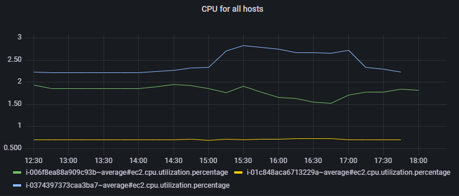
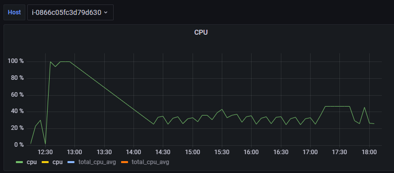

The Centreon plugin for Grafana allows you to view in Grafana data from Centreon platforms. If you are already using Grafana to retrieve data from other monitoring platforms, you will be able to view this data side by side with data from Centreon.

## Prerequisites

To be able to use the Centreon plugin for Grafana, you must have a valid [MBI](../reporting/introduction.md) license, and the module must be installed on your platform.

## Available data

At the moment, you can view the following Centreon data in Grafana:

- Host Groups
- Service Groups
- Hosts
- Services
- Meta-services
- Virtual metrics
- Business Activities (if BAM is installed and you have a license for it)
- Anomaly Detection (if the module is installed and you have a license for it)
- Metrics

Performance data (metrics) are available, but not data such as the status of hosts and services, or acknowledgements and downtimes.

## Where do I find the plugin?

The Centreon plugin for Grafana is available on [Centreon's download page](https://download.centreon.com/).

## Comparing data within a graph

Using the Centreon plugin for Grafana means that all of your performance data is available in Grafana and you can filter it according to specific data groups. For instance, within the same graph, you can compare the evolution of a specific metric for several hosts or for a given host group.

You can use regular expressions to filter on several hosts at once.

## Filtering a whole dashboard using variables

A Grafana dashboard can contain a number of panels. Each panel can display data from a specific source. In that way, you can compare data relating to the same host but from different sources, e.g. if you are monitoring different data on the same device using several tools. 

[Variables](https://grafana.com/docs/grafana/latest/variables/) allow you to create dropdown lists that will filter the whole dashboard. For instance, create a variable on hosts so that you can display data relating to one specific host at a time in the dashboard. If you use filters in the variable, you can limit the number of hosts that can be displayed.
 

