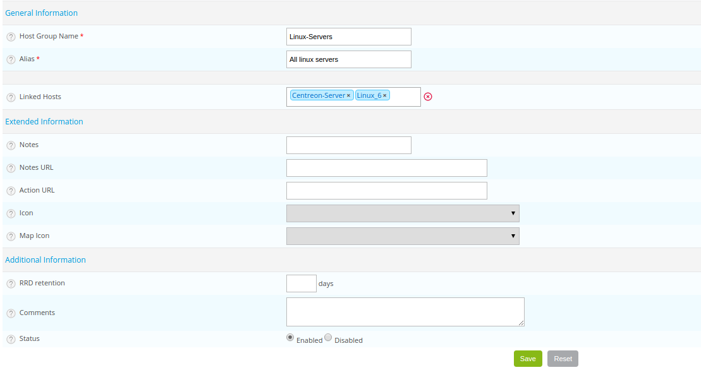

## Description

In Centreon, it is possible to group together one or more objects within different groups:

* *[Host Groups](#hosts-group)*
* *[Service Groups](#services-group)*
* *[Contact Groups](#contacts-group)*

It is also possible to create categories of *[hosts](#hosts-category)* or *[services](#services-category)*.

### Groups

Generally speaking, the groups are containers in which sets of objects having a common property can be grouped together:

* Same material identity (Dell, HP, IBM, etc., servers), logical identity (network equipment) or geographical identity
  (Europe, Asia, Africa, North America, etc.)
* Belonging to the same application (CMS application, etc.) or to a same sector of activity (Salary management, etc.)
* Etc.

#### Service Groups and Host Groups

Host groups and service groups are used to group together objects by logical entities. They are used to:

* Configure ACLs to link a set of resources to a type of profile
* Allow viewing of availability reports per group. Generate a “Paris Agency” availability report for resources.
* Enable viewing the status of a set of objects by selecting in the search filters of a group of objects
* Search several performance graphs quickly by browsing the object tree structure by group and then by resource

Generally speaking, we try to group together hosts by functional level. E.g.: DELL and HP hosts or Linux, Windows,
etc., hosts. 
We also try to group services by application jobs. E.g.: Salary management application, ERP Application, etc.

> For the hosts belonging to a host group, the retention of RRD files can be defined in the host group. This definition
> overrides the global definition. In the event that the same host belongs to several groups each possessing a
> retention definition, the highest value will be selected for the host.

#### Contact Groups

Contact Groups are used to notify contacts:

* On definition of a host or of a service
* On definition of an escalation of notifications

In addition, the groups of contacts are also used during the definition of an access group.

Consequently, it is necessary to group together contacts in a logical way. Most of the time, they are grouped together
according to their roles in the information systems. E.g.: DSI, Windows Administrators, Linux Administrators, Person
in charge of the application of Salary Management, etc.

### Categories

Generally speaking, the categories serve either to define a criticality level for a host or a service, or to group
together technically a set of objects (services linked to the execution of a request on a MariaDB DBMS, etc.).
Good practice requires that we group hosts or services together into categories to facilitate the filtration of these
objects in ACL.
The categories are also used to define types of objects in the Centreon MAP module or to classify the objects within
sub-groups in the Centreon BI module.

## Configuration

### Hosts Group

Go to the **Configuration > Hosts > Host Groups** menu and click on **Add**

* The **Host Group Name** and **Alias** defines the name and the alias of the host group.
* The **Linked Hosts** list allows us to add hosts in the hostgroup.
* The **Notes** field allows us to add optional notes concerning the host group.
* The **Notes URL** field defined a URL which can be used to give more information on the hostgroup.
* The **Action URL** field defined a URL normally use to give information on actions on the hostgroup (maintenance, etc.).
* The **Icon** field indicates the icon to be use for the host group.
* The **Map Icon** is the icon use for mapping.
* The **RRD retention** field is expressed in days, it serves to define the duration of retention of the services
  belonging to this hostgroup in the RRD database. It will be the default duration defined in the
  **Administration > Options > CentStorage** menu if this value is not defined.
* The **Status** and **Comments** fields allow to enable or disable the host group and to make comments on it.

### Services Group

Go to the **Configuration > Services > Service Groups** menu and click on **Add**

* The **Service Group Name** and **Description** fields describes the name and the description of the service group.
* The **Linked Host Services** list allows us to choose the various services that will be included in this group.
* The **Linked Host Group Services** list allows us to choose the services linked to a host group that will be part
  of this group.
* The **Linked Service Templates** list allows to deploy a service based on this template on all hosts linked to this group.
* The **Status** and **Comments** fields allow to enable or disable the service group and to make comment on it.

### Contacts Group

Go to the **Configuration > Users > Contact Groups** menu and click on **Add**

* The **Contact Group Name** and **Alias** fields define the name and the description of the contact group.
* The **Linked Contacts** list allows us to add contacts to the contact group.
* The **Status** and **Comment** fields allow to enable or disable the group of contacts and to make comment on it.

### Hosts category

Go to the **Configuration > Hosts > Categories** menu and click on **Add**

* The **Host Category Name** and **Alias** fields contain respectively the name and the alias of the category of host.
* The **Linked hosts** list allows us to add hosts to the category.
* If a host template is added to **Linked host template** list all the hosts which inherit from this Model belong to
  this category.
* The **Severity type** box signifies that the category of hosts has a criticality level.
* The **Level** and **Icon** fields define a criticality level and an associated icon respectively.
* The **Status** and **Comment** fields allow us to enable or disable the category of host and to comment on it.

### Services category

Go to the **Configuration > Services > Categories** menu and click on **Add**

* The **Name** and **Description** fields define the name and the description of the category of service.
* If a service template is added to **Service Template Descriptions** list all the services which inherit from this
  template belong to this category. 
* The **Severity type** box signifies that the category of service has a criticality level.
* The **Level** and **Icon** fields define a criticality level and an associated icon respectively.
* The **Status** field allows us to enable or disable the category of services.
