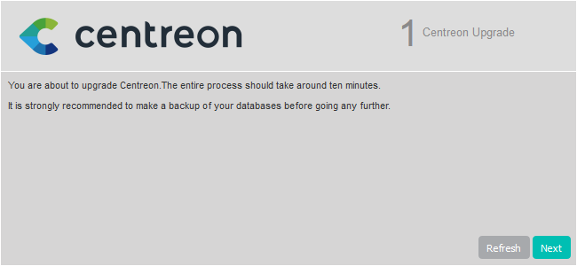
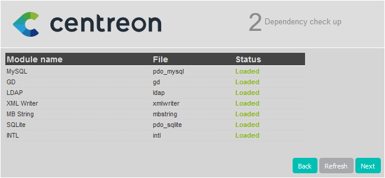

import Tabs from '@theme/Tabs';
import TabItem from '@theme/TabItem';

This chapter describes how to upgrade your Centreon platform from version 20.10
to version 22.04.

> If you want to migrate your Centreon server to Oracle Linux / RHEL 8
> you need to follow the [migration procedure](../migrate/migrate-from-20-x.md)

> To perform this procedure, your MariaDB version must be >= 10.3.22.
> If not, please follow [this](./upgrade-from-19-10.md#upgrade-mariadb-server)
> procedure in order to update MariaDB before you can continue with the upgrade
> from version 20.10 to version 21.04 as described by this document.

> Warning, following the correction of a problem relating to the database schema, it will be necessary to stop the 
> insertion of the data collected into the database during the update. These will be stored in temporary files and then
> installed at the end of the update process.

## Prerequisites

### Perform a backup

Be sure that you have fully backed up your environment for the following
servers:

- Central server
- Database server

### Update the RPM signing key

For security reasons, the keys used to sign Centreon RPMs are rotated regularly. The last change occurred on October 14, 2021. When upgrading from an older version, you need to go through the [key rotation procedure](../security/key-rotation.md#existing-installation), to remove the old key and install the new one.

### Update to the latest minor version

Update your platform to the latest available minor version of Centreon 20.10.

## Upgrade the Centreon Central server

> Since 21.04, Centreon uses **MariaDB 10.5**.
>
> This upgrade process will only upgrade Centreon components first.
>
> MariaDB will be upgraded afterwards.

### Update the Centreon repository

Run the following commands:

<Tabs groupId="sync">
<TabItem value="Alma / RHEL / Oracle Linux 8" label="Alma / RHEL / Oracle Linux 8">

```shell
dnf install -y https://yum.centreon.com/standard/22.04/el8/stable/noarch/RPMS/centreon-release-22.04-3.el8.noarch.rpm
```

</TabItem>
<TabItem value="CentOS 7" label="CentOS 7">

```shell
yum install -y https://yum.centreon.com/standard/22.04/el7/stable/noarch/RPMS/centreon-release-22.04-3.el7.centos.noarch.rpm
```

</TabItem>
</Tabs>

> If you are using a Business edition, install the correct Business repository too. You can find it on the [support portal](https://support.centreon.com/s/repositories).

### Upgrade PHP

Centreon 22.04 uses PHP in version 8.0.

<Tabs groupId="sync">
<TabItem value="Alma / RHEL / Oracle Linux 8" label="Alma / RHEL / Oracle Linux 8">

First, you need to install the **remi** repository:
```shell
dnf install -y dnf-plugins-core
dnf install -y https://dl.fedoraproject.org/pub/epel/epel-release-latest-8.noarch.rpm
dnf install -y https://rpms.remirepo.net/enterprise/remi-release-8.rpm
dnf config-manager --set-enabled 'powertools'
```
Then, you need to change the PHP stream from version 7.2 to 8.0 by executing the following commands and answering **y**
to confirm:
```shell
dnf module reset php
dnf module install php:remi-8.0
```

</TabItem>
<TabItem value="CentOS 7" label="CentOS 7">

First, you need to install the **remi** repository:
```shell
yum install -y yum-utils
yum install -y https://dl.fedoraproject.org/pub/epel/epel-release-latest-7.noarch.rpm
yum install -y https://rpms.remirepo.net/enterprise/remi-release-7.rpm
```
Then, you need to enable the php 8.0 repository
```shell
yum-config-manager --enable remi-php80
```

</TabItem>
</Tabs>

### Upgrade the Centreon solution

> Make sure all users are logged out from the Centreon web interface
> before starting the upgrade procedure.

If you have installed Business extensions, update the Business repository to version 22.04.
Visit the [support portal](https://support.centreon.com/s/repositories) to get its address.

Stop the Centreon Broker process:
```shell
systemctl stop cbd
```

Delete existing retention files:
```shell
rm /var/lib/centreon-broker/* -f
```

Clean yum cache:

```shell
yum clean all --enablerepo=*
```

Then upgrade all the components with the following command:

```shell
yum update centreon\*
```

> Accept new GPG keys from the repositories as needed.

<Tabs groupId="sync">
<TabItem value="Alma / RHEL / Oracle Linux 8" label="Alma / RHEL / Oracle Linux 8">

Execute the following commands:
```shell
systemctl enable php-fpm
systemctl restart php-fpm
```

</TabItem>
<TabItem value="CentOS 7" label="CentOS 7">

The PHP timezone should be set. Run the command:
```shell
echo "date.timezone = Europe/Paris" >> /etc/php.d/50-centreon.ini
```

> Replace **Europe/Paris** by your time zone. You can find the list of
> supported time zones [here](http://php.net/manual/en/timezones.php).

Execute the following commands:
```shell
systemctl stop rh-php72-php-fpm
systemctl disable rh-php72-php-fpm
systemctl enable php-fpm
systemctl start php-fpm
```

Or, if you have PHP 7.4:
```shell
systemctl stop rh-php74-php-fpm
systemctl disable rh-php74-php-fpm
systemctl enable php-fpm
systemctl start php-fpm
```

</TabItem>
</Tabs>

### Update your customized Apache configuration

This section only applies if you customized your Apache configuration. When upgrading your platform, the Apache configuration file is not upgraded automatically: the new configuration file brought by the rpm does not replace tha old file. You must copy the changes manually to your customized configuration file.

Run a diff between the old and the new Apache configuration files:

```
diff -u /opt/rh/httpd24/root/etc/httpd/conf.d/10-centreon.conf /opt/rh/httpd24/root/etc/httpd/conf.d/10-centreon.conf.rpmnew
```

* **10-centreon.conf** (post upgrade): this file contains the custom configuration. It does not contain anthing new brought by the upgrade, e.g. the **authentication** string in the **LocationMatch** directive
* **10-centreon.conf.rpmnew** (post upgrade): this file is provided by the rpm; it contains the **authentication** string, but does not contain any custom configuration.

For each difference between the files, assess whether you should copy it from **10-centreon.conf.rpmnew** to **10-centreon.conf**.

In particular, make sure your customized Apache configuration contains the following directive (with **authentication**).

```
<LocationMatch ^\${base_uri}/?(authentication|api/(latest|beta|v[0-9]+|v[0-9]+\.[0-9]+))/.*$>
    ProxyPassMatch "fcgi://127.0.0.1:9042${install_dir}/api/index.php/$1"
</LocationMatch>
```

### Finalizing the upgrade

<Tabs groupId="sync">
<TabItem value="Alma / RHEL / Oracle Linux 8" label="Alma / RHEL / Oracle Linux 8">

Before starting the web upgrade process, reload the Apache server with the
following command:
```shell
systemctl reload httpd
```

</TabItem>
<TabItem value="CentOS 7" label="CentOS 7">

Before starting the web upgrade process, reload the Apache server with the
following command:
```shell
systemctl reload httpd24-httpd
```

</TabItem>
</Tabs>

Then log on to the Centreon web interface to continue the upgrade process:

Click on **Next**:



Click on **Next**:



The release notes describe the main changes. Click on **Next**:


This process performs the various upgrades. Click on **Next**:


Your Centreon server is now up to date. Click on **Finish** to access the login
page:


If the Centreon BAM module is installed, refer to the
[upgrade procedure](../service-mapping/upgrade.md).

### Post-upgrade actions

1. Upgrade extensions. From **Administration > Extensions > Manager**, upgrade all extensions, starting
with the following:

    - License Manager,
    - Plugin Packs Manager,
    - Auto Discovery.

    Then you can upgrade all other commercial extensions.

2. [Deploy the configuration](../monitoring/monitoring-servers/deploying-a-configuration.md).

3. Restart the processes:
    ```shell
    systemctl restart cbd centengine centreontrapd gorgoned
    ```

### Upgrade the MariaDB server

The MariaDB components can now be upgraded.

> Refer to the official MariaDB documentation to know more about this process:
>
> https://mariadb.com/kb/en/upgrading-between-major-mariadb-versions/

#### Update the Centreon repository

> This step is required ONLY when your environment features an architecture with
> a dedicated remote DBMS. If your environment features Centreon Central and
> MariaDB together on the same server, you SHOULD simply skip this step.

Run the following command on the dedicated DBMS server:

<Tabs groupId="sync">
<TabItem value="Alma / RHEL / Oracle Linux 8" label="Alma / RHEL / Oracle Linux 8">

```shell
dnf install -y https://yum.centreon.com/standard/22.04/el8/stable/noarch/RPMS/centreon-release-22.04-3.el8.noarch.rpm 
```

</TabItem>
<TabItem value="CentOS 7" label="CentOS 7">

```shell
yum install -y https://yum.centreon.com/standard/22.04/el7/stable/noarch/RPMS/centreon-release-22.04-3.el7.centos.noarch.rpm
```

</TabItem>
</Tabs>

#### Upgrading MariaDB

You have to uninstall then reinstall MariaDB to upgrade between major versions (i.e. to switch from version 10.3 to version 10.5).

1. Stop the mariadb service:

    ```shell
    systemctl stop mariadb
    ```

2. Uninstall the current version:

    ```shell
    rpm --erase --nodeps --verbose MariaDB-server MariaDB-client MariaDB-shared MariaDB-compat MariaDB-common
    ```

3. Install version 10.5:

    ```shell
    yum install MariaDB-server-10.5\* MariaDB-client-10.5\* MariaDB-shared-10.5\* MariaDB-compat-10.5\* MariaDB-common-10.5\*
    ```

4. Start the mariadb service:

    ```shell
    systemctl start mariadb
    ```

5. Launch the MariaDB upgrade process:

    ```shell
    mysql_upgrade
    ```
    
    If your database is password-protected, enter:

    ```shell
    mysql_upgrade -u <database_admin_user> -p
    ```

    Example: if your database_admin_user is `root`, enter:

    ```
    mysql_upgrade -u root -p
    ```

    > Refer to the [official documentation](https://mariadb.com/kb/en/mysql_upgrade/)
    > for more information or if errors occur during this last step.

#### Enable MariaDB on startup

Execute the following command:

```shell
systemctl enable mariadb
```

## Upgrade the Remote Servers

This procedure is the same as for upgrading a Centreon Central server.

> At the end of the update, configuration should be deployed from the Central server.

## Upgrade the Pollers

### Update the Centreon repository

Run the following command:

<Tabs groupId="sync">
<TabItem value="Alma / RHEL / Oracle Linux 8" label="Alma / RHEL / Oracle Linux 8">

```shell
dnf install -y https://yum.centreon.com/standard/22.04/el8/stable/noarch/RPMS/centreon-release-22.04-3.el8.noarch.rpm
```

</TabItem>
<TabItem value="CentOS 7" label="CentOS 7">

```shell
yum install -y https://yum.centreon.com/standard/22.04/el7/stable/noarch/RPMS/centreon-release-22.04-3.el7.centos.noarch.rpm
```

</TabItem>
</Tabs>

### Upgrade the Centreon solution

Clean yum cache:

```shell
yum clean all --enablerepo=*
```

Upgrade all the components with the following command:

```shell
yum update centreon\*
```

> Accept new GPG keys from the repositories as needed.

Start and enable **gorgoned**:

```shell
systemctl start gorgoned
systemctl enable gorgoned
```