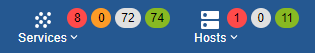
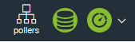

You can grant rights to Centreon [users](../monitoring/basic-objects/contacts.md):

- on resources: which hosts, services, etc. users will be allowed to see
- on the menus in the Centreon interface (which pages users will be able to access)
- on actions users will be allowed to carry out, on resources or on a monitoring engine (planning a downtime, exporting the configuration...).

Rights are not defined at user level but through [access groups](#creating-an-access-group).

- A specific user can belong to several access groups: the rights defined in each group will be combined.
- Non-administrator users that belong to no access group will have no rights at all on the monitoring platform (empty screen at login)
- [Administrator](../monitoring/basic-objects/contacts-create.md#centreon-authentication) users have all rights (even if you add an administrator to an access group with limited rights).

ACLs are recalculated every minute; this is why it is sometimes necessary
to wait a few seconds before changes are applied to a user. You can also [reload them](#reload-acl) manually.

> The Centreon [MBI](../reporting/configure.md), BAM and [MAP](../graph-views/configuration.md) modules have their own ACLs.

## Granting rights to a user

To grant rights to a user:

1. [Create the user](../monitoring/basic-objects/contacts.md) in Centreon.

2. [Create an access group](#creating-an-access-group).

3. Add the user to the access group.

4. Create access filters on [resources](#access-filters-on-resources), [menus](#access-filters-on-menus) and [actions](#access-filters-on-actions).

5. Set the rights you want:
    - either on the access group
    - or on the access filters on resources, menus and actions.

## Creating an access group

To create an access group:

1. Go to **Administration > ACL > Access groups** and then click **Add**.

2. On the **Group information** tab, enter a name and an alias (a description) for the group.

3. To add users (contacts) or contact groups to the access group, use the **Linked Contacts/Linked Contact Groups** table. (Select the user(s) you want in the **Available** column, and then click **Add**. The user(s) is moved to the **Selected** column.)

    > The contact group can be groups coming from the LDAP directory connected to the
    > Centreon interface.
    >
    > Groups created in the Centreon interface should not have the same name as LDAP
    > groups to avoid problems.

4. On the **Authorizations information** tab, set the rights you want on the access group
by choosing access filters on [resources](#access-filters-on-resources), [menus](#access-filters-on-menus) and [actions](#access-filters-on-actions) (if you have already created them).

5. Click **Save**.

## Creating access filters on resources, menus and actions

### Access filters on resources

The access filters on resources allow you to define which objects (hosts, host groups, services and service groups) users will be able to see in the Centreon interface.

To create an access filter on resources:

1. Go to **Administration > ACL > Resources Access**.

2. Click  **Add**.

3. Fill in the fields you want (see table below).

4. Click **Save**.

> Once the filters on the resources are defined, you can view the results
> using the **Check User View** button on page **Administration > ACL > Resources Access**.

#### Reference

| Tab                 | Actions                                                                                                                                                         |
|------------------------|------------------------------------------------------------------------------------------------------------------------------------------------------------------------------------------------------------------------------------------------------------------------------------------------------------------------------------------------------------------------------------------------------------------------------------------------------------------------------------------------------------------------------------------------------------------------------------------------|
| **General Information** | <ul> <li>Use the **Linked groups** table to link access groups to the filter on resources, i.e. grant the rights defined in the filter to the access group.</li><li>**Status** and **Comments** allow you to enable/disable the filter or to add comments to it.</li></ul>                                                                                                                                                                                                                |
| **Hosts Resources**    | <ul><li>Define which hosts and hosts groups users will be able to see in the Centreon interface.</li><li>If **Include all hosts** or **Include all hostgroups** is selected, any newly created host or host group will be added to the filter automatically.</li></ul>   
When **Include all hosts** or **Include all hostgroups** is selected, you can explicitly exclude hosts from the filter (e.g. when only 1 or 2 hosts should not be included in the filter). 
                                                                       |
| **Services resources** | The **Services resources** tab allows you to define which service groups users will be allowed to see.                                                                                                                             |
| **Meta Services**       | The **Meta Services** tab allows you to define which meta services users will be able to see.                                                                                                                             |
| **Filters**                | <ul><li>The **Poller Filter** table allows you to select hosts supervised by a specific monitoring engine (if no poller is selected, then all pollers are taken into account)</li><li>The **Host Category Filter** table allows you to filter the hosts by category</li><li>The **Service Category Filter** table allows you to filter services by category. Filters by poller or by category of objects are inclusion filters (UNION). Only the objects belonging to these filters in addition to groups of objects (hosts and services) will be visible.</li></ul> |

### Access filters on menus

Access filters on menus allow you to define which pages in the Centreon interface users will be able to access.

> Accessing the command editing menu, as well as accessing the SNMP trap editing
> menu can be very dangerous. Indeed, privileged users can create commands,
> which may lead to the creation of security breaches (RCE). Only give this access
> to people you trust.

To create an access filter on menus:

1. Go to **Administration > ACL > Menus Access**.

2. Click **Add**.

3. Fill in the following fields:
    - **ACL Definition** (its name) and **Alias**
    - **Status**: enable or disable the filter
    - **Comments**: add info about the filter.

4. To grant access groups the rights defined in this filter, use the **Linked groups** table.

5. In the **Accessible pages** section, define which menus the access group will be able to access.

   - A parent menu must be selected to access the child menu.
   - By default, access is **Read Only**. If you want to allow your users to modify
the configuration, select the **Read / Write** option for each
submenu.
   - To access an ‘n-1’ menu level, users must have access to the ‘n’ menu level,
 otherwise they will not be able to view the menu via the interface. If this is not
the case, users will have to access the page via a direct link
 (autologin, etc.).
    - Whenever a new Centreon module is created with a web interface accessible
 via a new menu, it should be added to the filter so that users can
access it (if applicable).

6. Click **Save**.

### Access filters on actions

Filters on actions allow you to define which actions users will be allowed to perform
on resources (hosts and services) and on the monitoring engines.

To create an access filter on actions:

1. Go to **Administration > ACL > Actions Access**.
3. Click **Add**.

    - The **Action Name** and **Description** fields contain the name of the
    filter and its description
    - In the **Relations** section, use the **Linked Groups** table to grant access groups the rights defined in the filter.

4. Select the options you want (see tables below).

5. Click **Save**.

#### Global Functionalities Access

| Field                                  | Associated actions                                                               |
| -------------------------------------- | -------------------------------------------------------------------------------- |
| Display Top Counter                    | The monitoring overview will be displayed in the banner at the top of all pages                  |
| Display Top Counter pollers statistics | The monitoring poller status overview will be displayed on the left in the banner at the top of all pages  |
| Display Poller Listing                 | Allows you to filter on the poller on page **Monitoring > Status Details > Hosts** or  **Monitoring > Status Details > Services** (deprecated pages)         |

#### Configuration Actions

| Field                            | Associated actions                                                                                                                   |
| -------------------------------- | ------------------------------------------------------------------------------------------------------------------------------------ |
| Generate Configuration Files     | Allows users to generate, test and export configuration to pollers and to restart the monitoring scheduler                           |
| Generate SNMP Trap configuration | Allows users to generate and export configuration of the SNMP traps for the Centreontrapd process on pollers and to restart it |

#### Global Monitoring Engine Actions (External Process Commands)

These fields are no longer in use.

#### Services Actions Access

| Field                                                         | Associated actions                                                                     |
| ------------------------------------------------------------- | -------------------------------------------------------------------------------------- |
| Enable/Disable Checks for a service                           | Allows users to enable or disable checks for a service on page **Monitoring > Status details > Services** (deprecated page)                           |
| Enable/Disable Notifications for a service                    | Allows users to enable or disable notifications for a service  on page **Monitoring > Status details > Services** (deprecated page)                          |
| Acknowledge a service                                         | Allows users to [acknowledge a service](../alerts-notifications/acknowledge.md)                                                  |
| Disacknowledge a service | Allows users to disacknowledge a service |
| Re-schedule the next check for a service                      | Allows users to [trigger a check on a service](../alerts-notifications/resources-status.md#refresh-a-status). The check is made even outside the service's check period.     |
| Re-schedule the next check for a service (Forced)             | Allows users to [trigger a check on a service](../alerts-notifications/resources-status.md#refresh-a-status). The check is made even outside the service's check period.  |
| Schedule downtime for a service                               | Allows users to [schedule downtime](../alerts-notifications/downtimes.md) on a service                                         |
| Add/Delete a comment for a service                            | Allows users to add or delete a [comment](../alerts-notifications/other.md#adding-a-comment) on a service                                   |
| Enable/Disable Event Handler for a service                    | Allows users to enable or disable the event handler processing of a service in the detailed sheet of a service accessible via the **Monitoring > Status Details > Services** menu (deprecated page)           |
| Allows users to enable or disable flap detection of a service | Allows users to enable or disable flap detection of a service in the detailed sheet of a service accessible via the **Monitoring > Status Details > Services** menu (deprecated page)                          |
| Enable/Disable passive checks of a service                    | Allows users to enable or disable passive checks of a service in the detailed sheet of a service accessible via the **Monitoring > Status Details > Services** menu (deprecated page)                         |
| [Submit result](../alerts-notifications/submit.md) for a service                                   | Allows users to modify the status of a passive service manually, until the next check                                             |
| Display executed command by monitoring engine                 | Displays the executed command for a service in its [Details panel](../alerts-notifications/resources-status.md#service-panel)                             |

#### Hosts Actions Access

| Field                                           | Associated actions                                                                  |
| ----------------------------------------------- | ----------------------------------------------------------------------------------- |
| Enable/Disable Checks for a host                | Allows users to enable or disable checks for a host on page **Monitoring > Status details > Hosts** (deprecated page)                                  |
| Enable/Disable Notifications for a host         | Allows users to enable or disable notifications for a host on page **Monitoring > Status details > Hosts** (deprecated page)                          |
| Acknowledge a host                              | Allows users to [acknowledge a host](../alerts-notifications/acknowledge.md)                                                  |
| Disaknowledge a host                            | Allows users to disacknowledge a host                                               |
| Schedule the check for a host                   | Allows users to [trigger a check on a host](../alerts-notifications/resources-status.md#refresh-a-status). The check is made even outside the host's check period.                                     |
| Schedule the check for a host (Forced)          | Allows users to [trigger a check on a host](../alerts-notifications/resources-status.md#refresh-a-status). The check is made even outside the host's check period.   |
| Schedule downtime for a host                    | Allows users to [schedule downtime](../alerts-notifications/downtimes.md) on a host                                         |
| Add/Delete a comment for a host                 | Allows users to add or delete a [comment](../alerts-notifications/other.md#adding-a-comment) for a host                                   |
| Enable/Disable Event Handler for a host         | Allows users to enable or disable the event handler processing of a host on page **Monitoring > Status details > Hosts** (deprecated page)            |
| Enable/Disable Flap Detection for a host        | Allows users to enable or disable flap detection of a host on page **Monitoring > Status details > Hosts** (deprecated page)                         |
| Enable/Disable Checks services of a host        | Allows users to enable or disable all service checks of a host on page **Monitoring > Status details > Hosts** (deprecated page)                     |
| Enable/Disable Notifications services of a host | Allows users to enable or disable service notifications of a host on page **Monitoring > Status details > Hosts** (deprecated page)                  |
| [Submit result](../alerts-notifications/submit.md) for a host   | Allows users to modify the status of a passive host manually, until the next check                                             |

- The **Status** field is used to enable or disable the filter.

## Reload ACL

It is possible of reload the ACLs manually:

1. Go into the menu: `Administration > ACL`
2. In the left menu, click on **Reload ACL**
3. Select the user(s) you want to reload the ACL
4. In the **More actions** menu, click on **Reload ACL**
