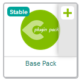
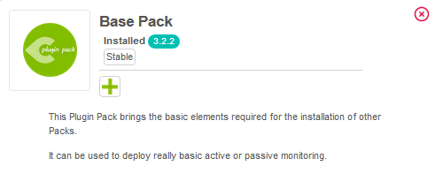

This topic proposes to install the monitoring templates supplied free of charge with the Centreon solution
and then to implement them to monitor your first equipment.

> If you have a license for it, you can use our [Auto Discovery](../monitoring/discovery/introduction.md) feature to find and configure hosts easily. See also our tutorial on [how to detect AWS EC2 instances](autodisco-aws.md).

### Installation of basic monitoring templates

Go to the **Configuration \> Plugin Packs** menu.

> [Configure the proxy](../administration/parameters/centreon-ui.md#proxy-configuration) to allow the Centreon server to access the internet.

Install the **Base Generic** Plugin Pack (if it is not already installed) by moving your cursor on it and by clicking on the **+** icon (it is a prerequisite
to the installation of any other Plugin Packs):

You can also click on the Plugin Pack in order to know its content before installing it:

Install other Plugin Packs you probably need for your environment, for example **Linux SNMP** and **Windows SNMP** available
for free:

Now you have the basic templates and plugins to start monitoring hosts!

## Start to monitor your first host

### Monitor Printer equipment with SNMP

Go to the **Configuration \> Plugin Packs** menu and install **Printer Standard** Plugin Pack:

Go to the **Configuration \> Hosts \> Hosts** menu and click on **Add**:

Fill in the following information:

* The name of the server
* A description of the server
* The IP address
* The SNMP version and community

Click on **+ Add a new entry** button in **Templates** field, then select the **HW-Printer-standard-rfc3805-custom**
template in the list.

Click on **Save**.

Your equipment has been added to the monitoring configuration:

Go to **Configuration \> Services \> Services by host** menu. A set of indicators has been automatically deployed:

It is now time to [deploy the supervision](#deploying-a-configuration).

Then go to the **Monitoring \> Status Details \> Services** menu and select **All** value for the **Service Status**
filter. After a few minutes, the first results of the monitoring appear:

### Monitor UPS equipment with SNMP

Go to the **Configuration \> Plugin Packs** menu and install **UPS Standard** Plugin Pack:

Go to the **Configuration \> Hosts \> Hosts** menu and click on **Add**:

Fill in the following information:

* The name of the server
* A description of the server
* The IP address
* The SNMP version and community

Click on **+ Add a new entry** button in **Templates** field, then select the **HW-UPS-Standard-Rfc1628-SNMP-custom**
template in the list.

Click on **Save**.

Your equipment has been added to the monitoring configuration:

Go to **Configuration \> Services \> Services by host** menu. A set of indicators has been automatically deployed:

It is now time to [deploy the supervision](#deploying-a-configuration).

Then go to the **Monitoring \> Status Details \> Services** menu and select **All** value for the **Service Status**
filter. After a few minutes, the first results of the monitoring appear:

## Deploying a configuration

On creation/deletion/change of objects via the configuration interface, the changes performed are not applied
automatically to the monitoring engine. To apply the changes performed, it is necessary to follow the procedure below.

1. Go to **Configuration \> Pollers > Pollers**.
2. Select the pollers whose configuration you want to export.
3. Click on **Export configuration**.

    

4. Check the following boxes:
    - **Generate Configuration Files**
    - **Run monitoring engine debug (-v)**
    - **Move Export Files**
    - **Restart Monitoring Engine**.

5. Click **Export**.

    

6. Check that no errors appear during generation.
