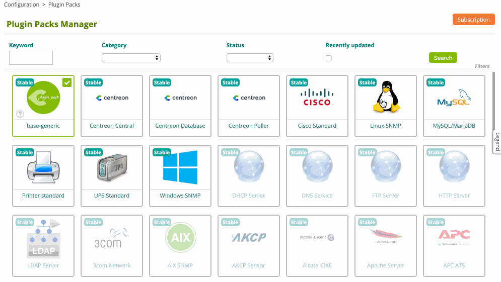
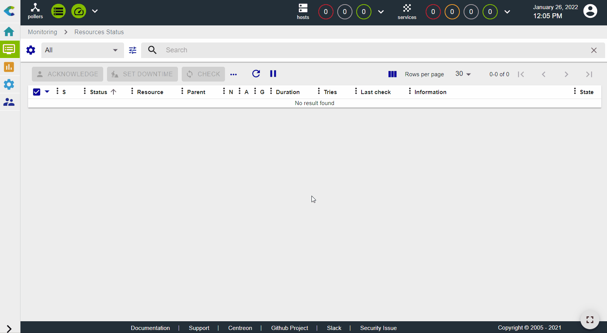
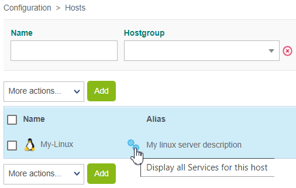

## Monitoring a Linux server with SNMP

In this tutorial, we're assuming that your Centreon platform is installed and running well, and that you have at least a [Centreon IT 100 Edition](it100.md) that provides Centreon Plugin Packs (your [license](../administration/licenses.md) is already set up).

Your Linux server will be monitored using the [Linux SNMP Plugin Pack](/monitoring-connectors/integrations/plugin-packs/procedures/operatingsystems-linux-snmp). (More about Plugin Packs [here](../monitoring/pluginpacks.md)).

## Prerequisites

### On the Linux server you want to monitor

The first step is to activate and configure an SNMP agent on your monitored host.
Please refer to the documentation of your Linux distribution to know how to configure the SNMP agent.

Find below a minimalist snmpd.conf/net-snmp configuration file:

- replace the **agentaddress** line by the appropriate address of the interface which snmpd listens on
- replace **my-snmp-community** by the correct value for your environment.
- Add the line **view  centreon  included .1.3.6.1** to have access to all information in the MIB required by the plugin

```shell
agentaddress 0.0.0.0,[::]

#       sec.name  source          community
com2sec notConfigUser  default       my-snmp-community

####
# Second, map the security name into a group name:

#       groupName      securityModel securityName
group   notConfigGroup v1           notConfigUser
group   notConfigGroup v2c           notConfigUser

####
# Third, create a view for us to let the group have rights to:

# Make at least  snmpwalk -v 1 localhost -c public system fast again.
#       name           incl/excl     subtree         mask(optional)
view centreon included .1.3.6.1
view    systemview    included   .1.3.6.1.2.1.1
view    systemview    included   .1.3.6.1.2.1.25.1.1

####
# Finally, grant the group read-only access to the systemview view.

#       group          context sec.model sec.level prefix read   write  notif
access notConfigGroup "" any noauth exact centreon none none
access  notConfigGroup ""      any       noauth    exact  systemview none none

```

The SNMP server must be restarted each time the configuration is modified. Also make sure that the SNMP server is configured to automatically start on boot. Use the following commands for recent distributions:

```shell
systemctl restart snmpd
systemctl enable snmpd
```

> The target server must be reachable from the Centreon Poller on the UDP/161 SNMP port.

### On the poller

Connect to your poller using SSH and install the Linux SNMP plugin (see the [monitoring procedure for the **Linux SNMP** Plugin Pack](/monitoring-connectors/integrations/plugin-packs/procedures/operatingsystems-linux-snmp) for more information):

   ```shell
   yum install centreon-plugin-Operatingsystems-Linux-Snmp
   ```

### On the central server

In the web interface, go to **Configuration > Plugin Packs** and install the **Linux SNMP** Plugin Pack:

   

## Configure the host and deploy the configuration

1. Go to **Configuration > Hosts > Hosts** and click on **Add**:

   

2. Fill in the following information:

   * The name of the server (1)
   * A description of the server (2)
   * Its IP address (3)
   * The SNMP version and community (4)
   * Select the poller that will monitor your Linux server (keep "Central" if you have no other poller) (5)

3. Click on **+ Add a new entry** in the **Templates** field (6), then select the **OS-Linux-SNMP-custom** template (7) from the list:

   

4. Click on **Save** (8). Your equipment has been added to the list of hosts:

   

5. Go to **Configuration > Services > Services by host**. A set of indicators has been created automatically.

   

   You can also use the shortcut beside the host's name to go directly to **Configuration > Services > Services by host**. The list will be filtered by the name of the host:

   

   

6. [Deploy the configuration](../monitoring/monitoring-servers/deploying-a-configuration.md).

7. Go to **Monitoring > Resources Status** and select **All** from the **Resource status** filter. At first, the resources appear with the status **Pending**, which means that no checks have been executed yet:

   

   After a few minutes, the first results of the monitoring appear:

   

   If not all services are in an OK state, check what causes the error and fix the problem.
