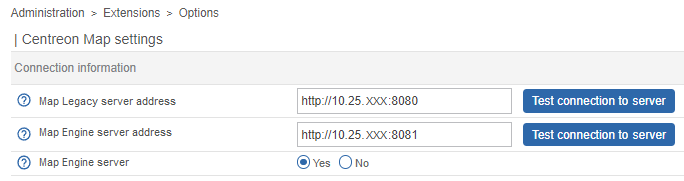
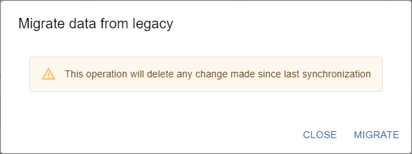
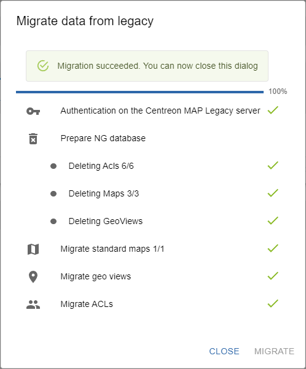

This topic describes how to move from Centreon MAP (Legacy) to Centreon MAP and how to import your legacy maps into your MAP module.

> Centreon MAP must be installed on your environment. See the [MAP installation](map-web-install.md) procedure if needed.

## Switching from Legacy to MAP

1. Log in to Centreon web interface.

2. Go to the **Administration > Extensions > Map > Options** page.

3. In the **Connection information** section, set the **Map Engine server** to **Yes**. Then click **Save**.

  

## Importing legacy maps into MAP

> When you import your legacy maps, any content created in MAP is deleted.

### Step 1: Migrate images

If you have imported images into your desktop client (to custom folders outside the Centreon folder), and used them in your maps, you need first to migrate them to your central server.

1. In the MAP (Legacy) desktop client, in the **Media** panel, select all images you want to migrate from your custom folders, then right-click them and select **Export**.

2. Save the images to your computer.

3. In the central server, go to **Administration > Parameters > Images**, then upload all the images from your computer to the **centreon-map** folder. Be careful not to change the name of your images during this process.

### Step 2: Update MAP (Legacy)

For the icons to be displayed properly after you migrate your maps, you need to update your MAP (legacy) by running the following commands:

```shell
systemctl stop centreon-map
yum update centreon-map-server
systemctl daemon-reload
systemctl start centreon-map
```

### Step 3: Migrate maps

1. To import your legacy maps into MAP, go to the **Monitoring > Map** page, then click the **Migrate** button. The following window appears:

  

2. Click **Migrate**.
 
  

3. When the migration succeeded, you can close the window.

  Your legacy maps are now displayed on the **Map** page. 
