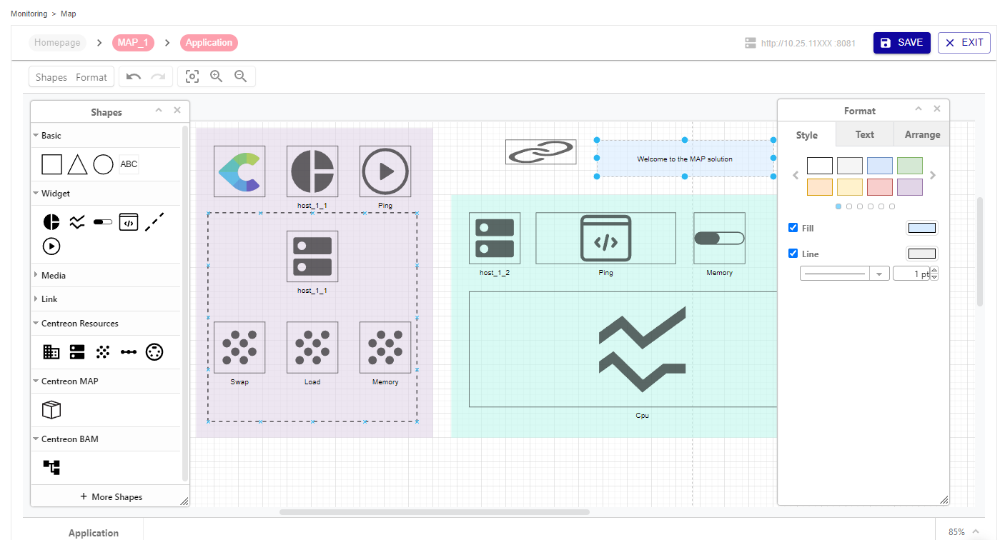
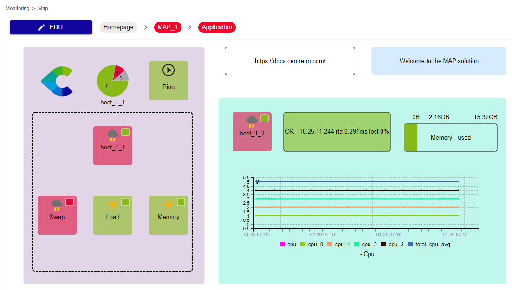

Centreon MAP is a solution fully available in the Centreon web interface while offering you the best possible experience in creating, visualizing and sharing graphical representations of your monitored infrastructure.

The difference with the MAP (Legacy) version is that MAP provides you with an edition tool fully embedded in the web interface. You do not need to install anything on your desktop. You can navigate easily between the edition mode and the view mode.

> If you already used the MAP (Legacy) version, note that you can easily import your legacy maps into the MAP interface.

## Overview

Create, customize, and visualize your maps within a single web interface.

You need first to create your logical views using the MAP editor:

Then you can visualize your map directly in the view mode:

## Procedures

Use the following procedures to use and administrate Centreon MAP:

### Administrating MAP
  - [Install MAP](map-web-install.md) describes prerequisites and procedures to install MAP.
  - [Install MAP on a remote server](map-web-install-remote.md) explains how to install MAP on a remote server.
  - [Update MAP](map-web-update.md) describes the update process of MAP.
  - [Import legacy maps into MAP](import-into-map-web.md) explains how to migrate your legacy maps into the MAP interface.
  - [Install on a remote server](remote-server.md) explains how to install MAP on a remote server.
  - [Manage access rights on MAP](map-web-manage.md) describes the different rights and permissions on maps.
  - [MAP known issues](map-web-known-issues.md) is a list of issues you may encounter using MAP.
  - [MAP troubleshooting](map-web-troubleshooting.md) helps you to solve some issues occuring in MAP.

### Using MAP
  - [Manage maps on MAP](map-web-manage.md) gives you information about how to create and manage maps from the Centreon MAP interface.
  - [Use the map editor](map-web-editor.md) explains how to build maps using the editor tool.
