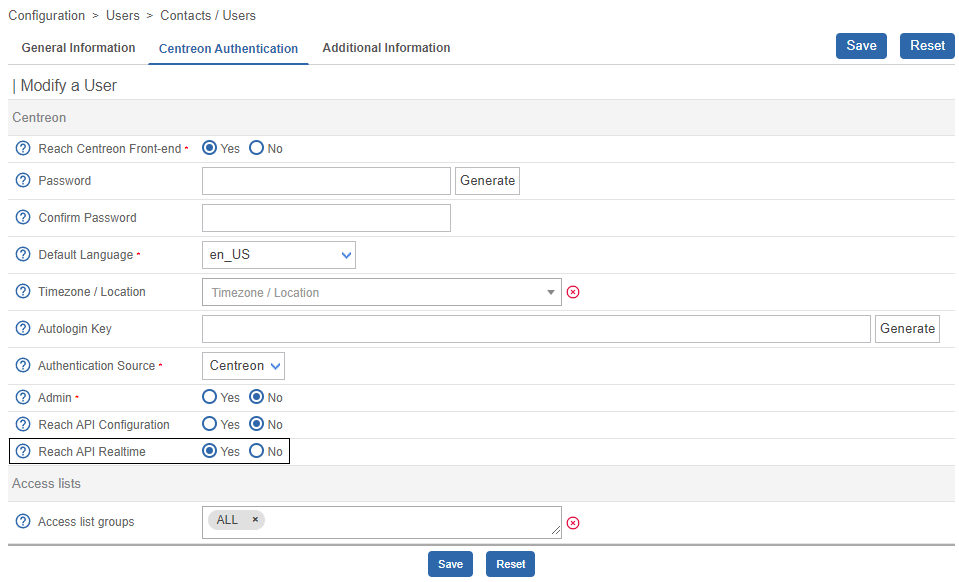
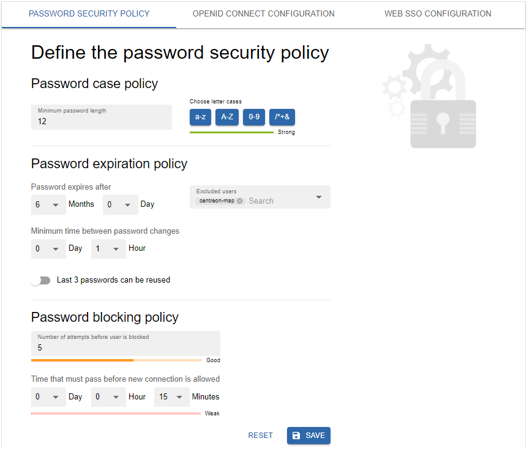

import Tabs from '@theme/Tabs';
import TabItem from '@theme/TabItem';

This topic describes how to install Centreon MAP. It is recommended to install MAP on the central server. However, if you have large volumes of data, you can install it on your legacy MAP server. The MAP module does not use the **centreon_studio** database.

## License

If you need an additional [license](../administration/licenses.md) for Centreon MAP, please contact the [Centreon support
team](https://support.centreon.com/) to get and install your license key.

## Architecture

The diagram below summarizes the MAP architecture:


**Table of network flow**

| Application    | Source     | Destination               | Port      | Protocol   | Purpose                                             |
|----------------|------------|---------------------------|-----------|------------|-----------------------------------------------------|
| Map Server     | Map server | Centreon central broker   | 5758      | TCP        | Get real-time status updates                        |
| Map Server     | Map server | Centreon MariaDB database | 3306      | TCP        | Retrieve configuration and other data from Centreon |
| Web            | Map server | Centreon central          | 80/443    | HTTP/HTTPS | Authentication & data retrieval                     |
| Web interface  | User       | Map server                | 8081/9443 | HTTP/HTTPS | Retrieve views & content                            |
| Web interface  | User       | Internet\* (Mapbox)       | 443       | HTTPS      | Retrieve Mapbox data                                |

\* *With or without a proxy*

## Prerequisites

### Centreon MAP Engine server

#### License

The server requires the license to be available and valid on Centreon's central
server. To do this, you must contact the [Centreon support
team](https://support.centreon.com/) to get and install your license key.

#### Software

- OS: CentOS 7 or Redhat 7 / 8
- DBMS: MariaDB 10.5
- Firewall: Disabled
- SELinux: Disabled

#### Information required during configuration

- Centreon web login with administration rights.

> Even with a correctly sized server, you should have in mind the best
> practices and recommendations when creating views so you do not face
> performance issues.

### Centreon MAP web client

#### License

The web interface requires the license to be available and valid on Centreon's
central server. To do this, you must contact the [Centreon support
team](https://support.centreon.com/) to get and install your license key.

#### Compatibility

Note that the MAP web interface has the same requirements as the Centreon web interface. See the prerequisites for the web browsers compatibility [here](../installation/prerequisites.md).

## Server installation

### Centreon MAP interface

You must provide to Centreon MAP Engine server a dedicated user
**who has access to all resources** through the appropriate [access list groups](../administration/access-control-lists.md). 
Since the password will be stored in human-readable form in a 
configuration file, you should not use a Centreon admin user account.

- Go to the **Configuration > Users > Contacts/Users** page. Then click the **Centreon Authentication** tab.
- Set the **Reach API Realtime** parameter to **Yes**.



Exclude the user from the password expiration policy on page **Administration > Authentication**: their password will never expire.



### Centreon central server

Create a user in the mysql instance hosting 'centreon' and 'centreon_storage'
databases:

```sql
CREATE USER 'centreon_map'@'<IP_SERVER_MAP>' IDENTIFIED BY 'centreon_map';
GRANT SELECT ON centreon_storage.* TO 'centreon_map'@'<IP_SERVER_MAP>';
GRANT SELECT, INSERT ON centreon.* TO 'centreon_map'@'<IP_SERVER_MAP>';
```

The INSERT privilege will only be used during the installation process
in order to create new Centreon Broker output. It will be revoked later.

### Centreon MAP Engine server

If you installed your Centreon MAP server from a "fresh CentOS installation"
you need to install the **centreon-release** package:

<Tabs groupId="sync">
<TabItem value="Alma / RHEL / Oracle Linux 8" label="Alma / RHEL / Oracle Linux 8">

First you need to install an EPEL repository:

```shell
dnf install -y https://dl.fedoraproject.org/pub/epel/epel-release-latest-8.noarch.rpm
```

The command should return results as follows:

```shell
Installed:
  epel-release-8-17.el8.noarch

Complete!
```

Then install the **centreon-release** package:

```shell
dnf install -y https://yum.centreon.com/standard/22.04/el8/stable/noarch/RPMS/centreon-release-22.10.el8.noarch.rpm
```

</TabItem>
<TabItem value="CentOS 7" label="CentOS 7">

#### Java version requirement
  > Ensure a version of Java 17 or later is installed before you start the procedure.
  
  - If you need to check the Java version, enter the following command:
  
  ```shell
  java -version
  ```
  
  - If you need to upgrade the Java installation to Java 17 (or later), go to the [Oracle official download](https://www.oracle.com/java/technologies/javase/jdk17-archive-downloads.html) page.

  - If several Java versions are installed, you need to activate the right version. Display the installed versions using the following command and select the Java 17 (or later) version:

  ```shell
  sudo update-alternatives --config java
  ```
  
  - If you need to use your platform in HTTPS, you will have to generate a keystore file for the Java 17 version ([see the procedure](./secure-your-map-platform.md#httpstls-configuration-with-a-recognized-key)).

Now you can install the **centreon-release** package:

```shell
yum install -y https://yum.centreon.com/standard/22.10/el7/stable/noarch/RPMS/centreon-release-22.10.el7.centos.noarch.rpm
```

</TabItem>
<TabItem value="Debian 11" label="Debian 11">

Install the following dependencies:

```shell
apt update && apt install lsb-release ca-certificates apt-transport-https software-properties-common wget gnupg2
```

To install the Centreon repository, execute the following command:

```shell
echo "deb https://apt.centreon.com/repository/22.04/ $(lsb_release -sc) main" | tee /etc/apt/sources.list.d/centreon.list
```

Then import the repository key:

```shell
wget -O- https://apt-key.centreon.com | gpg --dearmor | tee /etc/apt/trusted.gpg.d/centreon.gpg > /dev/null 2>&1
```

</TabItem>
</Tabs>

> If the URL does not work, you can manually find this package in the folder.

Install Centreon MAP repository, you can find it on the
[support portal](https://support.centreon.com/s/repositories).

Then install Centreon MAP Engine server using the following command:

<Tabs groupId="sync">
<TabItem value="Alma / RHEL / Oracle Linux 8" label="Alma / RHEL / Oracle Linux 8">

```shell
dnf install centreon-map-engine
```

</TabItem>
<TabItem value="CentOS 7" label="CentOS 7">

```shell
yum install centreon-map-engine
```

</TabItem>
<TabItem value="Debian 11" label="Debian 11">

```shell
apt update
apt install centreon-map-engine
```

</TabItem>
</Tabs>

When installing Centreon MAP Engine server, it will automatically install java
(OpenJDK 11) if needed.

> You need to have a MariaDB database to store your Centreon MAP data, except if it has already been created at the central level.

To install MariaDB, execute the following command:

<Tabs groupId="sync">
<TabItem value="Alma / RHEL / Oracle Linux 8" label="Alma / RHEL / Oracle Linux 8">

```shell
dnf install mariadb-client mariadb-server
```

</TabItem>
<TabItem value="CentOS 7" label="CentOS 7">

```shell
yum install mariadb-client mariadb-server
```

</TabItem>
<TabItem value="Debian 11" label="Debian 11">

```shell
apt install mariadb-client mariadb-server
```

</TabItem>
</Tabs>

### Configuration

Make sure the database that stores Centreon MAP data is optimized
(automatically added by the RPM in `/etc/my.cnf.d/map.cnf`):

```text
max_allowed_packet = 20M
innodb_log_file_size = 200M
```

Then, restart MariaDB:

```shell
systemctl restart mariadb
```

#### Secure the database

Since MariaDB 10.5, it is mandatory to secure the database's root access before installing Centreon. If you are using a local database, run the following command on the central server:

```shell
mysql_secure_installation
```

* Answer **yes** to all questions except "Disallow root login remotely?".
* It is mandatory to set a password for the **root** user of the database. You will need this password during the [web installation](../installation/web-and-post-installation.md).

> For more information, please see the [official MariaDB documentation](https://mariadb.com/kb/en/mysql_secure_installation/).

#### Configure.sh script

Execute the Centreon MAP Engine server configuration script. Two modes are available:
interactive or automatic.

- interactive *(no option/default mode)*: Several questions will be asked to
  interactively fill in the installation variables.
- automatic *(--automatic or -a)*: The installation will be done automatically
  from the values set in `/etc/centreon-map/vars.sh` file

If it's your first installation, we advise you to use the standard mode
(interactive) and choose **No** when asked for advanced installation mode:

```shell
/etc/centreon-map/configure.sh
```

If you have just installed Centreon 22.10, be aware that the platform now uses the new BBDO v3 protocol. For MAP to work properly,
edit the following file: **/etc/centreon-map/studio-config.properties**

```text
broker.pb.message.enabled=true
```

Then restart the **centreon-map-engine** service:

```shell
systemctl restart centreon-map-engine
```

### Central server

> Before restarting Broker you must export the configuration from the Centreon
> web interface.

Restart Centreon Broker on the Central server:

```shell
systemctl restart cbd
```

Remove the INSERT privilege from user centreon_map:

```sql
REVOKE INSERT ON centreon.* FROM 'centreon_map'@'<IP_SERVER_MAP>';
```

### Centreon MAP Engine server

Check your configuration:

```shell
/etc/centreon-map/diagnostic.sh
```

> In case of any error, see the **Run our diagnostic tool** section in the [Troubleshooting MAP](map-web-troubleshooting.md#run-our-diagnostic-tool) topic.

If configuration is correct, the centreon-map-engine service can be
started from the Centreon MAP server:

```shell
systemctl restart centreon-map-engine
```

Enable the service to start up automatically on server boot:

```shell
systemctl enable centreon-map-engine
```

Centreon MAP Engine server is now started and enabled, let's install
the interface part of the extension.

## Installation MAP Web client

### Step 1: Install the business repository

Install Centreon MAP repository, you can find it on the
[support portal](https://support.centreon.com/s/repositories).

Then execute the following commands:

<Tabs groupId="sync">
<TabItem value="Alma / RHEL / Oracle Linux 8" label="Alma / RHEL / Oracle Linux 8">

    ```shell
    sudo dnf install https://yum.centreon.com/centreon-business/1a97ff9985262bf3daf7a0919f9c59a6/21.10/el8/stable/noarch/RPMS/centreon-business-release-22.10-5.el8.noarch.rpm
    ```

</TabItem>
<TabItem value="CentOS 7" label="CentOS 7">

    ```shell
    sudo yum install https://yum.centreon.com/centreon-business/1a97ff9985262bf3daf7a0919f9c59a6/21.10/el7/stable/noarch/RPMS/centreon-business-release-21.10-5.el7.centos.noarch.rpm
    ```

</TabItem>
<TabItem value="Debian" label="Debian">

    ```shell
    sudo yum install https://yum.centreon.com/centreon-business/1a97ff9985262bf3daf7a0919f9c59a6/21.10/el7/stable/noarch/RPMS/centreon-business-release-21.10-5.el7.centos.noarch.rpm
    ```

</TabItem>
</Tabs>

### Step 2: Install the MAP module

1. From your terminal, run the following command:

  <Tabs groupId="sync">
  <TabItem value="Alma / RHEL / Oracle Linux 8" label="Alma / RHEL / Oracle Linux 8">

  ```shell
  sudo dnf install centreon-map-web-client
  ```

  </TabItem>
  <TabItem value="CentOS 7" label="CentOS 7">

  ```shell
  sudo yum install centreon-map-web-client
  ```

  </TabItem>
  </Tabs>

2. Then you need to log on to the Centreon web interface.

3. Go to **Administration > Extensions > Manager** and install the **Map Web Client** module.

### Step 3: Activate the MAP module

By default, the MAP module is not enabled. Perform the following procedure to enable it.

1. Log on to the Centreon interface and go to **Administration > Extensions > Map > Options**.

2. In the **Connection information** section, set **Map server** to **Yes**.

3. Enter the IP address of your MAP server in the **Map server address** field. (If you installed MAP on the central server, this is the IP address of the central server. Use its full IP address, not the localhost.). The default port is 8081. For instance: ``http://10.10.10.10:8081``.

4. Click the **Test connection to Map server** button to test the connection. This test should return the **Connection test successful** message.

5. Click **Save**.

6. Go to the **Configuration > Pollers > Pollers** page. [Export the configuration](../monitoring/monitoring-servers/deploying-a-configuration.md) of the central server (using the **Reload** method).

7. In the terminal, restart the cbd service:

  ```shell
  systemctl restart cbd
  ```

8. Now the configuration is correct, you can start the server by running this command:

  ```shell
  systemctl start centreon-map-engine
  ```

9. Run the following command to check that the **centreon-map-engine** service is properly started:

  ```shell
  systemctl status centreon-map-engine
  ● centreon-map-ng.service - Centreon Studio map server
     Loaded: loaded (/usr/lib/systemd/system/ccentreon-map-engine.service; enabled; vendor preset: disabled)
     Active: active (running) since Tue 2022-09-06 09:29:02 UTC; 15s ago
   Main PID: 19560 (centreon-map-ng)
      Tasks: 23 (limit: 24448)
     Memory: 314.8M
     CGroup: /system.slice/centreon-map-engine.service
             ├─19560 /bin/bash /usr/share/centreon-map-server/bin/centreon-map-engine
             └─19576 /usr/bin/java -Dsun.misc.URLClassPath.disableJarChecking=true -XX:+HeapDumpOnOutOfMemoryError -XX:HeapDumpPath=/var/log/centreon-map -Dcentreon-map.signing-key=NeEmPqd1512l467yKcYkYQsU6XQ1oDZHkBglDH6nmnTWDRz5hIImTollDTZFOhtOB -Dcentreon-map.access-tok>
  ```

You can now use the MAP module by accessing the **Monitoring > Map** page.
