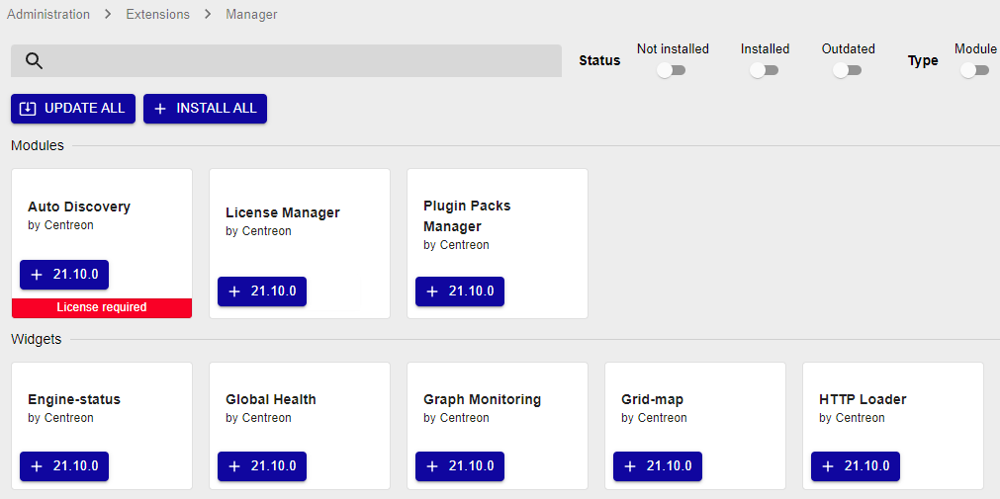

## Web installation

Log in to Centreon web interface via the URL `http://<IP>/centreon`.

### Step 1: Welcome to Centreon setup

The Centreon setup wizard is displayed. Click on **Next**.

### Step 2: Dependency check up

Needed modules and prerequisites are checked. They must be all satisfied. Click on **Refresh**
once needed corrective actions have been made.

Then click on **Next**.

### Step 3: Monitoring engine information

Define paths used by the monitoring engine. We recommend to use defaults.

Then click on **Next**.

### Step 4: Broker module information

Define paths used by the broker module. We recommend to use defaults.

Then click on **Next**.

### Step 5: Admin information

Define the information needed for the default admin account creation. This is the account you will use to log in to Centreon for the first time. The password must comply with the default password security policy: 12 characters minimum, lower and upper case letters, numbers and special characters. You can change this policy later.

Then click on **Next**.

### Step 6: Database information

Provide the information needed to connect to the database instance.

- **Database Host Address**: If you are using a local database, leave the field blank (the default value is **localhost**). Otherwise, enter the IP address of your remote database.
- **Root user/password**: this is the account that will be used to install the databases.
   - if this is the default account (**root**), the root password of the database is the password [you have defined](installation-of-a-central-server/using-packages.md#secure-the-database) when executing `mysql_secure_installation`.
   - if you have defined a custom user with root privileges on all databases (e.g. during the process of installing a [remote database](../installation/installation-of-a-central-server/using-packages.md#with-a-remote-database)), use this one. This user can be deleted once the web installation process is finished.

- **Database user name/password**: the credentials of the account that will be used to interact with the Centreon databases. The account will be created when the database is installed.

Then click on **Next**.

### Step 7: Installation

The Centreon setup wizard creates configuration files and databases structure:

When done, click on **Next**.

### Step 8: Modules installation

Select the available modules and widgets to be installed. Then click on **Install**.

Once the installation is complete, click on **Next**.

### Step 9: Installation finished

At this point, an advertisement informs you of the latest Centreon news and
products. If your platform is connected to the internet, the information you receive
will be up to date. If you are not online, only information on the current version will be
displayed.

The installation is complete. Click on **Finish**.

You can now log in using the **admin** account and [initialize the monitoring](#initialization-of-the-monitoring).

## Initialization of the monitoring

To start the monitoring processes:

1. From your web interface, go to **Configuration > Pollers**.
2. Select **Central** from the listing and click on
**Export configuration**.
3. Check **Move Export Files** in addition to the default selection and click on
**Export**.
4. In your terminal, log on to the Central server.
5. Start/restart collect processes:

    ```shell
    systemctl restart cbd centengine
    ```

6. Restart the tasks manager:

    ```shell
    systemctl restart gorgoned
    ```

7. Start the passive monitoring services:

    ```shell
    systemctl start snmptrapd centreontrapd
    ```

8. If you want to monitor this server, start the SNMP daemon:

    ```shell
    systemctl start snmpd
    ```

Monitoring is now working. You can start monitoring your IT system.

## Add a license

According to your Centreon edition, you may have to [add a license](../administration/licenses.md).

## Install available extensions

Go to **Administration > Extensions > Manager** menu and click on
**Install all**:



## Secure your platform

Don't forget to secure your Centreon platform following our
[recommendations](../administration/secure-platform.md).

## Getting started

Go to the [Getting Started](../getting-started/welcome.md)
chapter to configure your first monitoring.
