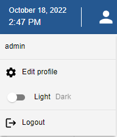
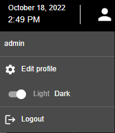
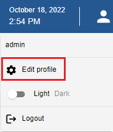
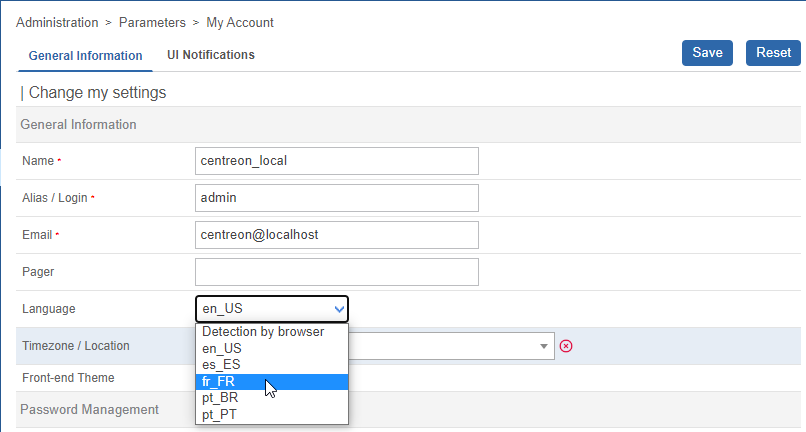
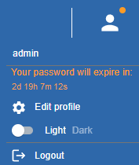
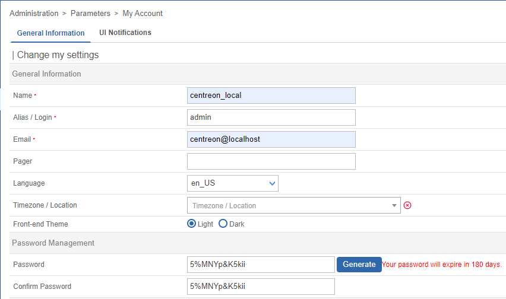
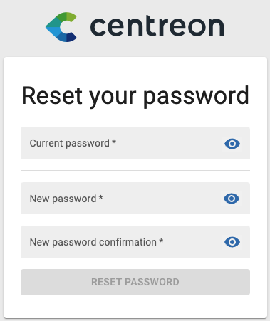

You can optimize the use of Centreon by using the following customization features:

## Switch to dark mode

When you first connect to the interface, Centreon is displayed in light mode by default.

On the banner, click on the profile icon and use the switch button to turn on the dark mode.
Next time you connect to the interface, the mode you previously selected remains on.

- Light mode:

- Dark mode:

## Change the user interface language

On the banner, click on the profile icon, then click on **Edit profile**:

In the language select box, choose your language:

Then click on **Save**. Your interface is now translated.

> If your language doesn't appear in the available language list, you can help the Centreon community to translate the web interface. For more details go to [How to translate Centreon](../../developer/developer-translate-centreon.md).

## Reset your password

### Reset your password before expiration

When your password is going to expire in the next 7 days, an orange dot appears in the banner on the right
next to the profile icon:

Click on **Edit profile**, then change your password:

### Reset your password when expired

If you have not changed your password before it expires, you will be redirected after login
to a dedicated page where you can update it:

Fill in your current password, define a new one and then click on **Reset Password**.
