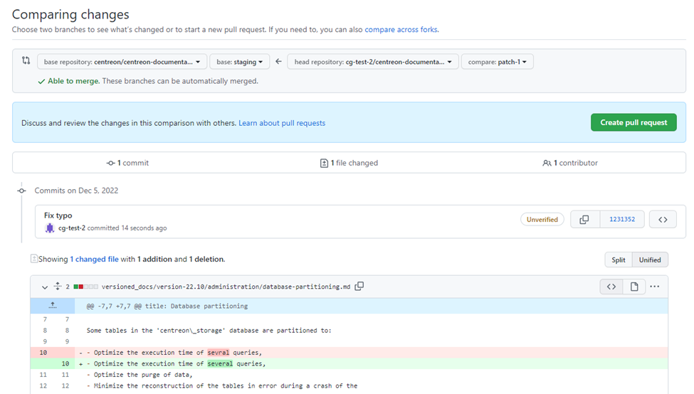
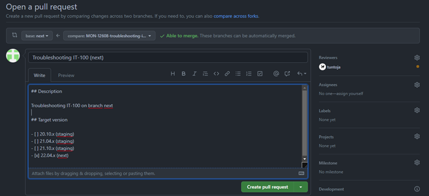

You can contribute to the Centreon documentation by submitting pull requests on [our GitHub repository](https://github.com/centreon/centreon-documentation). As an external contributor, you cannot commit directly to the repository: a fork will be created automatically when you commit changes.

This page only details the procedure to request changes in the documentation:
* If your problem is a general question about Centreon or the documentation, ask in the [Slack](https://centreon.github.io/register-slack/) channel instead, or on our community platform [The Watch](https://thewatch.centreon.com/).

* If you have an idea for a new feature please submit it in the [Ideas](https://thewatch.centreon.com/ideas) section of The Watch.

* If you have found a bug, file that issue in the project's code repository. You may use the contribution guide [here](https://github.com/centreon/.github/blob/master/CONTRIBUTING.md).

## Pull request guidelines

Help us review your PRs more quickly by following these guidelines.

* Try not to touch a large number of files in a single PR if possible.

* Don't change whitespace or line wrapping in parts of a file you are not editing for other reasons. Make sure your text editor is not configured to automatically reformat the whole file when saving.

* If you speak French, apply your changes both to the English and French versions of the documentation. The French version is stored in the **i18n** folder.

## Editing a single documentation page

1. The simplest way to suggest a change is to use the **Edit this page** link at the bottom of each page. This method is suitable when you only want to edit one file at a time.

   

   (You can also navigate to the page you want on [GitHub](https://github.com/centreon/centreon-documentation) and click the **Edit** button.)

2. The file can then be edited:

   

3. Make your changes, then scroll to the bottom of the page:

   

4. In the first field, enter a short description of your changes (e.g. “Fix typo”): this will be the title of your commit. You can add more information in the second field.
5. Click **Propose changes**. A branch is created in a fork of the Centreon repository, and a commit is made and pushed to it. The page now shows your changes:

   

6. Click **Create pull request** and fill in the fields:

   * Enter a title that will make it easy to understand what your pull request is about.
   * Only put an x in the box for the versions that you have corrected.

    

7. The pull request is created. Note that the name of your branch appears here (format : `<name_of_the_fork>:<name_of_the_branch>`):

    

Your PR is done! The Centreon documentation team will:

* Make sure your pull request is validated: someone checks that every change in the PR is factually correct. We may ask you to make changes to your pull request. In that case, you will receive a notification from GitHub.
* Make sure your PR is merged and published.

## I have created a pull request but I want to add changes, what do I do?

1. To edit another file, go to your fork of our documentation repository on GitHub (**Your profile** > click on the fork) and select your branch using the dropdown list in the top left corner of the screen.

   

2. Navigate to the file you want, make the changes you want, then scroll to the bottom of the page:

   

3. Click **Commit changes**. Your changes are committed, pushed and added to the list of commits for this pull request.

## Editing several pages at once

If you are going to make changes to quite a few files (or if you like this method better), you may want to clone the repository, create a new branch and make the changes from your disk.

Your branch should be based on branch **staging**. From this branch you can make changes to docs that are already published and still supported:

* for Centreon OnPrem, see [this table](../installation/prerequisites.md#operating-systems),
* sections “Centreon Cloud” and “Plugin Packs”.

### Procedure

1. Clone the documentation repository on to your disk:

   ```shell
   git clone https://github.com/centreon/centreon-documentation.git
   ```

2. Go to the **centreon-documentation** directory. You are on branch **staging**.
3. Create a new branch based on **staging**: give it a meaningful name. To create a branch and checkout this branch:

   ```shell
   git checkout -b <name_of_the_branch>
   ```

   For instance, `git checkout -b username-mypr` creates a branch called **username-mypr** and switches to it automatically.

4. Make your changes:

   * [build the documentation locally](#how-can-i-preview-my-pr) to check that everything is displayed correctly.
   * don’t forget to `git add` all the files you need (especially images).
5. Commit your changes and push them.
6. Go to [GitHub](https://github.com/centreon/centreon-documentation). You should see a message that looks like this:
   

7. Click **Compare & pull request**.
   

   * Edit the name of the PR and add extra info if needed.
   * Select the versions to which you have made changes.
8. Click **Create pull request**. The pull request is created.

Once your PR is done, the Centreon documentation team will:

* Make sure your pull request is validated: someone checks that every change in the PR is factually correct. We may ask you to make changes to your pull request. In that case, you will receive a notification from GitHub.
* Make sure your PR is merged and published.

### Making changes to the same file in different versions

If you want to make the same change to a file across different versions, you have to copy your change to each version of the doc manually (no cherrypicking).

### How can I preview my PR?

When you create a complex PR by cloning the repository, you may want to check that everything is displayed properly. (Looking at the PR in GitHub doesn't show you this.)

To do this, you must build the documentation locally.

#### Procedure

1. On your disk, go to the **centreon-documentation** folder of your branch.
2. Install [Yarn](https://classic.yarnpkg.com/lang/en/docs/install/#windows-stable).
3. Install [Node.js](https://nodejs.org/en/download/).
4. Install dependencies:

   ```shell
   yarn
   ```

5. Build the EN or FR version of the site (faster):
   * EN: `yarn start`
   * FR: `yarn start --locale=fr`

   The website opens in your browser at the following address: `http://localhost:3000/`.
   Most changes are reflected live without having to restart the server.
6. If you really need to build the whole website, use the following command (but be aware it takes a long time to build):

   ```shell
   yarn build
   ```

   Then use the `npm run serve` command to open the website in your browser. The site that is built is a snapshot of the documentation at the time you build it; subsequent changes are not taken into account.

#### What if the build fails?

In some cases, the build may fail. Check the error message in the log. Possible reasons are:

* an image is missing,
* a link has an incorrect format,
* some backticks (``` characters used around code blocks) are not closed properly, or there is an extra space before the backticks,
* a file doesn’t have the exact same name in French and in English.
