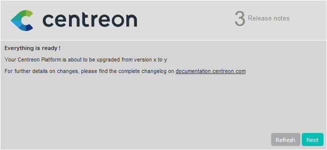

import Tabs from '@theme/Tabs';
import TabItem from '@theme/TabItem';

This chapter describes how to upgrade your Centreon platform from version 22.04
to version 22.10.

> When you upgrade your central server, make sure you also upgrade all your remote servers and your pollers. All servers in your architecture must have the same version of Centreon. In addition, all servers must use the same [version of the BBDO protocol](../developer/developer-broker-bbdo.md#switching-versions-of-bbdo).

> If you want to migrate your Centreon platform to another server/OS, please read our chapter on migration.
> you need to follow the [migration procedure](../migrate/introduction.md).

## Prerequisites

### Perform a backup

Be sure that you have fully backed up your environment for the following
servers:

- Central server
- Database server

### Update to the latest minor version

Update your platform to the latest available minor version of Centreon 22.04.

## Upgrade the Centreon Central server

### Update the Centreon repository

Run the following commands:

<Tabs groupId="sync">
<TabItem value="Alma / RHEL / Oracle Linux 8" label="Alma / RHEL / Oracle Linux 8">

```shell
dnf install -y https://yum.centreon.com/standard/22.10/el8/stable/noarch/RPMS/centreon-release-22.10-1.el8.noarch.rpm
```

</TabItem>
<TabItem value="CentOS 7" label="CentOS 7">

```shell
yum install -y https://yum.centreon.com/standard/22.10/el7/stable/noarch/RPMS/centreon-release-22.10-1.el7.centos.noarch.rpm
```

</TabItem>
</Tabs>

> If you are using a Business edition, install the correct Business repository too. You can find it on the [support portal](https://support.centreon.com/s/repositories).

### Install the MariaDB repository

```shell
cd /tmp
curl -JO https://downloads.mariadb.com/MariaDB/mariadb_repo_setup
bash ./mariadb_repo_setup
sed -ri 's/10\../10.5/' /etc/yum.repos.d/mariadb.repo
rm -f ./mariadb_repo_setup
```

### Upgrade PHP

Centreon 22.10 uses PHP in version 8.1.

<Tabs groupId="sync">
<TabItem value="RHEL 8" label="RHEL 8">

You need to change the PHP stream from version 8.0 to 8.1 by executing the following commands and answering **y**
to confirm:
```shell
dnf module reset php
dnf module install php:remi-8.1
```

</TabItem>
<TabItem value="Alma / Oracle Linux 8" label="Alma / Oracle Linux 8">

You need to change the PHP stream from version 8.0 to 8.1 by executing the following commands and answering **y**
to confirm:
```shell
dnf module reset php
dnf module install php:remi-8.1
```

</TabItem>
<TabItem value="CentOS 7" label="CentOS 7">

You need to enable the php 8.1 repository
```shell
yum-config-manager --enable remi-php81
```

</TabItem>
</Tabs>

### Upgrade the Centreon solution

> Make sure all users are logged out from the Centreon web interface
> before starting the upgrade procedure.

If you have installed Business extensions, update the Business repository to version 22.10.
Visit the [support portal](https://support.centreon.com/s/repositories) to get its address.

Stop the Centreon Broker process:

```shell
systemctl stop cbd
```

Delete existing retention files:

```shell
rm /var/lib/centreon-broker/* -f
```

Clean yum cache:

```shell
yum clean all --enablerepo=*
```

Then upgrade all the components with the following command:

<Tabs groupId="sync">
<TabItem value="Alma / RHEL / Oracle Linux 8" label="Alma / RHEL / Oracle Linux 8">

```shell
yum update centreon\* ioncube-loader php-pecl-gnupg
```

</TabItem>
<TabItem value="CentOS 7" label="CentOS 7">

```shell
yum update centreon\* ioncube-loader php-pecl-gnupg
```

</TabItem>
<TabItem value="Debian 11" label="Debian 11">

```shell
apt upgrade centreon\* php8.0-sourceguardian-loader php8.0-gnupg
```

</TabItem>
</Tabs>

> Accept new GPG keys from the repositories as needed.

### Update your customized Apache configuration

This section only applies if you customized your Apache configuration. When upgrading your platform, the Apache configuration file is not upgraded automatically: the new configuration file brought by the rpm does not replace tha old file. You must copy the changes manually to your customized configuration file.

Run a diff between the old and the new Apache configuration files:

```shell
diff -u /opt/rh/httpd24/root/etc/httpd/conf.d/10-centreon.conf /opt/rh/httpd24/root/etc/httpd/conf.d/10-centreon.conf.rpmnew
```

* **10-centreon.conf** (post upgrade): this file contains the custom configuration. It does not contain anthing new brought by the upgrade.
* **10-centreon.conf.rpmnew** (post upgrade): this file is provided by the rpm; it does not contain any custom configuration.

For each difference between the files, assess whether you should copy it from **10-centreon.conf.rpmnew** to **10-centreon.conf**.


### Upgrade the MariaDB server

The MariaDB components can now be upgraded.

> Refer to the official MariaDB documentation to know more about this process:
>
> https://mariadb.com/kb/en/upgrading-between-major-mariadb-versions/

#### Update the Centreon repository

> This step is required ONLY when your environment features an architecture with
> a dedicated remote DBMS. If your environment features Centreon Central and
> MariaDB together on the same server, you SHOULD simply skip this step.

Run the following command on the dedicated DBMS server:

<Tabs groupId="sync">
<TabItem value="Alma / RHEL / Oracle Linux 8" label="Alma / RHEL / Oracle Linux 8">

```shell
dnf install -y https://yum.centreon.com/standard/22.10/el8/stable/noarch/RPMS/centreon-release-22.10-1.el8.noarch.rpm 
```

</TabItem>
<TabItem value="CentOS 7" label="CentOS 7">

```shell
yum install -y https://yum.centreon.com/standard/22.10/el7/stable/noarch/RPMS/centreon-release-22.10-1.el7.centos.noarch.rpm
```

</TabItem>
</Tabs>

#### Upgrading MariaDB

You have to uninstall then reinstall MariaDB to upgrade between major versions (i.e. to switch from version 10.3 to version 10.5).

1. Stop the mariadb service:

    ```shell
    systemctl stop mariadb
    ```

2. Uninstall the current version:

    ```shell
    rpm --erase --nodeps --verbose MariaDB-server MariaDB-client MariaDB-shared MariaDB-compat MariaDB-common
    ```

    > During this uninstallation step, you may encounter an error because one or several MariaDB packages are missing. In that case, you have to execute the uninstallation command without including the missing package.

    For instance, you get the following error message:

    ```shell
    package MariaDB-compat is not installed
    ```

    As **MariaDB-compat** is the missing package, please execute the same command without quoting **MariaDB-compat**:

    ```shell
    rpm --erase --nodeps --verbose MariaDB-server MariaDB-client MariaDB-shared MariaDB-common
    ```

  > Make sure you have [installed the official MariaDB repository](upgrade-from-22-04.md#install-the-mariadb-repository) before you continue the procedure.

3. Install the 10.5 version:

    ```shell
    yum install MariaDB-server-10.5\* MariaDB-client-10.5\* MariaDB-shared-10.5\* MariaDB-common-10.5\*
    ```

4. Start the mariadb service:

    ```shell
    systemctl start mariadb
    ```

5. Launch the MariaDB upgrade process:

    ```shell
    mysql_upgrade
    ```
    
    If your database is password-protected, enter:

    ```shell
    mysql_upgrade -u <database_admin_user> -p
    ```

    Example: if your database_admin_user is `root`, enter:

    ```
    mysql_upgrade -u root -p
    ```

    > Refer to the [official documentation](https://mariadb.com/kb/en/mysql_upgrade/)
    > for more information or if errors occur during this last step.

#### Enable MariaDB on startup

Execute the following command:

```shell
systemctl enable mariadb
```

### Finalizing the upgrade

Before starting the web upgrade process, reload the Apache server with the
following command:

<Tabs groupId="sync">
<TabItem value="Alma / RHEL / Oracle Linux 8" label="Alma / RHEL / Oracle Linux 8">

```shell
systemctl reload php-fpm httpd
```

</TabItem>
<TabItem value="CentOS 7" label="CentOS 7">

```shell
systemctl reload php-fpm httpd24-httpd
```

</TabItem>
<TabItem value="Debian 11" label="Debian 11">

```shell
systemctl reload php8.0-fpm apache2
```

</TabItem>
</Tabs>

Then log on to the Centreon web interface to continue the upgrade process:

Click on **Next**:


Click on **Next**:


The release notes describe the main changes. Click on **Next**:



This process performs the various upgrades. Click on **Next**:


Your Centreon server is now up to date. Click on **Finish** to access the login
page:


If the Centreon BAM module is installed, refer to the
[upgrade procedure](../service-mapping/upgrade.md).

### Post-upgrade actions

1. Upgrade extensions. From **Administration > Extensions > Manager**, upgrade all extensions, starting
with the following:

   - License Manager,
   - Plugin Packs Manager,
   - Auto Discovery.

   Then you can upgrade all other commercial extensions.

2. [Deploy the configuration](../monitoring/monitoring-servers/deploying-a-configuration.md).

3. Restart the processes:

    ``` shell
    systemctl restart cbd centengine centreontrapd gorgoned
    ```

## Upgrade the Remote Servers

This procedure is the same as for upgrading a Centreon Central server.

> At the end of the update, configuration should be deployed from the Central server.

## Upgrade the Pollers

### Update the Centreon repository

Run the following command:

<Tabs groupId="sync">
<TabItem value="Alma / RHEL / Oracle Linux 8" label="Alma / RHEL / Oracle Linux 8">

```shell
dnf install -y https://yum.centreon.com/standard/22.10/el8/stable/noarch/RPMS/centreon-release-22.10-1.el8.noarch.rpm
```

</TabItem>
<TabItem value="CentOS 7" label="CentOS 7">

```shell
yum install -y https://yum.centreon.com/standard/22.10/el7/stable/noarch/RPMS/centreon-release-22.10-1.el7.centos.noarch.rpm
```

</TabItem>
</Tabs>

### Upgrade the Centreon solution

Clean yum cache:

```shell
yum clean all --enablerepo=*
```

Upgrade all the components with the following command:

```shell
yum update centreon\*
```

> Accept new GPG keys from the repositories as needed.

Start and enable **gorgoned**:

```shell
systemctl start gorgoned
systemctl enable gorgoned
```

Restart **centengine**:

```shell
systemctl restart centengine
```
