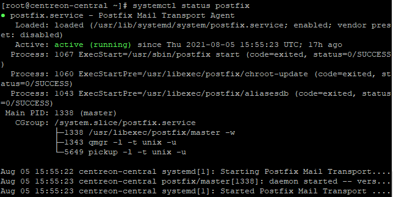

import Tabs from '@theme/Tabs';
import TabItem from '@theme/TabItem';

For your Centreon to be able to send notification emails, you need to configure a local SMTP server.

This page gives you an example of a possible configuration. Refer to the [official Postfix documentation](https://www.postfix.org/BASIC_CONFIGURATION_README.html) for more information.

On some distributions, Postfix may already be installed.

Notification commands are executed by the poller that monitors the resource, so you need to configure the mail relay on all pollers.

We recommend that you use a dedicated email account to send notifications.

## Step 1: Configuring Postfix

1. In your server's terminal, enter the following command:

<Tabs groupId="sync">
<TabItem value="Alma 8" label="Alma 8">

``` shell
dnf install postfix mailx cyrus-sasl-plain
```

</TabItem>
<TabItem value="Alma 9" label="Alma 9">

``` shell
dnf install postfix mailx cyrus-sasl-plain
```

</TabItem>
<TabItem value="RHEL / Oracle Linux 8" label="RHEL / Oracle Linux 8">

``` shell
dnf install mailx cyrus-sasl-plain
```

</TabItem>
<TabItem value="RHEL / Oracle Linux 9" label="RHEL / Oracle Linux 9">

``` shell
dnf install s-nail cyrus-sasl-plain
```

</TabItem>
<TabItem value="Debian 11 & 12" label="Debian 11 & 12">

``` shell
apt install postfix bsd-mailx libsasl2-modules
```

</TabItem>
</Tabs>

2. Restart Postfix:

    ```shell
    systemctl restart postfix
    ```

3. Configure Postfix to run at startup:

    ```shell
    systemctl enable postfix
    ```

4. Edit the following file:

    ```shell
    vi /etc/postfix/main.cf
    ```

5. Add the following information:

<Tabs groupId="sync">
<TabItem value="With authentication/TLS" label="With authentication/TLS">

    ```shell
    myhostname = hostname
    relayhost = [smtp.isp.com]:port
    smtp_use_tls = yes
    smtp_sasl_auth_enable = yes
    smtp_sasl_password_maps = hash:/etc/postfix/sasl_passwd
    smtp_tls_CAfile = /etc/ssl/certs/ca-bundle.crt
    smtp_sasl_security_options = noanonymous
    smtp_sasl_tls_security_options = noanonymous
    ```
    
    - **myhostname** is the hostname of the Centreon server.
    - **relayhost** is the email server for the account that will send notifications.

    In the following example, Centreon will use a Gmail account to send notifications:

    ```shell
    myhostname = centreon-central
    relayhost = [smtp.gmail.com]:587
    smtp_use_tls = yes
    smtp_sasl_auth_enable = yes
    smtp_sasl_password_maps = hash:/etc/postfix/sasl_passwd
    smtp_tls_CAfile = /etc/ssl/certs/ca-bundle.crt
    smtp_sasl_security_options = noanonymous
    smtp_sasl_tls_security_options = noanonymous
    ```

</TabItem>
<TabItem value="Without authentication/TLS" label="Without authentication/TLS">

    ```shell
    myhostname = centreon-central
    relayhost = [smtp.gmail.com]:587
    smtp_use_tls = no
    smtp_sasl_auth_enable = no
    ```

6. Restart Postfix:

   ```shell
   systemctl restart postfix
   ```

## Step 2: Configuring the credentials of the account that will send emails

1. Create a `/etc/postfix/sasl_passwd` file:

    ```shell
    touch /etc/postfix/sasl_passwd
    ```

2. Add the following line (replace `username:password` with the credentials of the account that will send the notification emails):

    ```shell
    [smtp.isp.com]:port username:password
    ```

    Example:

    ```shell
    [smtp.gmail.com]:587 username@gmail.com:XXXXXXXX
    ```

3. Save the file.

4. In the terminal, enter the following command:

    ```shell
    postmap /etc/postfix/sasl_passwd
    ```

5. For security reasons, change the permissions on the file:

    ```shell
    chown root:postfix /etc/postfix/sasl_passwd*
    chmod 640 /etc/postfix/sasl_passwd*
    ```

6. Reload Postfix so that changes are taken into account:

    ```shell
    systemctl reload postfix
    ```

## Testing and troubleshooting email configuration

- To send a test email, enter the following command:

    ```shell
    echo "Test" | mail -s "Test" user@isp.com
    ```

    Replace `user@isp.com` with a real email address. The recipient should receive the test email.

- If the user has not received the message, check the following log file (if it exists):

<Tabs groupId="sync">
<TabItem value="Alma / RHEL / Oracle Linux 8" label="Alma / RHEL / Oracle Linux 8">

    ```shell
    tail -f /var/log/maillog
    ```
</TabItem>
<TabItem value="Alma / RHEL / Oracle Linux 9" label="Alma / RHEL / Oracle Linux 9">

    ```shell
    tail -f /var/log/maillog
    ```
</TabItem>
<TabItem value="Debian 11 & 12" label="Debian 11 & 12">

    ```shell
    tail -f /var/log/mail.log
    ```
</TabItem>
</Tabs>

- To check that your Postfix service is running, enter:

    ```shell
    systemctl status postfix
    ```

    The results should look like this:

    

## Gmail configuration

To use postfix with Gmail, you need to use an [app password](https://support.google.com/mail/answer/185833?hl=en).
