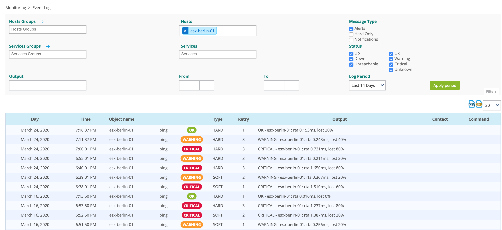

Use event logs to:

* View the changes of status and state of the monitored objects
* See the notifications sent and their recipients.

To view the event logs, go to **Monitoring > Event logs**.

- In the upper menu, select the hosts and/or the services you want to
view logs for. You can also filter by servicegroup or hostgroup.

- Select the options you want in sections **Message Type** and **Status** to display the corresponding events.

- Use the following fields to define the time period for which you want to display events:
    - **Log Period**: select predefined time periods
    - **From**/**To**: enter specific dates.

- You can export the result in CSV or XML format using the export
buttons above the list, to the right:

