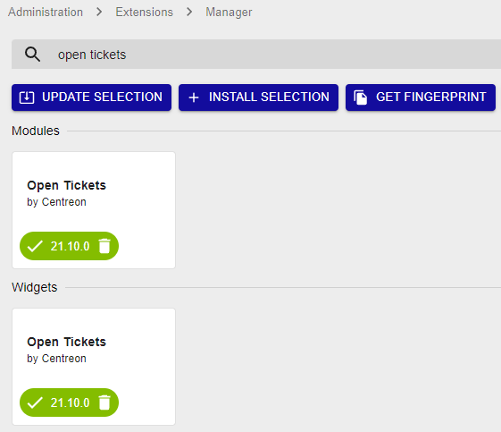

**Centreon Open Tickets** is a community module developed to create
tickets to an ITSM platform using APIs.

Once a provider is configured, the module allows for an operator to
create tickets for hosts and services in a non-ok state using a
dedicated widget. Indeed, a button associated with each host or service
allows you to connect to the API and create the ticket while offering
the possibility to acknowledge in same time the object.

Regarding the widget configuration, it is possible to see the created
tickets by presenting tickets ID and date of creation of these.

## Installing packages

Execute the following command:

``` shell
yum install centreon-open-tickets
```

## UI installation

After installing the rpm, you have to finish the module installation
through the web frontend. Go to **Administration > Extensions > Manager**
menu and search **Open Tickets**. Click on **Install selection**:


Your Centreon Open Tickets Module is now installed.

