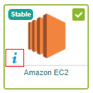
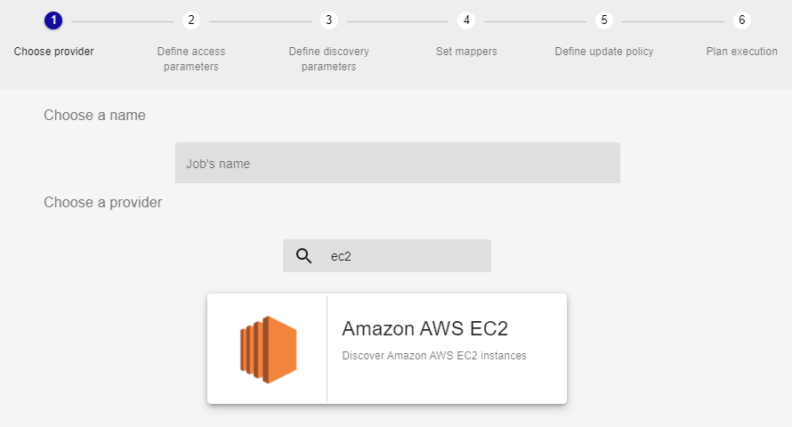
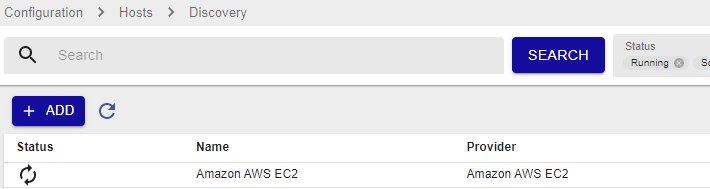
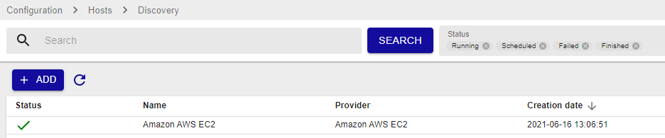
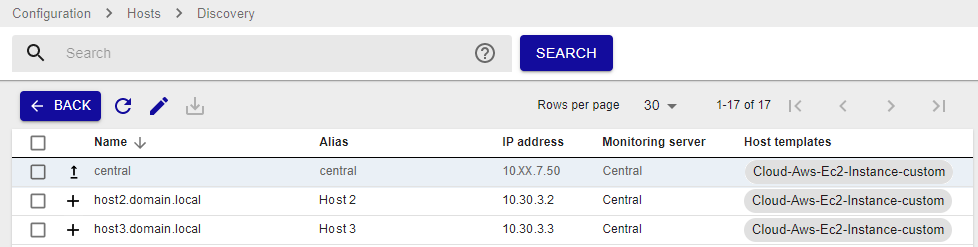

import Tabs from '@theme/Tabs';
import TabItem from '@theme/TabItem';

In this tutorial, we will use the [Autodiscovery module](../monitoring/discovery/hosts-discovery.md) to detect AWS EC2 instances and monitor them.

## Prerequisites

You must have:
- the credentials to the AWS group of instances you want to monitor (Name, AWS Access Key and AWS Secret Key)
- the region your AWS instances are in.

## Step 1: Installing the Amazon EC2 plugin

1. Make sure your commercial [license](../administration/licenses.md) or your free [IT-100](it100.md) license is installed.

2. [Install](../monitoring/discovery/installation.md) the autodiscovery module.

3. Make the Monitoring Connectors available:

    - If you have an online license, the Monitoring Connectors are already available in the interface.
    - If you have an offline licence, in your central server's terminal, enter:
     
<Tabs groupId="sync">
<TabItem value="Alma / RHEL / Oracle Linux 8" label="Alma / RHEL / Oracle Linux 8">

``` shell
dnf install centreon-pack-*
```

</TabItem>
<TabItem value="Alma / RHEL / Oracle Linux 9" label="Alma / RHEL / Oracle Linux 9">

``` shell
dnf install centreon-pack-*
```

</TabItem>
<TabItem value="Debian 11" label="Debian 11">

```shell
apt install centreon-pack-*
```

</TabItem>

</Tabs>


4. To install the Amazon EC2 Monitoring Connector, go to **Configuration > Monitoring Connector Manager**.

5. In the **Keyword** field, type **Amazon EC2** and then click **Search**.

6. Click on the `+` sign in the top right corner of the Monitoring Connector. The Monitoring Connector now has a green border and a tick mark in the top right corner: configuration templates and discovery providers are now installed.

7. Follow [this procedure](/monitoring-connectors/integrations/plugin-packs/procedures/cloud-aws-ec2) (sections [Plugin dependencies](/monitoring-connectors/integrations/plugin-packs/procedures/cloud-aws-ec2#plugin-dependencies) and [Setup](/monitoring-connectors/integrations/plugin-packs/procedures/cloud-aws-ec2#setup)) to finish installing the Monitoring Connector. (You can also access the documentation for a Monitoring Connector by clicking on the `i`.)

    

## Step 2: Configure the discovery job

1. Go to **Configuration > Hosts > Discovery**, and then click **Add**.

2. Enter a name for your discovery job, and then select the **Amazon AWS EC2** provider. Click **Next**.

    

3. If your infrastructure requires it, fill in the details for the proxy you want to use.

4. Click on the `+` sign to the right of the **Choose credentials** list. Fill in the Name, AWS Access Key and AWS Secret Key fields, then click on **Confirm**. Click **Next**.

5. Enter the region your EC2 instances are in (for example, **eu-north-1**). Click **Next**.

6. Edit or add [mappers](../monitoring/discovery/hosts-discovery.md#how-to-use-mappers):
    - Map `host.name` to the `discovery.results.name` attribute. The names of your hosts in Centreon will be the ones defined in this attribute (i.e. the hostname of the instance).
    - In our example, we will exclude the instances whose hostname contains "test".

    

    Click **Next**.

7. Select **Manual analysis**: we will have to add the hosts to the list of monitored hosts manually. Click **Next**.

8. Select **Execute immediately** and then click **Finish**. The discovery job appears in the list of jobs.
    
    

## Step 3: Saving the hosts and monitoring them

1. After a few seconds, refresh the page. There should be a green tick mark in the **Status** column.

    

2. Hover over the job that has just ended and then click **Display the job result** (the arrow icon). A list of hosts appears.

    

    Icons allow you to identify the action that will be performed on the host:
   
   - The **plus** icon means the host does not exist yet and will be created.
   - The **arrow** icon means the host already exists and its configuration will be updated.
   
3. Select the hosts you want to add to the list of monitored hosts, and then click **Save**. 

4. Go to **Configuration > Hosts > Hosts** and check that the hosts you selected at the previous step appear in the list. The hosts are added to the lists of hosts but they are not monitored yet.

5. [Deploy the configuration](../monitoring/monitoring-servers/deploying-a-configuration.md). The hosts appear in the **Resources Status** page: they are monitored.

