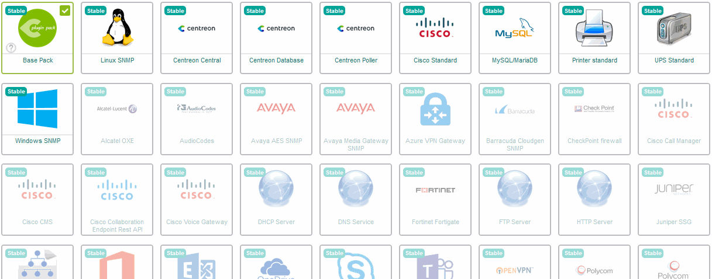

This topic proposes to install the monitoring templates supplied free of charge with the Centreon solution
and then to implement them to monitor your first equipment...

> If you have a license for it, you can use our [Auto Discovery](../monitoring/discovery/introduction.md) feature to find and configure hosts easily. See also our tutorial on [how to detect AWS EC2 instances](autodisco-aws.md).

### Installation of basic monitoring templates

Go to the **Configuration \> Monitoring Connectors** menu.

> [Configure the proxy](../administration/parameters/centreon-ui.md#proxy-configuration) to allow the Centreon server to access the internet.

Install the **Base Generic** Monitoring Connector (if it is not already installed) by moving your cursor on it and by clicking on the **+** icon (it is a prerequisite
to the installation of any other Monitoring Connectors):

You can also click on the Monitoring Connector in order to know its content before installing it:

Install other Monitoring Connectors you probably need for your environment, for example **Linux SNMP** and **Windows SNMP** available
for free:

Now you have the basic templates and plugins to start monitoring hosts!

## Deploying a configuration

When you create a host, you will need to deploy the configuration for the host to be monitored.

1. Go to **Configuration \> Pollers > Pollers**.
2. Select the pollers whose configuration you want to export.
3. Click on **Export configuration**.

    

4. Check the following boxes:
    - **Generate Configuration Files**
    - **Run monitoring engine debug (-v)**
    - **Move Export Files**
    - **Restart Monitoring Engine**.

5. Click **Export**.

    

6. Check that no errors appear during generation.
