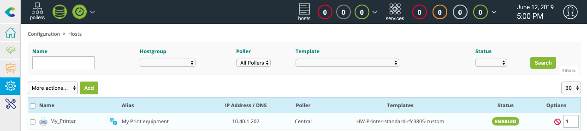

Go to the **Configuration \> Monitoring Connectors** menu and install **Printer Standard** Monitoring Connector:

Go to the **Configuration \> Hosts \> Hosts** menu and click on **Add**:

Fill in the following information:

* The name of the server
* A description of the server
* The IP address
* The SNMP version and community

Click on **+ Add a new entry** button in **Templates** field, then select the **HW-Printer-standard-rfc3805-custom**
template in the list.

Click on **Save**.

Your equipment has been added to the monitoring configuration:

Go to **Configuration \> Services \> Services by host** menu. A set of indicators has been automatically deployed:

It is now time to [deploy the configuration](#deploying-a-configuration).

Then go to the **Monitoring \> Status Details \> Services** menu and select **All** value for the **Service Status**
filter. After a few minutes, the first results of the monitoring appear:

