To create standard views, you have to use **Centreon Map Desktop client**.

## Best practices & limitations

In a production environment, you might have lot of views & information
to share with your final users.

Here are some best practices to have in mind when creating views.\*

**Content limitations** : Try not to have more than \~100 000 elements
loaded "at a time". A loaded element is an element in an **opened**
view. An opened view is a view that at least **one** user is looking at
(using desktop client or through the web interface).

Find below some usefull best practices to help you designing optimized
views:

- We more than **highly** recommend activating the ACL optimization
  (*gate.useResourcesAccess=false*).
- When you want to visualize application statuses, we highly recommend
  modelling them using [Business
  Activities](../service-mapping/introduction.md).
  This will help you to limit the number of elements you need to add to a
  view. Adding one Business Activity to a view means only 1 element is added
  instead of all the hosts & services you would have added in the view to
  model the application otherwise.
- Avoid duplicating the same resources (hostgroups, servicegroups, hosts,
  services) in the same view or in multiple views.
- If a view seems to contain "too many elements" (see *Content limitation*
  above), try to conceptually group several elements in order to split into
  multiple views.
- Create views having less than 5 levels (drill down)
- Do not display more than 100 elements in a single view level. (element:
  container, host, hostgroup, service, business activity)
- Do not display more than 10 widgets in a single view level.

**How to calculate the number of element?**

Here is an example that may help you: Let's imagine a view opened by a
user containing 10 containers, each containing 10 hosts, each host
containing 10 services.

`Number of elements: 10 containers + 10 containers * (10 host + 10 host * 10 services) = 1110 elements.`

1110 elements will be loaded when at least one user opens this view.
According to the content limitations, it means you can have 100 views
such as this one opened by at least one user.

*These limitations/recommendations are based on a Centreon Map server
having 8GB of RAM, 8vCPU (2.6Ghz), Google Chrome (latest version) with a
minimum of 5GB of memory on the computer.*

> You cannot add any objects (e.g., text, gauge, pie chart, graph etc.)
> to, or modify/copy-paste the contents of, a host, host group, service
> group or business activity.

## Connect to the desktop client

To connect the desktop client to the server you must first create a profile:

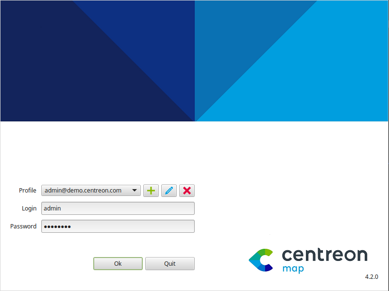

Add a profile by clicking on the "+" to the right of the Profile window:

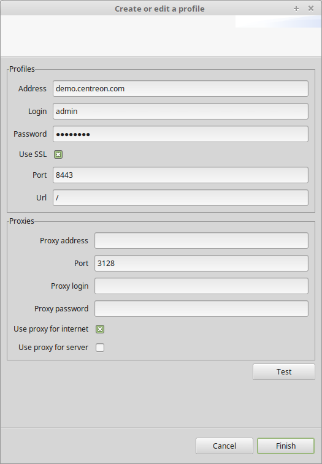

- **Address**: Address of the Map Server
- **Login**: Your Centreon Web username
- **Password**: Password for your Centreon Web username
- **Use TLS**: Check here if the Map Server is configured for HTTPS
- **Port**: Listening port for the Map Server -- it uses *8080* by default and
  *8443* if you have configured for HTTPS
- **URL**: The URL for reaching Map Server. The default value is "/".

If there is a proxy between your computer and the Map Server or internet,
configure it here:

- **Proxies**: Address of proxy server
- **Port**: Port of proxy server
- **Proxy Login** (not mandatory): Proxy server login
- **Proxy Password** (not mandatory): Login password for proxy server
- **Use proxy for internet**: Check here if a proxy is required to connect to
  the internet. It will be useful for automatically downloading updates to the
  desktop client.
- **Use proxy for server**: Check here if a proxy is required to reach your
  Map Server.

## Add a view

### Empty view

Here is how to create your first view:

Once you are logged in to your desktop client, you will see this screen:

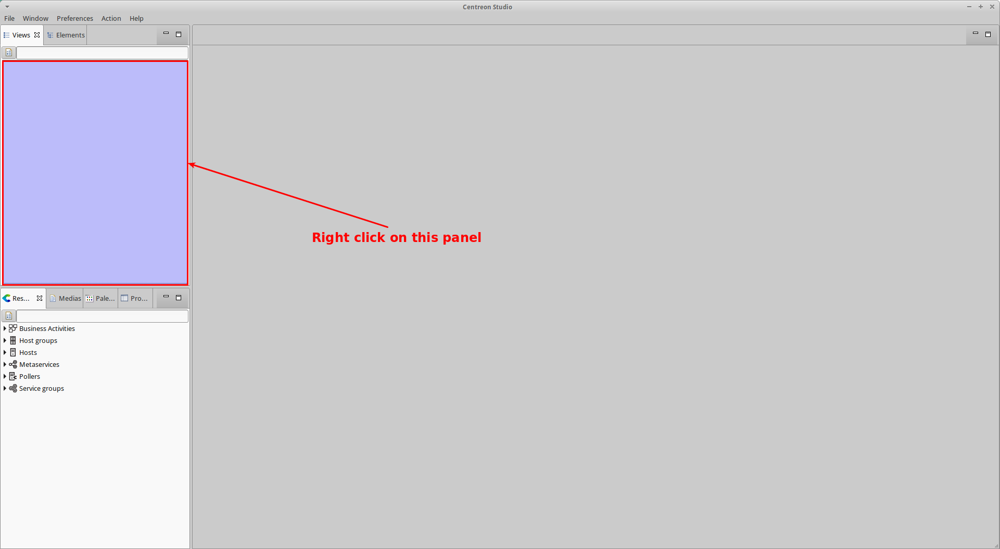

Click on **File > Create View** or right click on the empty left panel, then
**Add**.

A new wizard will appear. Enter a name for the new view (and an optional
description).

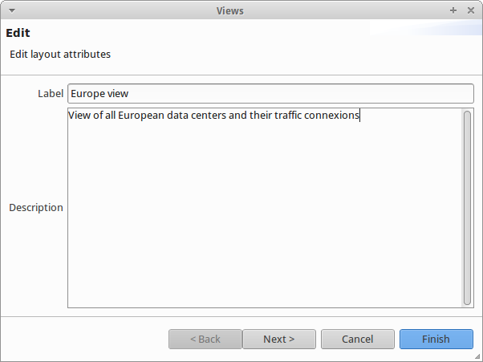

You can then either click **Finish** to create the view or click **Next** to
associate an image to it.

Once done, you will see your new view in the left tab panel.

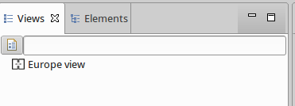

Now, double click on the view to open it. Your main panel will have a white
background and you will be able to start adding elements to it: simply drag and
drop resources from your resource panel to the main panel.

> You cannot add any objects (e.g., a gauge, pie chart or graph) to, or
> modify/copy-paste the contents of, a host, host group, service group or
> business activity.

Congratulations, your have just created your first view.

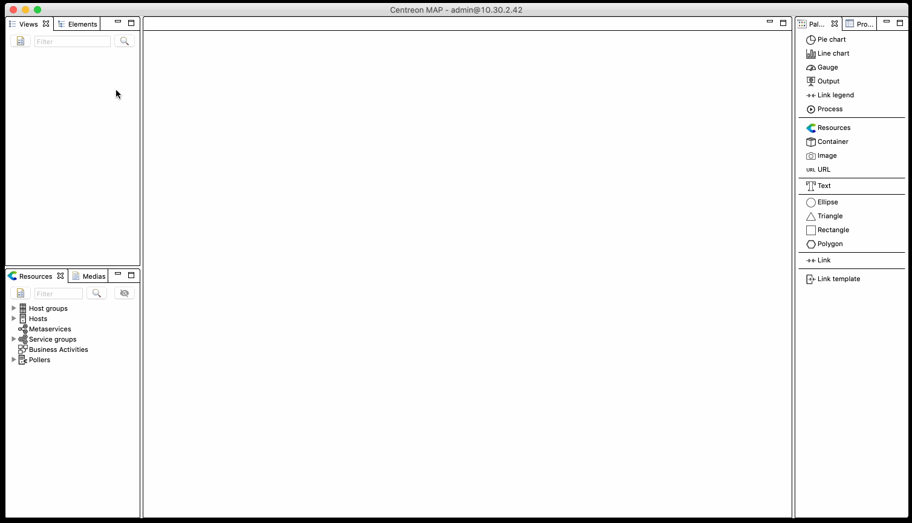

### From an existing container

When you want to share the sublevel of a view to a different profile without
duplicating its contents or assigning full access to the main view, you can
create another view that is directly linked to a container.

To do so, right click on the container or inside the target one and click on
**Create a view from that container**.

> If you rename the view that is linked to the container, the container will
> automatically be renamed.

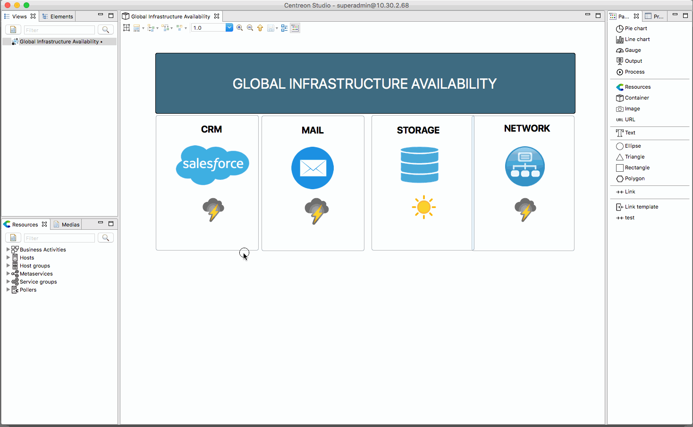

### Add a geographic background

After linking your Mapbox account you can create a standard view and
define a geo background:

1. Open your desktop client,
2. Open a view,
3. Right click on the background of the view and select "Edit",
4. Check the "Geographic" checkbox.

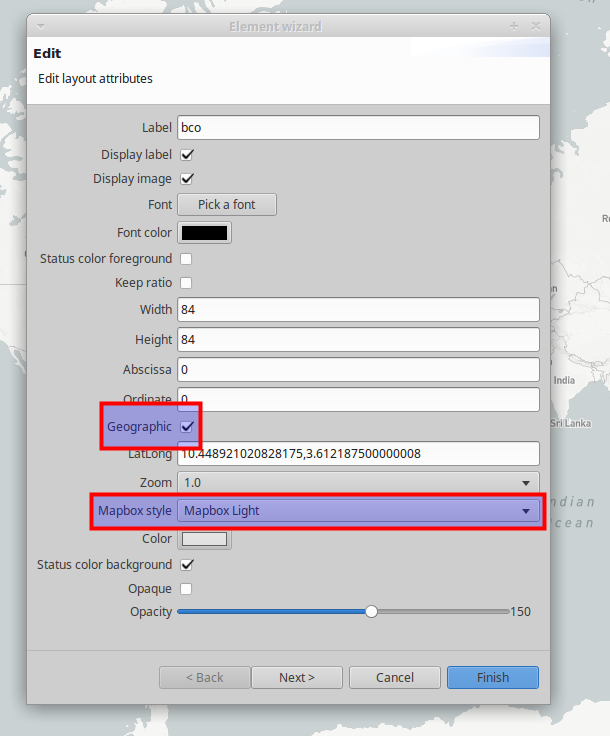

Your view will now appear as a geographic background on which you can
zoom and move around.

By default, the whole world is displayed. Every time you open the view,
the zoom is set to its default value: 1. You can change this setting.

Navigate around your view, zoom and go to the exact point where you
would like your view to open by default. Then use the "Set current lat /
long / zoom as defaut" button on the top of your desktop client.

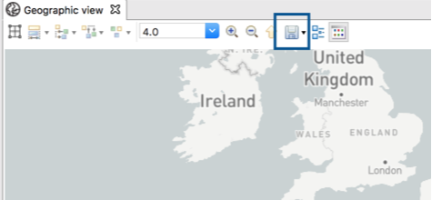

Whenever you open this view either through the desktop or the web
interface, the geographic view will always appear with the pre-defined
zoom level.

## Modify object style

When displaying any resource (group, host, services, business activity,
etc.) or container in a view, three different styles may be applied:

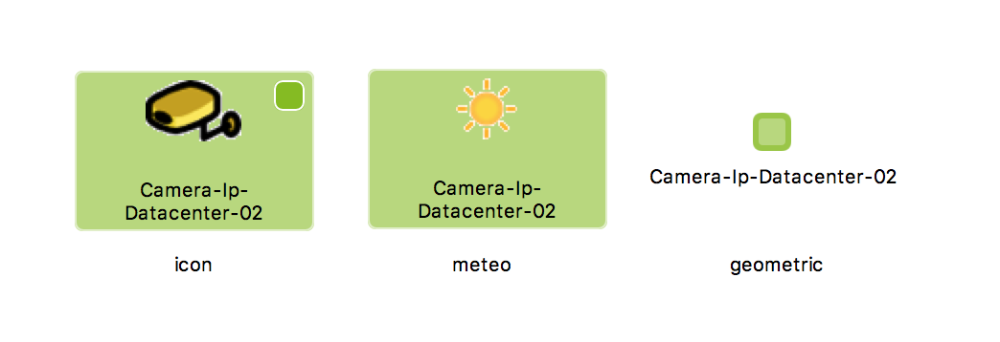

To change the style of an element, simply right click on it, select the
"Style" menu and pick the style you want. You can also select multiple
elements at the same time.

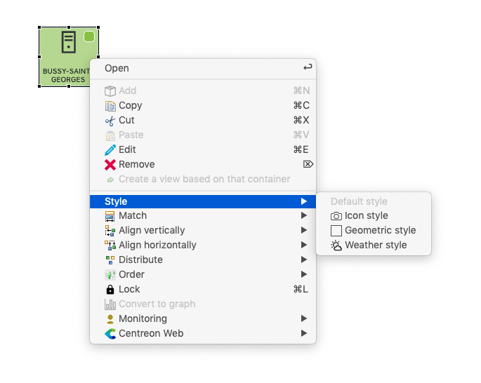

The default style for a geographic view is "geometric".

The default style for a standard view is "Icon".

## Use widgets

Dedicated data reprezentation called "Widgets" are available in the "Palette"
tab panel:

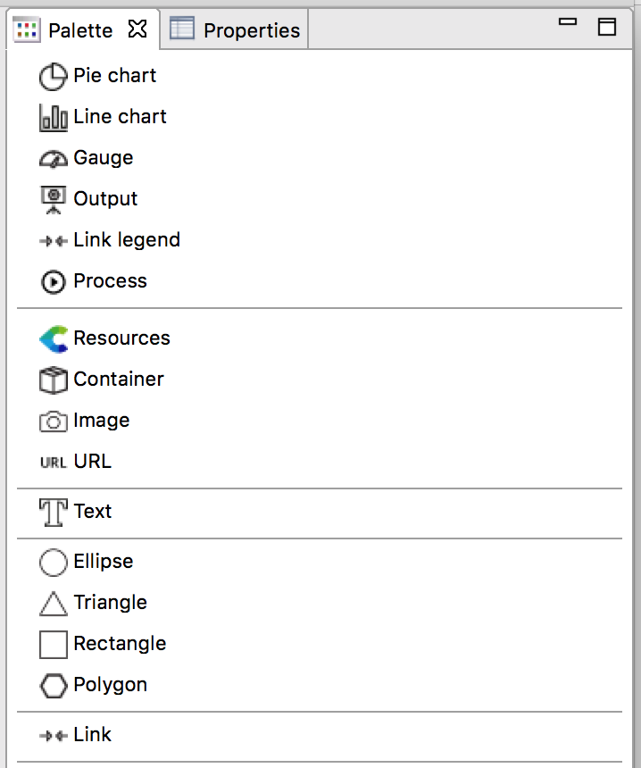

Here is a description of all the widgets available in Centreon MAP:

### Graphs

A graph describes a service and displays the performance data related to
it. You can specify a various parameters (the number of points you want
to display, stack lines, fill lines, etc.):

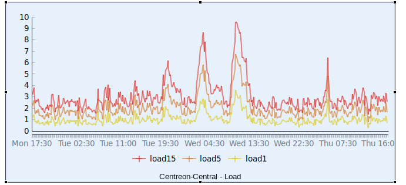

Once you create the graph, you can edit it on the wizard page, selecting
which lines you would like to display, their color and other properties:


### Gauges

A gauge displays the percentage of a metric. Create a gauge by selecting a
service and choosing the metric you want to display.

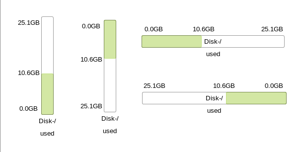

You can place a gauge in any position and in any direction (left to
right, bottom to top, etc.). By default, the color of the gauge is
associated with the status of the service.

### Pie charts

A pie charts displays the status of a host, host groups or service
groups.

For a host, the number of OK, Warning, Critical and NA states will be
displayed. For a host group, the number of hosts in OK, Warning,
Critical and NA states will be displayed.

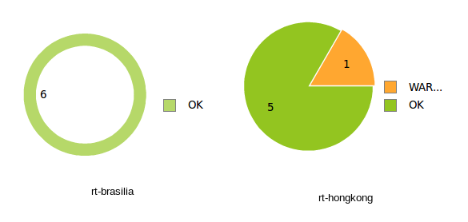

### Output

#### Default behaviour

The output widget describes the output of a service.


By default, the background is in the same color as the status. However,
you can edit it by double-clicking on the output and modifing the
"Status color background" checkbox in the output wizard.

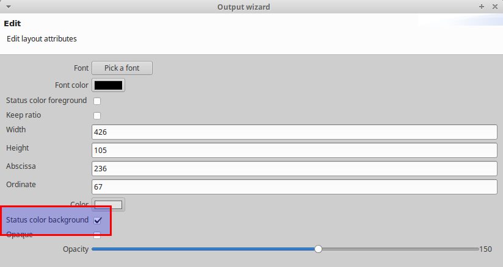

#### Customizing the output

You can customize the output by adding service and metric properties. To
do so, edit the output (by double-clicking) then click twice on the **Next**
button.

You will see this page:

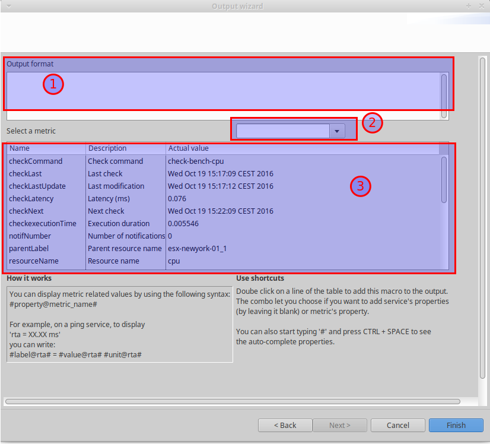

Here you can create the displayed content by using the properties listed
in the table (3). **Double clic** on a line in the table and it will be
inserted in the output.

By default, the properties listed belong to the service. If you want to
add **properties linked to a metric** (such as the metric's value,
minimum, maximum) select the metric you want to use with the combo (2).
The table (3) will then display the metric's properties.

> When you create new output, the column *Actual value* might not be
> filled. However, as soon as you click on the Finish button, these
> properties will be filled in. They will appear when you edit the
> output widget.

#### Example

You would like to display the number of users connected to a VPN along
with its name. The service you use has one metric called "clients" that
represents the number of users connected.

To display the following output :


Configure the output widget as follows:

```text
VPN : #parentLabel#
Number of users connected : #currentValue@clients#
```

### URL

The URL widget is associated with a URL. Double clicking on it will open
the URL.

For instance, if the URL points to a helpdesk platform, double click on
it to open the helpdesk webpage in your default web browser.

### Process

This widget can be used to trigger an action on any resources based on a
command.

Here is an example:

You have an internal website that uses Apache, and sometimes Apache
crashes. Your engineering team is investigating the core problem of why
this crash occurs, however your priority is to make sure the end users
can access the website. You can use the process widget by assigning a
command such as "services httpd restart" so that when the Apache process
crashes, users can immediately restart the Apache service from the view
by double-clicking on the widget.

When creating the process widget, you must choose a service.

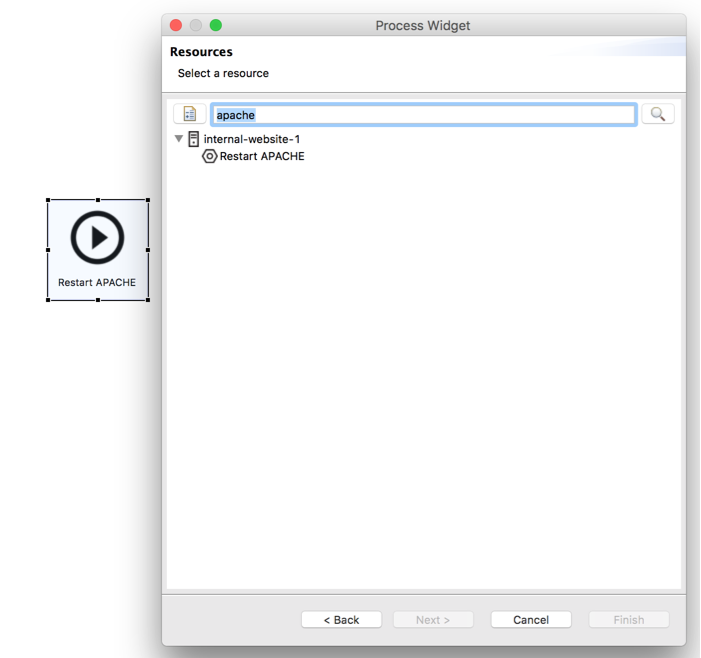

To create a service dedicated to an "action":

1. Create a command (**Configuration > Command > Add**) that contains "service
   httpd restart" (remember to enable shell).
2. Link the command to a passive service.
3. Link the passive service to a host (e.g., the host that hosts the website).

Then you can assign that service to the widget.

## Create links between objects

When using Centreon MAP, you can create links between any elements. There are
three kinds of link:

- Simple link: Connects two elements in color.
- Status link: Uses a color based on the status of a service.
- Metric link: Displays the % of a metric, appearing in a color according to
  this value.

You may use the concept of "link template" in Centreon Map to accelerate the
creation of lot of links with the same properties.

> When you delete a link template, it removes all the links created with this
> template.

### Simple links

The simple link in this view show the logical connection between different
elements.

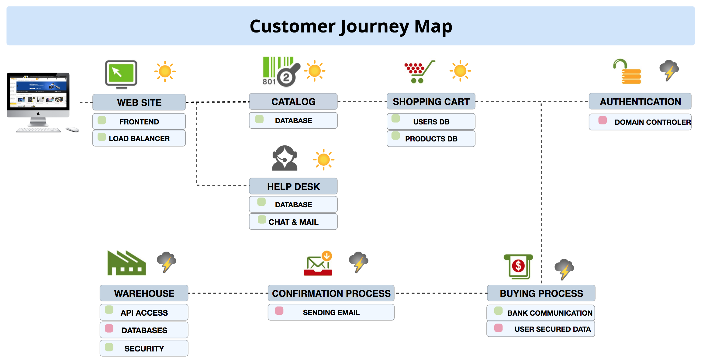

### Status links

Status links can be used to represent the ability of a resource to reach
another resource/area of the infrastructure, wether it's a service on
one of the two element connected or if it's on another resource.

The lines on this views shows the ability of users to connect to a
system using Citrix and then the ability of different technical areas to
reach each others. Detailed information are available when putting your
mouse over a link **on the web interface**.

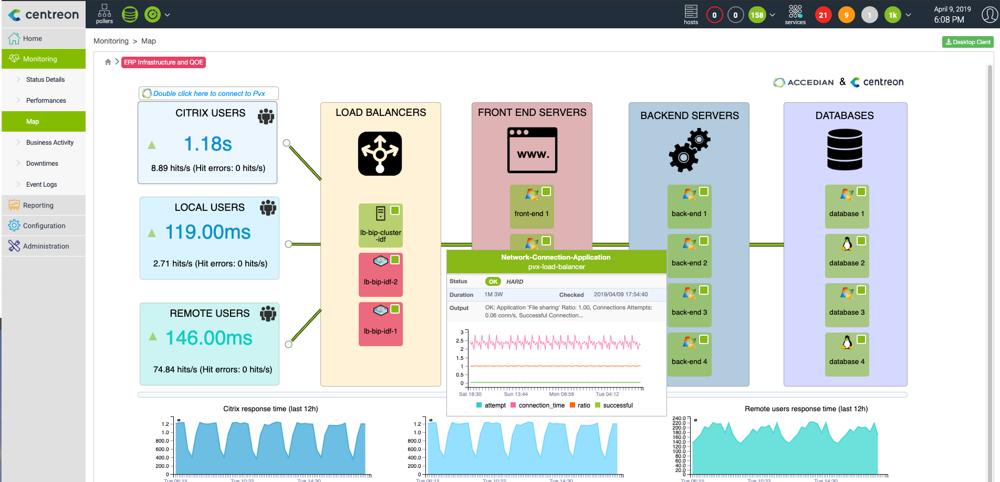

### Metric link

When configuring a metric link, choose a metric to associate it with.
For **double** links you need to choose two metrics.

A good example is the traffic metric. You generaly have a *traffic\_in*
and *traffic\_out* associated with your traffic service.

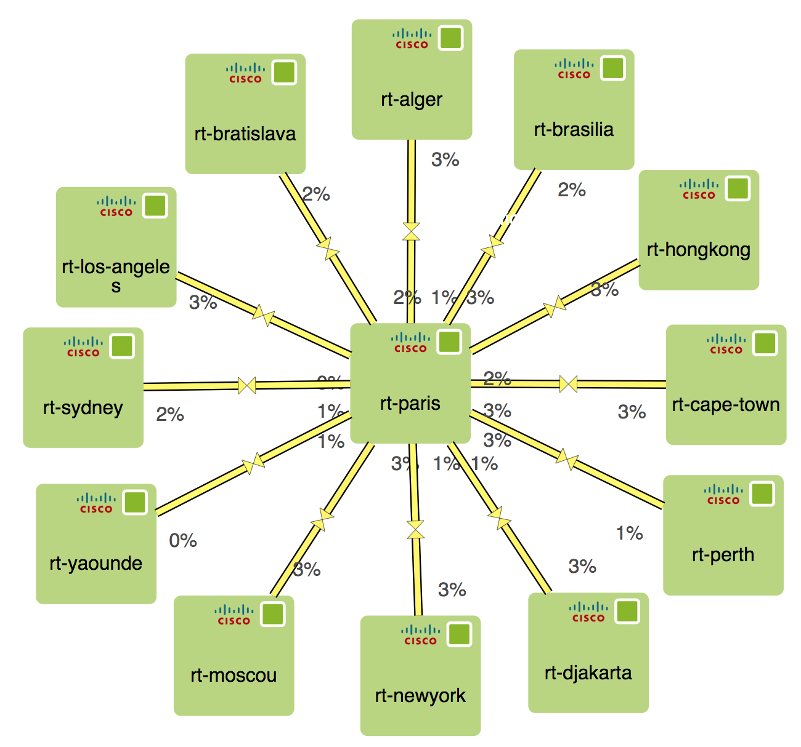

Detailed informations are available when mouse hovering a link **on the web
interface**.

> The color you see on the link is only visible to you, you may want to
> configure links color **globaly** for all user.

## Add images

By default, all the images added to Centreon are automatically available
to Centreon MAP so that they can be linked to objects and added to
views. These images are imported into the "centreon" folder and **you
cannot add or modify images in that folder**. However, if you want to
add new media than will only be used in Centreon MAP, follow this
procedure:

1. Open the **Media** panel,
2. Create at least one folder,
3. Right click on the new folder,
4. Click on **Import**.

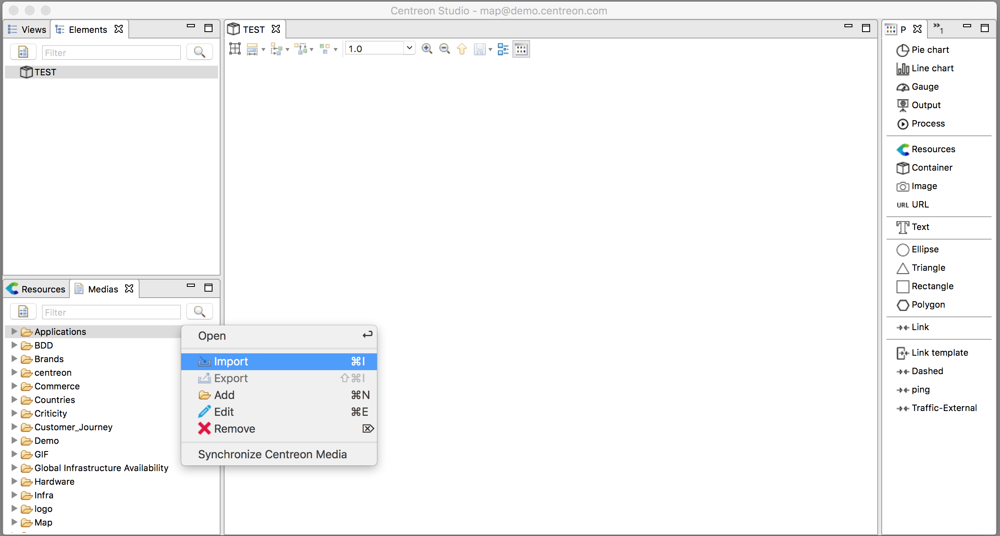

When adding new images to your Centreon platform (not from Centreon MAP)
you may click on **Actions > Synchronize Media** so that added or deleted
images from Centreon are mirrored to Centreon Map.

The following formats can be used in Centreon MAP:

- PNG
- GIF (will only animate on the web interface)
- JPEG.

## Create System command (desktop only)

Centreon MAP allows you to launch applications installed on your
computer using parameters from your Centreon. Proceed by *right
clicking* on an host in Centreon MAP to start a Putty / SSH session
directly, without entering any parameters.

### Example for Linux with Terminator

Here is how you would create a SSH command using the binary *terminator*.

Start by creating a new system command. Go to the Preferences page, under the
System commands menu. Then enter the following:

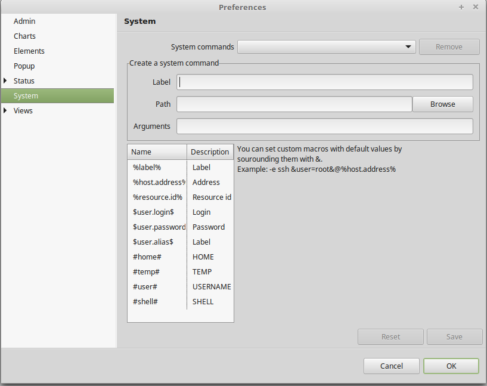

- Label: SSH
- Path: terminator
- Arguments:

  ```text
  -e ssh [root@%host.address%](mailto:root@%host.address%)
  ```

Here, the `%host.address%` will be automatically replaced by the host address of
the element you right click on.

Click on **Save**.

Your command is now available for every element on which you right click in the
System commands submenu.

### Example for Windows with Putty

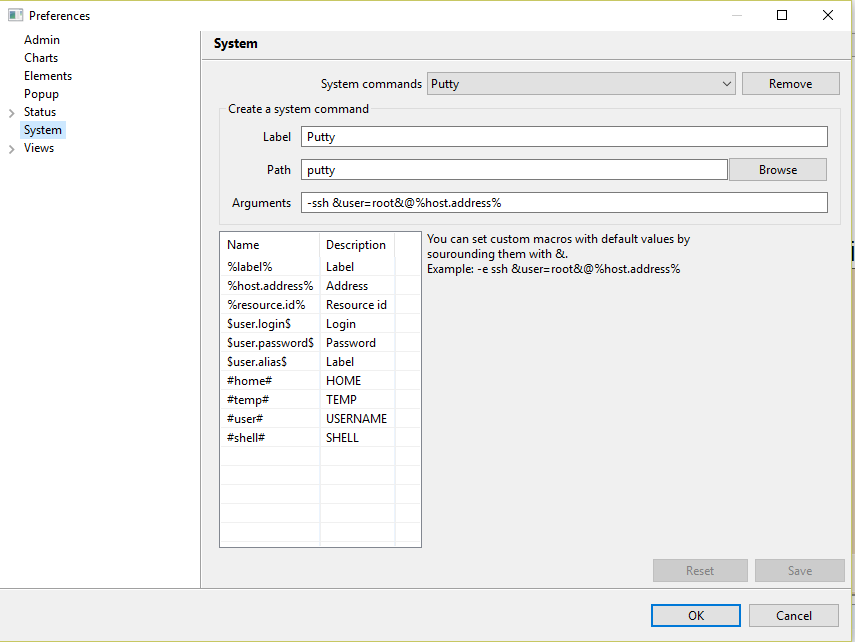

### Advanced configuration

In the parameters, you can use variables from the element you selected
and also from your account, such as username and password. To do so, add
the variables $user.login$ and $user.password$. This is convenient for
validating users over an LDAP with all the servers connected.

You can also set default parameters and request whether the user wants
to override them at runtime. To do so, use the following syntax:

```text
\&user=root&
```

The command and arguments will be:

```text
-ssh &user=root&@%host.address%
```

Every time the command is run, a prompt will be displayed proposing the
default value. The user can either press **ENTER** to validate or override
it with another value.
