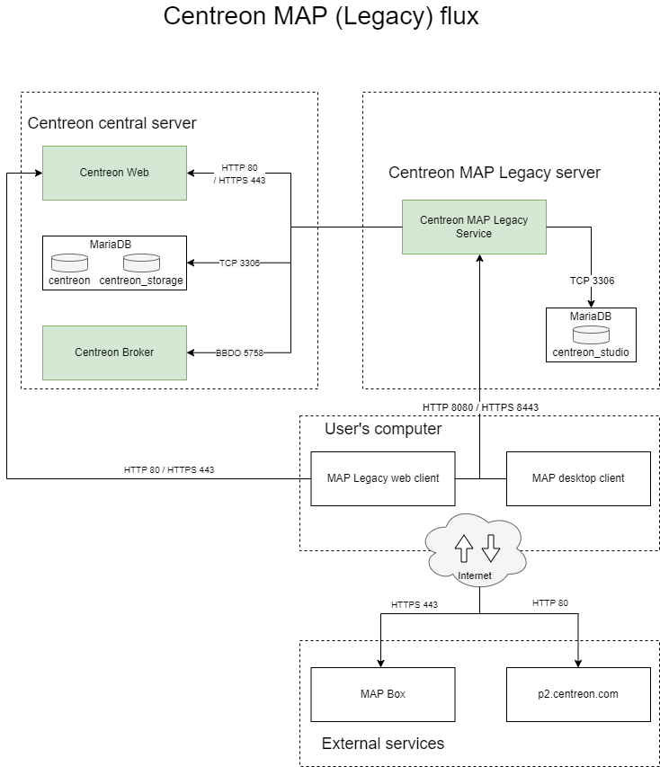
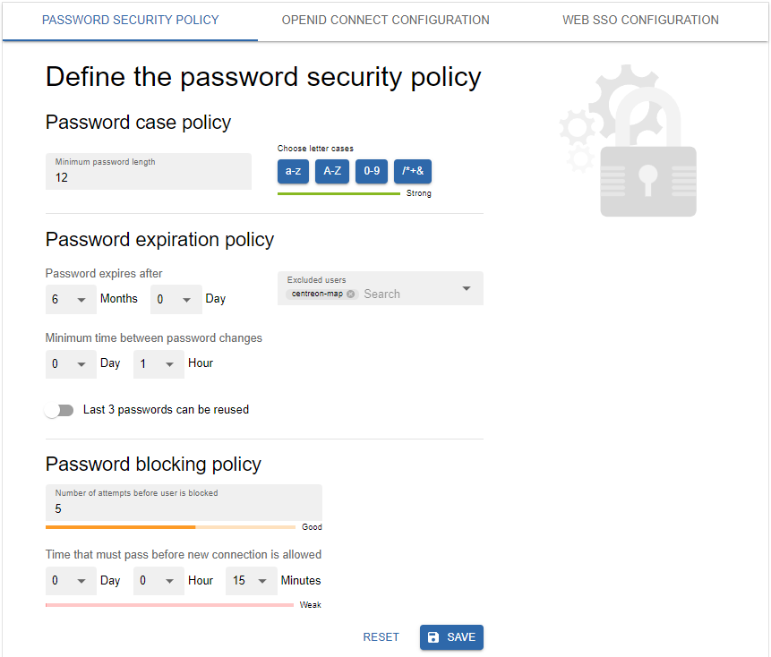
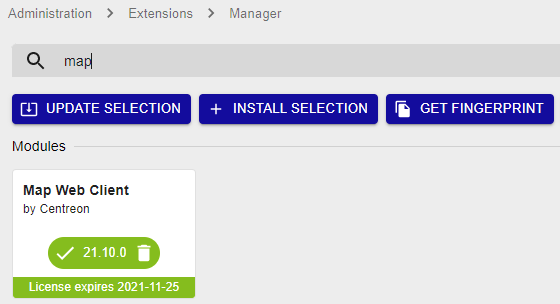
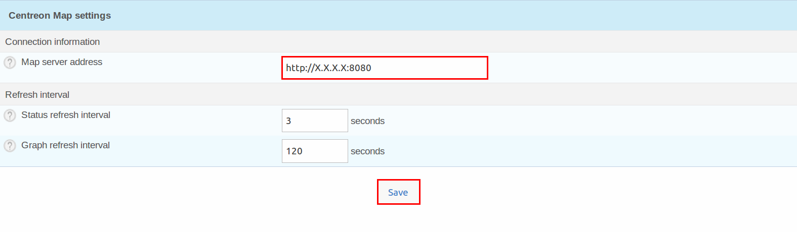
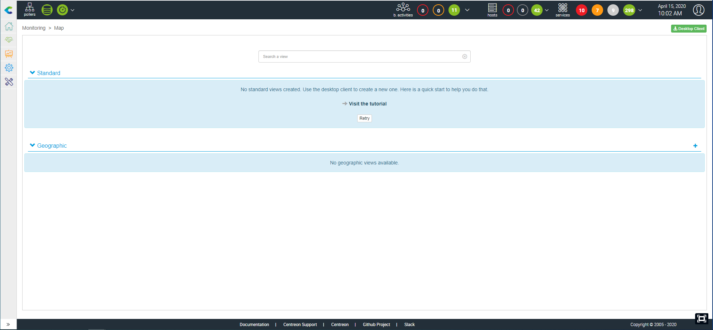

import Tabs from '@theme/Tabs';
import TabItem from '@theme/TabItem';


> Centreon MAP requires a valid license key. To purchase one and retrieve the
> necessary repositories, contact [Centreon](mailto:sales@centreon.com).

This chapter describes how to install Centreon MAP. The server must be
installed on a dedicated machine to allow Centreon MAP to operate with
its own database and avoid any potential conflict with the Centreon
central server.

Before installation, be sure to review the Prerequisites chapter for
system requirements (CPU and memory). Remember to choose the best type
of architecture to suit your needs.

## Architecture

Centreon MAP consists of three components:

- Centreon MAP Server, developed in Java, using SpringBoot, Hibernate and CXF
- Centreon MAP Web interface, developed in Javascript, based on
  [Backbone.js](http://backbonejs.org/)
- Centreon MAP Desktop Client, developed in Java, based on [Eclipse RCP
  4](https://wiki.eclipse.org/Eclipse4/RCP).

The diagram below summarizes the architecture:



**Table of network flow**

| Application    | Source     | Destination               | Port      | Protocol   | Purpose                                             |
|----------------|------------|---------------------------|-----------|------------|-----------------------------------------------------|
| Map Server     | Map server | Centreon central broker   | 5758      | TCP        | Get real-time status updates                        |
| Map Server     | Map server | Centreon MariaDB database | 3306      | TCP        | Retrieve configuration and other data from Centreon |
| Map Server     | Map server | Map server database       | 3306      | TCP        | Store all views and data related to Centreon MAP    |
| Web + Desktop  | Map server | Centreon central          | 80/443    | HTTP/HTTPS | Authentication & data retrieval                     |
| Web interface  | User       | Map server                | 8080/8443 | HTTP/HTTPS | Retrieve views & content                            |
| Web interface  | User       | Internet\* (Mapbox)       | 443       | HTTPS      | Retrieve Mapbox data                                |
| Desktop client | User       | Map server                | 8080/8443 | HTTP/HTTPS | Retrieve and create views & content                 |
| Desktop client | User       | Internet\* (Mapbox)       | 443       | HTTPS      | Retrieve Mapbox data                                |
| Desktop client | User       | Internet\* (p2 repo)      | 80        | HTTP       | Retrieve automatic desktop client update            |

\* *With or without a proxy*

## Prerequisites

### Centreon

The central server and Centreon MAP must be installed in the same major versions (i.e. both in 23.04.x).

### Centreon MAP Server

#### License

The server requires the license to be available and valid on Centreon's central
server. To do this, you must contact the support [Centreon support
team](https://support.centreon.com/) to get & install your license key.

#### Hardware

Hardware requirements for your dedicated Centreon MAP server are as follows:

| *Monitored services*     | < 10 000                | < 20 000             |  < 40 000            |  > 40 000            |
| ------------------------ | ----------------------- | -------------------- | -------------------- | -------------------- |
| *CPU*                    | 2 vCPU ( 3Ghz ) minimum | 4 CPU (3GHz) Minimum | 4 CPU (3GHz) Minimum | Ask Centreon Support |
| *Dedicated Memory*       | 2GB                     | 4GB                  | 8GB                  | Ask Centreon Support |
| *MariaDB data partition* | 2GB                     | 5GB                  | 10GB                 | Ask Centreon Support |

To correctly implement the dedicated memory, you have to edit the
*JAVA\_OPTS* parameter in the Centreon Map configurations file
`/etc/centreon-studio/centreon-map.conf` and restart the service:

```text
JAVA_OPTS="-Xms512m -Xmx4G"
```

> The Xmx value depends on the amount of memory indicated in the above table.

Then restart the service:

```shell
systemctl restart centreon-map
```

The space used by Centreon MAP server is directly determined by the
number of elements you add into your views. An element is any graphical
object in Centreon MAP. Most elements (like hosts, groups, etc.) have
children which must be included in the count.

> These values are applied after optimization of Centreon MAP tables.

#### Software

See the [software requirements](../installation/prerequisites.md#software).

#### Information required during configuration

- Centreon Web login with admin rights.

> Even with a correctly sized server, you should have in mind the best practices & recommandations when creating views so you don't face performance issues.

> If the central server is configured in HTTPS, you must apply the SSL configuration on the MAP server. Follow this [procedure](../graph-views/secure-your-map-platform.md) to secure your MAP server.

### Centreon MAP Web interface

#### License

The web interface requires the license to be available and valid on Centreon's
central server. To do this, you must contact the support [Centreon support
team](https://support.centreon.com/) to get & install your license key.

#### Compatibility

The Centreon MAP Web interface is compatible with the following web browsers:

* Google Chrome (latest version at the time of Centreon software release and above).  Please visit the [Google Chrome FAQ](https://support.google.com/chrome/a/answer/188447?hl=en) for a description of the Chrome support policy. 
* Mozilla Firefox (latest version at the time of Centreon software release and above).  Please visit the [Mozilla FAQ](https://www.mozilla.org/en-US/firefox/organizations/faq/) for a description of the Firefox support policy.
* Apple Safari (latest version at the time of Centreon software release and above)
* Microsoft Edge Chromium (latest version at the time of Centreon software release and above)

If an update to those supported browsers was to cause an incompatibility, Centreon would work on a fix in the shortest possible time (for supported Centreon versions). Though other browsers may work, Centreon will not attempt to resolve problems with browsers other than those listed above.

Your screen resolution must be at least 1280 x 768.

### Centreon MAP Desktop Client

- 4 GB of RAM minimum, 8 GB advised (mandatory for 10,000 or more services)
- **Java 64 bits version 8**
- Resolution must be at least 1280 x 768.
- Debian 7,8 or 9

> Desktop Client is not compatible with Microsoft Windows Server. * If a
> version of Java other than 8 is installed, consider installing Java 8 and
> modifying Centreon-Map4.ini to add the following line `-vm
> $path_to_java8$` BEFORE `-vmwargs`.

To optimize the desktop client, you have to "give" it more memory than the
default value. Modify the following file:

<Tabs groupId="sync">
<TabItem value="Windows" label="Windows">

```shell
C:\Users\<YOUR_USERNAME>\AppData\Local\Centreon-Map4\Centreon-Map4.ini
```

</TabItem>
<TabItem value="Linux" label="Linux">

```shell
/opt/centreon-map4-desktop-client/Centreon-Map4.ini
```

</TabItem>
</Tabs>

And add the following lines at the end of the file, on a new line:

```text
-Xms512m
-Xmx4g
```

### Network requirements

Centreon MAP Server machine must access:

- Centreon Central broker, usually on Centreon Central machine, using TCP
  port 5758
- Centreon Database, usually on Centreon Central machine, using TCP port 3306
- Centreon MAP database, usually on localhost, using TCP port 3306.

All the ports above are default values and can be changed if needed.

- Centreon Web Central, using HTTP port 80 or HTTPS port 443

Centreon MAP Desktop Client machines must access:

- Centreon MAP Server, using HTTP port 8080 or 8443 when HTTPS/TLS is enabled
- Internet with or without proxy.

Ports 8080 and 8443 are recommanded default values, but other
configurations are possible.

## Server installation

### Centreon Web interface

You must provide to Centreon MAP server a dedicated user
**who has access to all resources** through the appropriate [access list groups](../administration/access-control-lists.md). 
Since the password will be stored in human-readable form in a 
configuration file, you should not use a Centreon admin user account.

Provide this user with access to the Centreon Web real-time API:


Exclude the user from the password expiration policy on page **Administration > Authentication**: their password will never expire.



### Centreon Central server

Create a user in the mysql instance hosting 'centreon' and 'centreon_storage'
databases:

```sql
CREATE USER 'centreon_map'@'<IP_SERVER_MAP>' IDENTIFIED BY 'centreon_map';
GRANT SELECT ON centreon_storage.* TO 'centreon_map'@'<IP_SERVER_MAP>';
GRANT SELECT, INSERT ON centreon.* TO 'centreon_map'@'<IP_SERVER_MAP>';
```

The INSERT privilege will only be used during the installation process
in order to create new Centreon Broker output. It will be revoked later.

### Centreon MAP server

#### Java version requirement
  > Ensure a version of Java 17 (or 18) is installed before you start the procedure.
  
  - If you need to check the Java version, enter the following command:
  
  ```shell
  java -version
  ```
  
  - If you need to upgrade the Java installation to Java 17 (or 18), go to the [Oracle official download](https://www.oracle.com/java/technologies/downloads/#java17) page.

  - If several Java versions are installed, you need to activate the right version. Display the installed versions using the following command and select the Java 17 (or 18) version:
  ```shell
  sudo update-alternatives --config java
  ```
  
  - If you need to use your platform in HTTPS, you will have to generate a keystore file for the Java 17 (or 18) version ([see the procedure](./secure-your-map-platform.md#httpstls-configuration-with-a-recognized-key)).

#### Procedure

If you installed your Centreon MAP server from a "fresh installation"
you need to install the `centreon-release` package:

<Tabs groupId="sync">
<TabItem value="Alma / RHEL / Oracle Linux 8" label="Alma / RHEL / Oracle Linux 8">

First you need to install an EPEL repository:

```shell
dnf install -y https://dl.fedoraproject.org/pub/epel/epel-release-latest-8.noarch.rpm
```

The command should return results as follows:

```shell
Installed:
  epel-release-8-17.el8.noarch

Complete!
```

Then install the `centreon-release` package:

```shell
dnf config-manager --add-repo https://packages.centreon.com/rpm-standard/23.04/el8/centreon-23.04.repo
```

</TabItem>
<TabItem value="Alma / RHEL / Oracle Linux 9" label="Alma / RHEL / Oracle Linux 9">

First you need to install an EPEL repository:

```shell
dnf install -y https://dl.fedoraproject.org/pub/epel/epel-release-latest-9.noarch.rpm
```

The command should return results as follows:

```shell
Installed:
  epel-release-9-2.el9.noarch

Complete!
```

Then install the `centreon-release` package:

```shell
dnf config-manager --add-repo https://packages.centreon.com/rpm-standard/23.04/el9/centreon-23.04.repo
```

</TabItem>
<TabItem value="Debian 11" label="Debian 11">

Install the following dependencies:

```shell
apt update && apt install lsb-release ca-certificates apt-transport-https software-properties-common wget gnupg2
```

To install the Centreon repository, execute the following command:

```shell
echo "deb https://packages.centreon.com/apt-standard-23.04-stable/ $(lsb_release -sc) main" | tee /etc/apt/sources.list.d/centreon.list
echo "deb https://packages.centreon.com/apt-plugins-stable/ $(lsb_release -sc) main" | tee /etc/apt/sources.list.d/centreon-plugins.list
```

Then import the repository key:

```shell
wget -O- https://apt-key.centreon.com | gpg --dearmor | tee /etc/apt/trusted.gpg.d/centreon.gpg > /dev/null 2>&1
```
</TabItem>
</Tabs>

> If the URL doesn't work, you can manually find this package in the folder.

Install the Centreon Business repository, you can find it on the
[support portal](https://support.centreon.com/hc/en-us/categories/10341239833105-Repositories).

Then install Centreon MAP server using the following command:

<Tabs groupId="sync">
<TabItem value="Alma / RHEL / Oracle Linux 8" label="Alma / RHEL / Oracle Linux 8">

```shell
dnf install centreon-map-server
```

</TabItem>
<TabItem value="Alma / RHEL / Oracle Linux 9" label="Alma / RHEL / Oracle Linux 9">

```shell
dnf install centreon-map-server
```

</TabItem>
<TabItem value="Debian 11" label="Debian 11">

```shell
apt update
apt install centreon-map-server
```

</TabItem>
</Tabs>

When installing Centreon MAP server, it will automatically install java
(OpenJDK 11) if needed.

> You need to have a MariaDB database to store Centreon MAP data, whether
> it's on localhost or somewhere else.

To install MariaDB, execute the following command:

<Tabs groupId="sync">
<TabItem value="Alma / RHEL / Oracle Linux 8" label="Alma / RHEL / Oracle Linux 8">

```shell
dnf install mariadb-client mariadb-server
```

</TabItem>
<TabItem value="Alma / RHEL / Oracle Linux 9" label="Alma / RHEL / Oracle Linux 9">

```shell
dnf install mariadb-client mariadb-server
```

</TabItem>
<TabItem value="Debian 11" label="Debian 11">

```shell
apt install mariadb-client mariadb-server
```

</TabItem>
</Tabs>

### Configuration

Make sure the database that stores Centreon MAP data is optimized
(automatically added by the RPM in `/etc/my.cnf.d/map.cnf`):

```text
max_allowed_packet = 20M
innodb_log_file_size = 200M
```

Then, restart MariaDB:

```shell
systemctl restart mariadb
```

#### Secure the database

Since MariaDB 10.5, it is mandatory to secure the database's root access before installing Centreon. If you are using a local database, run the following command on the central server:

```shell
mysql_secure_installation
```

* Answer **yes** to all questions except "Disallow root login remotely?".
* It is mandatory to set a password for the **root** user of the database. You will need this password during the [web installation](../installation/web-and-post-installation.md).

> For more information, please see the [official MariaDB documentation](https://mariadb.com/kb/en/mysql_secure_installation/).

#### Configure.sh script

Execute the Centreon MAP server configuration script. Two modes are available:
interactive or automatic.

- interactive *(no option/default mode)*: Several questions will be asked to
  interactively fill in the installation variables.
- automatic *(--automatic or -a)*: The installation will be done automatically
  from the values set in `/etc/centreon-studio/vars.sh` file

If it's your first installation, we advice you to use the standard mode
(interactive) and choose **No** when asked for advanced installation mode:

```shell
/etc/centreon-studio/configure.sh
```

Then restart the **centreon-map** service:

```shell
systemctl restart centreon-map
```

### Central server

> Before restarting Broker you must export the configuration from the Centreon
> Web interface.

Restart Centreon Broker on the Central server:

```shell
systemctl restart cbd
```

Remove the INSERT privilege from user centreon_map:

```sql
REVOKE INSERT ON centreon.* FROM 'centreon_map'@'<IP_SERVER_MAP>';
```

### Centreon MAP server

Check your configuration:

```shell
/etc/centreon-studio/diagnostic.sh
```

If configuration is correct, the centreon-map service can be
started from the Centreon MAP server:

```shell
systemctl restart centreon-map
```

Enable the service to start up automatically on server boot:

```shell
systemctl enable centreon-map
```

Centreon Map server is now started and enabled, let's install
the interface part of the extension.

## Web Interface installation

### Central server

Install the Centreon Business repository, you can find it on the
[support portal](https://support.centreon.com/hc/en-us/categories/10341239833105-Repositories).

Then execute the following command:

<Tabs groupId="sync">
<TabItem value="Alma / RHEL / Oracle Linux 8" label="Alma / RHEL / Oracle Linux 8">

```shell
dnf install centreon-map-web-client
```

</TabItem>
<TabItem value="Alma / RHEL / Oracle Linux 9" label="Alma / RHEL / Oracle Linux 9">

```shell
dnf install centreon-map-web-client
```

</TabItem>
<TabItem value="Debian 11" label="Debian 11">

```shell
apt update
apt install centreon-map-web-client
```

</TabItem>
</Tabs>

### Web

Go to **Centreon > Administration > Extensions** and click on the install
button:

- License Manager (*if not yet installed*)
- Map Web Client

Upload the license **map.license** given by the support team. Refresh
the page and the banner must be green with the valid license date.



Click on Back to return to the Extensions page. Now that the module is
installed, we will configure it.

### Configuration

Go to **Administration > Extensions > Options**, and in the Centreon MAP menu
update the Centreon MAP server address field:

> Use the real IP address/hostname of your Centreon MAP server.



### Using the client

The Centreon MAP Web interface is now available in **Monitoring > MAP**.



>If the content doesn't display, you may empty your browser cache

You can see to which IP the client is connected.


### Centreon MAP Widget

By installing the Web interface, you automatically add the Centreon MAP
Widget, but you need to perform one last task. Go to
`Administration > Extensions` and click on the "Install" button on the
widget. The result after installed:


## Desktop Client

### Executables

The desktop client is currently available only for **64-bit** Windows,
Mac and Linux platforms (Debian and Ubuntu).

You can find the installers in **Monitoring > Map > Desktop Client** or
[here](https://download.centreon.com/?action=product&product=centreon-map&version=23.04&secKey=9ae03a4457fa0ce578379a4e0c8b51f2).

> For performance considerations, we highly recommand to have less than 5, 10
> users maximum connected at the same time manipulating views.

### Installation

#### On user's computer

The desktop client requires **Java 8**. You can download and install the latest
version of Java from [here](https://java.com/fr/download/manual.jsp).

> Be sure to download the 64-bit version. Browsers are usually 32-bit
> and the Oracle website generally proposes 32-bit Java instead of the
> 64-bit version. If you already have Java installed, use the java
> -version command to check the architecture. If 64-bit does not appear,
> the version is 32-bit.

> On a Mac platform, note that you must install Oracle JDK instead of
> the usually-required JRE.

To check the Java version run the command:

```shell
java -version
```

<Tabs groupId="sync">
<TabItem value="Windows" label="Windows">

Execute centreon-map4-desktop-client-xxxx.exe:

> You do not need to be the administrator of your computer to perform the
> installation. All the files are will be installed in your personnal folders.

The default installation folder is `C:\Users\$user$\AppData\LocalCentreon-Map4`.

You can install the software at this location without administrator rights but
can change the destination to Program files if you have the sufficient rights.

Use the installer to install the software properly and integrate it into the
Windows environment. The installer can also be used to uninstall it from the
Windows dedicated configuration page.


</TabItem>
<TabItem value="Debian" label="Debian">

Download the provided DEB file and run the command from the root directory:

```shell
sudo dpkg -i centreon-map4-desktop-client*.deb
```

Alternatively, you can open the DEB file using the Ubuntu software Center.

You should now be able to run Centreon-Map4.

```shell
centreon-map4
```

You will also find it in the list of installed applications.


</TabItem>
</Tabs>

### Updates

Once installed, the Desktop Client is automatically kept up to date
through an online update system. When it connects to a Centreon MAP
server it automatically downloads and installs the latest version
compatible with the server. Auto-update requires your computer to have
internet access.

## Secure your platform

Don't forget to secure your Centreon platform following our
[recommendations](secure-your-map-platform.md)
