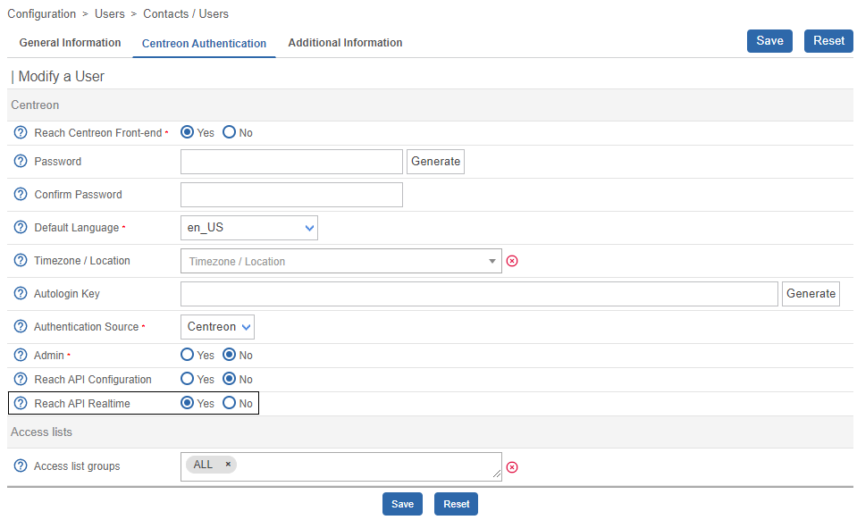

import Tabs from '@theme/Tabs';
import TabItem from '@theme/TabItem';

This topic describes how to install Centreon MAP. It is recommended to install MAP on a dedicated server. However, if you do not have large volumes of data, you can install it on the central server.

> Note to users already using the MAP (Legacy) version: the MAP module does not require the **centreon_studio** database (used for a MAP Legacy server). This database can be removed after [migrating your legacy maps to MAP](./import-into-map-web.md). Be aware that it is not possible to migrate from MAP to MAP (legacy).

## License

If you need an additional [license](../administration/licenses.md) for Centreon MAP, please contact the [Centreon support
team](https://support.centreon.com/) to get and install your license key.

## Architecture

The diagram below summarizes the MAP architecture.

- You can either install Centreon MAP on a dedicated server or on the central server.
- Centreon MAP does not require any installation on your machine: this solution is fully available in the Centreon web interface.


**Table of network flow**

| Application    | Source     | Destination               | Port      | Protocol   | Purpose                                             |
|----------------|------------|---------------------------|-----------|------------|-----------------------------------------------------|
| Map Server     | Map server | Centreon central broker   | 5758      | TCP        | Get real-time status updates                        |
| Map Server     | Map server | Centreon MariaDB database | 3306      | TCP        | Retrieve configuration and other data from Centreon |
| Web            | Map server | Centreon central          | 80/443    | HTTP/HTTPS | Authentication & data retrieval                     |
| Web interface  | User       | Map server                | 8081/9443 | HTTP/HTTPS | Retrieve views & content                            |
| Web interface  | User       | Internet\* (Mapbox)       | 443       | HTTPS      | Retrieve Mapbox data                                |

\* *With or without a proxy*

## Prerequisites

### Centreon MAP Engine server

#### License

The server requires the license to be available and valid on Centreon's central
server. To do this, you must contact the [Centreon support
team](https://support.centreon.com/) to get and install your license key.

#### Software

See the [software requirements](../installation/prerequisites.md#software).

#### Hardware

<Tabs groupId="sync">
<TabItem value="Up to 500 hosts" label="Up to 500 hosts">

| Element                     | Value     |
| ----------------------------| --------- |
| CPU   | 2 vCPU    |
| RAM                         | 4 GB      |

This is how your MAP server should be partitioned:

| Volume group (LVM) | File system                | Description | Size                                                     |
|-| ----------------------------|-------------|----------------------------------------------------------|
| | /boot | boot images | 1 GB |
|  vg_root | /                          | system root            | 20 GB                                |
| vg_root | swap                       | swap | 4 GB                               |
| vg_root | /var/log                   | contains all log files | 10 GB                                |
| vg_data | /var/lib/mysql  | database | 5 GB                               |
| vg_data |   | Free space (unallocated) | 2 GB                               |


</TabItem>
<TabItem value="Up to 1,000 hosts" label="Up to 1,000 hosts">

| Element                     | Value     |
| ----------------------------| --------- |
| CPU    | 4 vCPU    |
| RAM                         | 4 GB      |

This is how your MAP server should be partitioned:

| Volume group (LVM) | File system                | Description | Size                                                     |
|-| ----------------------------|-------------|----------------------------------------------------------|
| | /boot | boot images | 1 GB |
|  vg_root | /                          | system root            | 20 GB                                |
| vg_root | swap                       | swap | 4 GB                               |
| vg_root | /var/log                   | contains all log files | 10 GB                                |
| vg_data | /var/lib/mysql  | database | 5 GB                               |
| vg_data |   | Free space (unallocated) | 2 GB                               |


</TabItem>
<TabItem value="Up to 2,500 hosts" label="Up to 2,500 hosts">

| Element                     | Value     |
| ----------------------------| --------- |
| CPU    | 4 vCPU    |
| RAM                         | 10 GB      |

This is how your MAP server should be partitioned:

| Volume group (LVM) | File system                | Description | Size                                                     |
|-| ----------------------------|-------------|----------------------------------------------------------|
| | /boot | boot images | 1 GB |
|  vg_root | /                          | system root            | 20 GB                                |
| vg_root | swap                       | swap | 4 GB                               |
| vg_root | /var/log                   | contains all log files | 10 GB                                |
| vg_data | /var/lib/mysql  | database | 5 GB                               |
| vg_data |   | Free space (unallocated) | 2 GB                               |

</TabItem>
<TabItem value="Up to 5,000 hosts" label="Up to 5,000 hosts">

| Element                     | Value     |
| ----------------------------| --------- |
| CPU   | 4 vCPU    |
| RAM                         | 18 GB      |

This is how your MAP server should be partitioned:

| Volume group (LVM) | File system                | Description | Size                                                     |
|-| ----------------------------|-------------|----------------------------------------------------------|
| | /boot | boot images | 1 GB |
|  vg_root | /                          | system root            | 20 GB                                |
| vg_root | swap                       | swap | 4 GB                               |
| vg_root | /var/log                   | contains all log files | 10 GB                                |
| vg_data | /var/lib/mysql  | database | 5 GB                               |
| vg_data |   | Free space (unallocated) | 2 GB                               |

</TabItem>
<TabItem value="Up to 10,000 hosts" label="Up to 10,000 hosts">

| Element                     | Value     |
| ----------------------------| --------- |
| CPU   | 6 vCPU    |
| RAM                         | 18 GB      |

This is how your MAP server should be partitioned:

| Volume group (LVM) | File system                | Description | Size                                                     |
|-| ----------------------------|-------------|----------------------------------------------------------|
| | /boot | boot images | 1 GB |
|  vg_root | /                          | system root            | 20 GB                                |
| vg_root | swap                       | swap | 4 GB                               |
| vg_root | /var/log                   | contains all log files | 10 GB                                |
| vg_data | /var/lib/mysql  | database | 5 GB                               |
| vg_data |   | Free space (unallocated) | 2 GB                               |

</TabItem>
<TabItem value="Over 10,000 hosts" label="Over 10,000 hosts">

For very large amounts of data, contact your sales representative.

</TabItem>
</Tabs>

#### Information required during configuration

- Centreon web login with administration rights.

> Even with a correctly sized server, you should have in mind the best practices and recommendations when creating views so you do not face performance issues.

> If the central server is configured in HTTPS, you must apply the SSL configuration on the MAP server. Follow this [procedure](../graph-views/secure-your-map-platform.md) to secure your MAP server.

### Centreon MAP web client

#### License

The web interface requires the license to be available and valid on Centreon's
central server. To do this, you must contact the [Centreon support
team](https://support.centreon.com/) to get and install your license key.

#### Compatibility

Note that the MAP web interface has the same requirements as the Centreon web interface. See the prerequisites for the web browsers compatibility [here](../installation/prerequisites.md).

## Pre-installation

### Disable SELinux

<Tabs groupId="sync">
<TabItem value="Alma / RHEL / Oracle Linux 8" label="Alma / RHEL / Oracle Linux 8">

During installation, SELinux should be disabled. To do this, edit the file **/etc/selinux/config** and replace
**enforcing** by **disabled**. You can also run the following command:

```shell
sed -i s/^SELINUX=.*$/SELINUX=disabled/ /etc/selinux/config
```

Reboot your operating system to apply the change.

```shell
reboot
```

After system startup, perform a quick check of the SELinux status:

```shell
getenforce
```

You should have this result:

```shell
Disabled
```

> **Note that this deactivation should be temporary.** To enable SELinux again, edit the **/etc/selinux/config** file and change the value with the following options:
> - ``SELINUX=enforcing`` to make SELinux security policy enforced.
> - ``SELINUX=permissive`` to make SELinux print warnings instead of enforce security policy.

</TabItem>
<TabItem value="Alma / RHEL / Oracle Linux 9" label="Alma / RHEL / Oracle Linux 9">

During installation, SELinux should be disabled. To do this, edit the file **/etc/selinux/config** and replace
**enforcing** by **disabled**. You can also run the following command:

```shell
sed -i s/^SELINUX=.*$/SELINUX=disabled/ /etc/selinux/config
```

Reboot your operating system to apply the change.

```shell
reboot
```

After system startup, perform a quick check of the SELinux status:

```shell
getenforce
```

You should have this result:

```shell
Disabled
```

> **Note that this deactivation should be temporary.** To enable SELinux again, edit the **/etc/selinux/config** file and change the value with the following options:
> - ``SELINUX=enforcing`` to make SELinux security policy enforced.
> - ``SELINUX=permissive`` to make SELinux print warnings instead of enforce security policy.

</TabItem>
<TabItem value="Debian 11" label="Debian 11">

SELinux is not installed on Debian 11, continue.

</TabItem>
</Tabs>

### Configure or disable the firewall

If your firewall is active, add [firewall rules](../administration/secure-platform.md#enable-firewalld).
You can also disable the firewall during installation by running the following commands:

```shell
systemctl stop firewalld
systemctl disable firewalld
```

## MAP Engine server installation

### Step 1: Set authentication parameters

You must provide to Centreon MAP Engine server a dedicated user
**who has access to all resources** through the appropriate [access list groups](../administration/access-control-lists.md). 
Since the password will be stored in human-readable form in a 
configuration file, you should not use a Centreon admin user account.

- Log into Centreon and go to the **Configuration > Users > Contacts/Users** page. Then click the **Centreon Authentication** tab.
- Set the **Reach API Realtime** parameter to **Yes**.



Exclude the user from the password expiration policy on page **Administration > Authentication**: their password will never expire.


### Step 2: Create a MySQL user

From the central server terminal, create a user in the MySQL instance hosting 'centreon' and 'centreon_storage'
databases:

```sql
CREATE USER 'centreon_map'@'<IP_SERVER_MAP>' IDENTIFIED BY 'centreon_map';
GRANT SELECT ON centreon_storage.* TO 'centreon_map'@'<IP_SERVER_MAP>';
GRANT SELECT, INSERT ON centreon.* TO 'centreon_map'@'<IP_SERVER_MAP>';
```

The INSERT privilege will only be used during the installation process
in order to create new Centreon Broker output. It will be revoked later.

### Step 3: Install MAP Engine server

#### Package installation

If you installed your Centreon MAP server from a "fresh OS installation"
you need to install the Centreon repository:

<Tabs groupId="sync">
<TabItem value="Alma / RHEL / Oracle Linux 8" label="Alma / RHEL / Oracle Linux 8">

First you need to install an EPEL repository:

```shell
dnf install -y https://dl.fedoraproject.org/pub/epel/epel-release-latest-8.noarch.rpm
```

The command should return results as follows:

```shell
Installed:
  epel-release-8-17.el8.noarch

Complete!
```

Then install the Centreon repository:

```shell
dnf install -y dnf-plugins-core
dnf config-manager --add-repo https://packages.centreon.com/rpm-standard/23.04/el8/centreon-23.04.repo
```

</TabItem>
<TabItem value="Alma / RHEL / Oracle Linux 9" label="Alma / RHEL / Oracle Linux 9">

First you need to install an EPEL repository:

```shell
dnf install -y https://dl.fedoraproject.org/pub/epel/epel-release-latest-9.noarch.rpm
```

The command should return results as follows:

```shell
Installed:
  epel-release-9-2.el9.noarch

Complete!
```

Then install the Centreon repository:

```shell
dnf install -y dnf-plugins-core
dnf config-manager --add-repo https://packages.centreon.com/rpm-standard/23.04/el9/centreon-23.04.repo
```

</TabItem>
<TabItem value="Debian 11" label="Debian 11">

Install the following dependencies:

```shell
apt update && apt install lsb-release ca-certificates apt-transport-https software-properties-common wget gnupg2 curl
```

To install the Centreon repository, execute the following command:

```shell
echo "deb https://packages.centreon.com/apt-standard-23.04-stable/ $(lsb_release -sc) main" | tee /etc/apt/sources.list.d/centreon.list
echo "deb https://packages.centreon.com/apt-plugins-stable/ $(lsb_release -sc) main" | tee /etc/apt/sources.list.d/centreon-plugins.list
```

Then import the repository key:

```shell
wget -O- https://apt-key.centreon.com | gpg --dearmor | tee /etc/apt/trusted.gpg.d/centreon.gpg > /dev/null 2>&1
```

</TabItem>
</Tabs>

> If the URL does not work, you can manually find this package in the folder.

#### Business repository installation

Install Centreon Business repository, you can find it on the
[support portal](https://support.centreon.com/hc/en-us/categories/10341239833105-Repositories).

#### MAP Engine server installation

You have two possibilities for the installation:

- on a new server (without existing Centreon MAP packages),
- or on an existing Centreon MAP server legacy.

Select the right tab below and install the Centreon MAP Engine server:

<Tabs groupId="sync">
<TabItem value="New MAP Engine server" label="New MAP Engine server">

#### MariaDB requirement

> You need to have a MariaDB database to store your Centreon MAP data.

First you need to add the MariaDB repository:

<Tabs groupId="sync">
<TabItem value="Alma / RHEL / Oracle Linux 8" label="Alma / RHEL / Oracle Linux 8">

```shell
curl -LsS https://r.mariadb.com/downloads/mariadb_repo_setup | sudo bash -s -- --os-type=rhel --os-version=8 --mariadb-server-version="mariadb-10.5"
```

</TabItem>
<TabItem value="Alma / RHEL / Oracle Linux 9" label="Alma / RHEL / Oracle Linux 9">

```shell
curl -LsS https://r.mariadb.com/downloads/mariadb_repo_setup | sudo bash -s -- --os-type=rhel --os-version=9 --mariadb-server-version="mariadb-10.5"
```

</TabItem>
<TabItem value="Debian 11" label="Debian 11">

```shell
curl -LsS https://r.mariadb.com/downloads/mariadb_repo_setup | sudo bash -s -- --os-type=debian --os-version=11 --mariadb-server-version="mariadb-10.5"
```

</TabItem>
</Tabs>

Then install MariaDB server:

<Tabs groupId="sync">
<TabItem value="Alma / RHEL / Oracle Linux 8" label="Alma / RHEL / Oracle Linux 8">

```shell
dnf install MariaDB-server
```

</TabItem>
<TabItem value="Alma / RHEL / Oracle Linux 9" label="Alma / RHEL / Oracle Linux 9">

```shell
dnf install MariaDB-server
```

</TabItem>
<TabItem value="Debian 11" label="Debian 11">

```shell
apt update && apt install mariadb-server
```

> MariaDB has to listen to all interfaces instead of localhost/127.0.0.1, which is the default value. Edit the following file:
> 
> ```shell
> /etc/mysql/mariadb.conf.d/50-server.cnf
> ```
> 
> Set the **bind-address** parameter to **0.0.0.0** and restart mariadb.
> 
> ```shell
> systemctl restart mariadb
> ```

</TabItem>
</Tabs>

Then enable and restart mariadb

```shell
systemctl enable mariadb
systemctl restart mariadb
```

Since MariaDB 10.5, it is mandatory to secure the database's root access before installing Centreon. If you are using a local database, run the following command on the Map server:

```shell
mysql_secure_installation
```

* Answer **yes** to all questions except "Disallow root login remotely?".
* It is mandatory to set a password for the **root** user of the database.

> For more information, please see the [official MariaDB documentation](https://mariadb.com/kb/en/mysql_secure_installation/).

Now you can install Centreon MAP Engine.

<Tabs groupId="sync">
<TabItem value="Alma / RHEL / Oracle Linux 8" label="Alma / RHEL / Oracle Linux 8">

```shell
dnf install centreon-map-engine
```

</TabItem>
<TabItem value="Alma / RHEL / Oracle Linux 9" label="Alma / RHEL / Oracle Linux 9">

```shell
dnf install centreon-map-engine
```

</TabItem>
<TabItem value="Debian 11" label="Debian 11">

```shell
apt update && apt install centreon-map-engine
```

</TabItem>
</Tabs>

</TabItem>
<TabItem value="Existing MAP Legacy server" label="Existing MAP Legacy server">

> If you already have MAP Legacy and are installing MAP Engine on the same server, you need to perform the following procedure. Otherwise, move to the **New MAP Engine server** tab.

> You can use the existing MariaDB database of Centreon MAP Legacy for the new MAP Engine server. So it's not necessary to install a new database.

This procedure is to ensure that the configuration file can be used for both MAP Engine and MAP Legacy.

1. Make a backup of the **map.cnf** file:

   <Tabs groupId="sync">
   <TabItem value="Alma / RHEL / Oracle Linux 8" label="Alma / RHEL / Oracle Linux 8">
   
   ```shell
   cp /etc/my.cnf.d/map.cnf /etc/my.cnf.d/map.cnf.bk
   ```
   
   </TabItem>
   <TabItem value="Alma / RHEL / Oracle Linux 9" label="Alma / RHEL / Oracle Linux 9">
   
   ```shell
   cp /etc/my.cnf.d/map.cnf /etc/my.cnf.d/map.cnf.bk
   ```
   
   </TabItem>
   <TabItem value="Debian 11" label="Debian 11">
   
   ```shell
   cp /etc/mysql/map.cnf /etc/mysql/map.cnf.bk
   ```
   
   </TabItem>
   </Tabs>

2. Install the centreon-map-engine package
   
   <Tabs groupId="sync">
   <TabItem value="Alma / RHEL / Oracle Linux 8" label="Alma / RHEL / Oracle Linux 8">
   
   ```shell
   dnf install centreon-map-engine
   ```
   
   </TabItem>
   <TabItem value="Alma / RHEL / Oracle Linux 9" label="Alma / RHEL / Oracle Linux 9">
   
   ```shell
   dnf install centreon-map-engine
   ```
   
   </TabItem>
   <TabItem value="Debian 11" label="Debian 11">
   
   ```shell
   apt update && apt-get -o Dpkg::Options::="--force-overwrite" install centreon-map-engine
   ```
   
   </TabItem>
   </Tabs>

3. Retrieve the configuration file backup:
  
   <Tabs groupId="sync">
   <TabItem value="Alma / RHEL / Oracle Linux 8" label="Alma / RHEL / Oracle Linux 8">
   
   ```shell
   cp /etc/my.cnf.d/map.cnf.bk /etc/my.cnf.d/map.cnf
   ```
   
   </TabItem>
   <TabItem value="Alma / RHEL / Oracle Linux 9" label="Alma / RHEL / Oracle Linux 9">
   
   ```shell
   cp /etc/my.cnf.d/map.cnf.bk /etc/my.cnf.d/map.cnf
   ```
   
   </TabItem>
   <TabItem value="Debian 11" label="Debian 11">
   
   ```shell
   cp /etc/mysql/map.cnf.bk /etc/mysql/map.cnf
   ```
   
   </TabItem>
   </Tabs>

4. Answer **Y** when prompted. Then restart MySQL:
   
   ```shell
   systemctl restart mariadb
   ```
   
</TabItem>
</Tabs>

When installing Centreon MAP Engine server, it will automatically install java
(OpenJDK 17) if needed.

#### Java requirement
  > Ensure a version of Java 17 (or 18) is installed before you start the procedure.
  
  - If you need to check the Java version, enter the following command:
  
  ```shell
  java -version
  ```
  
  - If you need to upgrade the Java installation to Java 17 (or 18), go to the [Oracle official download](https://www.oracle.com/java/technologies/downloads/#java17) page.

  - If several Java versions are installed, you need to activate the right version. Display the installed versions using the following command and select the Java 17 (or 18) version:
  ```shell
  sudo update-alternatives --config java
  ```
  
  - If you need to use your platform in HTTPS, you will have to generate a keystore file for the Java 17 (or 18) version ([see the procedure](./secure-your-map-platform.md#httpstls-configuration-with-a-recognized-key)).

### Step 4: Check the database configuration

Make sure the database that stores Centreon MAP data is optimized
(automatically added by the RPM in **/etc/my.cnf.d/map.cnf** or in **/etc/mysql/map.cnf** for Debian):

```text
max_allowed_packet = 20M
innodb_log_file_size = 200M
```

Then, restart MariaDB:

```shell
systemctl restart mariadb
```

Since MariaDB 10.5, it is mandatory to secure the database's root access before installing Centreon. If you are using a local database, run the following command on the central server:

```shell
mysql_secure_installation
```

* Answer **yes** to all questions except "Disallow root login remotely?".
* It is mandatory to set a password for the **root** user of the database. You will need this password during the [web installation](../installation/web-and-post-installation.md).

> For more information, please see the [official MariaDB documentation](https://mariadb.com/kb/en/mysql_secure_installation/).

### Step 5 : Execute the configure.sh script

Execute the Centreon MAP Engine server configuration script.

Two modes are available:
  - Interactive (no option/default mode): several questions will be asked to interactively fill in the installation variables.
  - Automatic (--automatic or -a): the installation will be done automatically from the values set in **/etc/centreon-map/vars.sh** file.
  
If it is your first installation, we advise you to use the standard mode (interactive) and choose **No** when asked for advanced installation mode:
   
  ```shell
   /etc/centreon-map/configure.sh
  ```

The output should look like this:

  ```shell
  Configuration completed, enjoy !
  ```

This script generates the **map-config.properties** file.

#### Custom URI 

If you have customized the URI for your Centreon platform, you need to edit the **map-config.properties** file by adding the following command using the custom URI already defined [here](../administration/secure-platform.md#custom-uri):

```shell
centreon.path=/your-custom-uri
```

#### Java memory optimization

> JAVA_OPTS is a standard environment variable used to edit Java properties.

To correctly implement the dedicated memory:

Edit the *JAVA\_OPTS* parameter in the Centreon Map configuration file `/etc/centreon-map/centreon-map.conf` by adding -Xms and -Xmx parameters:

```text
JAVA_OPTS="-Xms512m -Xmx4G..."
```

> The Xmx value depends on the amount of memory indicated in the tables in the [Hardware](#hardware) section.

Then restart the **centreon-map-engine** service:

```shell
systemctl restart centreon-map-engine
```

### Step 6: Apply Centreon Broker configuration and restart MAP Engine service

> Before restarting Broker you must export the configuration from the Centreon web interface.

Restart Centreon Broker on the Central server:

```shell
systemctl restart cbd
```

Remove the INSERT privilege from user **centreon_map**:

```sql
REVOKE INSERT ON centreon.* FROM 'centreon_map'@'<IP_SERVER_MAP>';
```

Then restart the **centreon-map-engine** service:

```shell
systemctl restart centreon-map-engine
```

Run the following command to check that the **centreon-map-engine** service is properly started:
  
  ```shell
  systemctl status centreon-map-engine
  ```

  This is an example of results:

  ```shell
  ● centreon-map-engine.service - Centreon Studio map server
   Loaded: loaded (/usr/lib/systemd/system/centreon-map-engine.service; disabled; vendor preset: disabled)
   Active: active (running) since Thu 2022-11-24 09:10:58 UTC; 6h ago
 Main PID: 39103 (centreon-map-en)
    Tasks: 50 (limit: 23465)
   Memory: 598.1M
   CGroup: /system.slice/centreon-map-engine.service
           ├─39103 /bin/bash /usr/share/centreon-map-engine/bin/centreon-map-engine
           └─39119 /usr/bin/java -Dsun.misc.URLClassPath.disableJarChecking=true -XX:+HeapDumpOnOutOfMemoryError -XX:HeapDumpPath=/var/log/centreon-map
  ```

### Step 7: Check the configuration

Check the MAP Engine server configuration by using this command:

```shell
/etc/centreon-map/diagnostic.sh
```

> In case of any error, see the **Run our diagnostic tool** section in the [Troubleshooting MAP](map-web-troubleshooting.md#run-our-diagnostic-tool) topic.

If configuration is correct, the **centreon-map-engine** service can be
started from the Centreon MAP server:

```shell
systemctl restart centreon-map-engine
```

Enable the service to start up automatically on server boot:

```shell
systemctl enable centreon-map-engine
```

Centreon MAP Engine server is now started and enabled, let's install
the interface part of the extension.

## MAP web client installation

### Step 1: Install the business repository

Install the Centreon Business repository, you can find it on the
[support portal](https://support.centreon.com/hc/en-us/categories/10341239833105-Repositories).

### Step 2: Install the MAP module

1. From your terminal, run the following command on the central server:

  <Tabs groupId="sync">
  <TabItem value="Alma / RHEL / Oracle Linux 8" label="Alma / RHEL / Oracle Linux 8">

  ```shell
  sudo dnf install centreon-map-web-client
  ```

  </TabItem>
  <TabItem value="Alma / RHEL / Oracle Linux 9" label="Alma / RHEL / Oracle Linux 9">

  ```shell
  sudo dnf install centreon-map-web-client
  ```

  </TabItem>
  <TabItem value="Debian" label="Debian">

  ```shell
  sudo apt install centreon-map-web-client
  ```

  </TabItem>
  </Tabs>

2. Then you need to log on to the Centreon web interface.

3. Go to **Administration > Extensions > Manager** and install the **Map Web Client** module.

### Step 3: Activate the MAP module

By default, the MAP module is not enabled. Perform the following procedure to enable it.

1. Log on to the Centreon interface and go to **Administration > Extensions > Map > Options**.
  

2. In the **Connection information** section, set **Map Engine server** to **Yes**.

3. Enter the IP address of your MAP server in the **Map Engine server address** field. If you installed MAP on the central server, this is the IP address of the central server. Use its full IP address, not the localhost. The default port is 8081 (for instance: ``http://10.25.xxx:8081``).

4. Click the **Test connection to server** button to test the connection. This test should return the **Connection test successful** message.

5. Click **Save**.

6. Go to the **Configuration > Pollers > Pollers** page. [Export the configuration](../monitoring/monitoring-servers/deploying-a-configuration.md) of the central server (using the **Reload** method).

7. From your terminal, restart the cbd service:

  ```shell
  systemctl restart cbd
  ```

You can now use the MAP module by accessing the **Monitoring > Map** page.

## Secure MAP in HTTPS

If you want to use MAP in HTTPS, you must both secure your Centreon platform and MAP.

- Follow this [procedure](../administration/secure-platform.md) to secure your Centreon platform.
- Follow this [procedure](../graph-views/secure-your-map-platform.md) to secure MAP.
