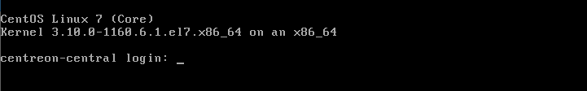
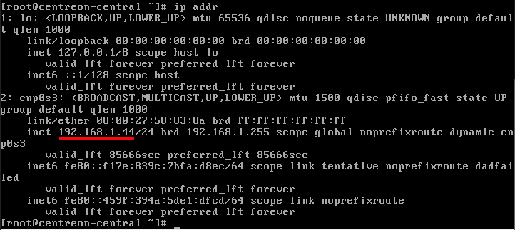
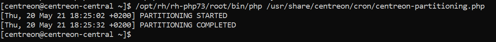

import Tabs from '@theme/Tabs';
import TabItem from '@theme/TabItem';

On its [download page](https://download.centreon.com), Centreon provides a ready-to-use virtual machine. This virtual machine is available in OVA format for VMware environments and in OVF format for Oracle VirtualBox. It is based on the **Alma Linux 8** operating system and includes a Centreon installation that allows you to easily start your first monitoring.

The VM uses the **Thin Provision** option to save as much free space as possible on the disk (this is best practice).

**Prerequisites**

The host machine must have the following characteristics:

- Processor: any recent Intel or AMD processor with at least 2 vCPUs.
- Memory: depending on your operating system, you will need at least 1 GB of RAM. To fully enjoy the Centreon experience, you need at least 2 GB of free memory.
- Hard Disk storage: The virtual machine requires at least 6.5 GB of free space on your hard disk. However, if you want keep using Centreon, it is recommended to have at least 10 GB as its size will grow over time.

## Step 1: Downloading the virtual machine

1. Make sure your virtualization tool (VMWare or VirtualBox) is installed on your machine and up to date.

2. Go to the [Centreon download page](https://download.centreon.com). In section 1, **Appliances** is already selected.

3. In section 2, select which version of Centreon you want to download.

4. In section 3, **Download your image**, click the **Download** button next to the VM you want. A new page opens.

    - If you want Centreon to contact you, fill in your details, then click **Download**.

    - Otherwise, click **Direct download**.

5. The file you have downloaded is an archive file: extract its contents to the folder you want.

## Step 2 : Installing the virtual machine

<Tabs groupId="sync">
<TabItem value="VMware environment" label="VMware environment">

1. Import the **centreon-central.ova** file into VMWare. A terminal window opens: wait for the server to start. When it is ready, the terminal shows the following message:

    

2. According to how your network is set up, in the configuration of your virtual machine, add a network adapter and select the network through which the virtual machine can communicate with the resources it will monitor. Here is an example of configuration in VSphere 6:

    

</TabItem>
<TabItem value="Oracle VirtualBox" label="Oracle VirtualBox">

1. Import the **centreon-central.ova** file into VirtualBox. The VM is added to your list of VMs in VirtualBox.

    

2. In the right-hand panel, click **Settings**. The **Settings** dialog box opens.

3. On the **System** tab, check the **Hardware Clock in UTC Time** box.

4. According to how your network is set up, add a network adapter and select the network through which the virtual machine can communicate with the resources it will supervise. For instance:

    1. On the **Network** tab, select **Enable Network Adapter**.

    2. In the **Attached to** list, select **Bridged Adapter**.

    3. In the **Name** list, select the network card you want.

5. Click **OK**.

6. In the right-hand panel, click **Start** to start the VM. A terminal window opens: wait for the server to start. When it is ready, the terminal shows the following message:

    

</TabItem>
</Tabs>

## Step 3 : Completing the configuration

1. Log in to the Centreon server using the following credentials: login: `root`, password: `centreon`.

2. To know your server's IP address, type `ip addr`. (By default, the VM has a qwerty keyboard: if you have an azerty keyboard, enter `ip qddr`.) The VM is configured to obtain an IP address from the DHCP server automatically.

    

3. Log in to the server from another machine, as user `root`, using the terminal you want and the IP address you obtained at the previous step.

4. The first time you connect to the server, instructions are displayed to help you complete the configuration.

    Change the following settings:

    - The timezone for the Centreon server. By default, it is set to UTC. This will set the time for the various Centreon logs.

        Use the following command:

        ```shell
        timedatectl set-timezone your_timezone
        ```

        For example, to set the timezone to Europe/London, type:

        ```shell
        timedatectl set-timezone Europe/London
        ```

        You can get a list of all available timezones using this command:

        ```shell
        timedatectl list-timezones
        ```

    - The timezone for the php server. To avoid errors, this should be the same as the timezone of the server. By default, it is set to Europe/London.

        1. Open the following file:

            ```shell
            /etc/php.d/50-centreon.ini
            ```

        2. In `date.timezone`, define the timezone you want.

        3. Restart the php server:

            ```shell
            systemctl restart php-fpm
            ```

    - The hostname of your server. The default name is `centreon-central`. To change it, use the following command:

        ```shell
        hostnamectl set-hostname your-hostname
        ```

        For example, if you want your machine to be called `supervision`, type:

        ```shell
        hostnamectl set-hostname supervision
        ```

5. Add a MariaDB table partition: this step is mandatory. Your Centreon server will not work if this isn't done.

    1. Connect as user `centreon`:

        ```shell
        su - centreon
        ```

    2. Type the following command:

        ```shell
        /bin/php /usr/share/centreon/cron/centreon-partitioning.php
        ```

        The partition is created:

        

    3. Connect back as user `root`:

        ```shell
        exit
        ```

    4. Restart the Centreon broker process so that changes are taken into account:

        ```shell
        systemctl restart cbd centengine gorgoned
        ```

        Your Centreon server is now ready to use.

        >Once those operations have been carried out, you can get rid of the message that describes them in the terminal. To do so, delete the following file:
        >
        >`/etc/profile.d/centreon.sh`

6. To log in to the web interface, go to `http://ip_address/centreon` or `http://FQDN/centreon`. (For example, a valid URL would be `http://192.168.1.44/centreon`.) 

7. Log in using the following credentials: Login: `admin`, password: `Centreon!123`. By default, your server has a predefined configuration to monitor the Centreon server itself.

8. According to your Centreon edition, you may have to [add a license](../../administration/licenses.md).

9. [Update](../../update/update-centreon-platform.md) your Centreon platform.

9. [Secure your Centreon platform](../../administration/secure-platform.md). We recommend that you change the passwords for the root and admin accounts. You must define a password for the MariaDB database.

10. You can now [monitor your first host](../../getting-started/first-supervision.md).


## Default credentials

- To log in to the Centreon web interface, the default credentials are: `admin`/`Centreon!123`.
- The server administration account (using SSH) is: `root`/`centreon`.
- The root password of the DBMS is not initialized.

> For security reasons, we highly recommend you change those passwords after you complete the installation.
