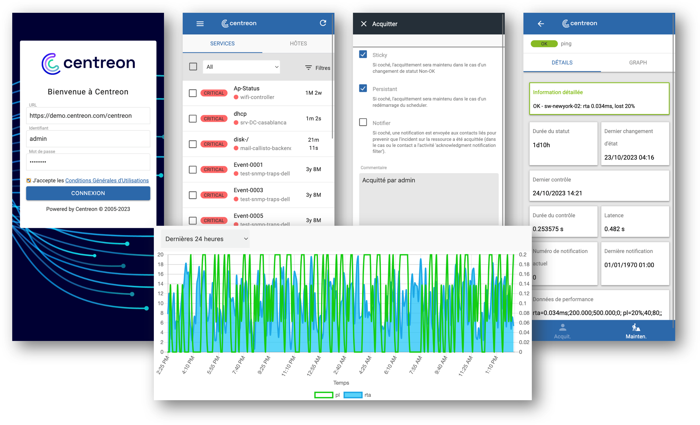
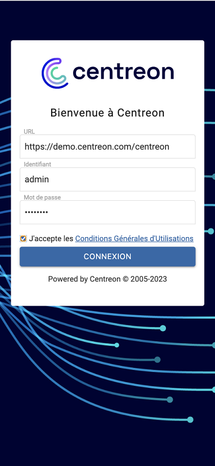

import Tabs from '@theme/Tabs';
import TabItem from '@theme/TabItem';

Centreon comes with a mobile version to let you access resources status whether you're on phone or tablet.

  

The main capabilities of Centreon mobile are :

- See your resources current status: hosts & services
- Filter resources list
- Take actions: acknowledge or set a planned downtime
- See detail information of host or service
- Access metrics history via charts

<video width="675" height="712" controls={true} allowFullScreen={true} poster={require('../assets/mobile/mobile-login.png').default}><source src={require('../assets/mobile/mobile-demo.mp4').default} type="video/mp4"/></video>

## Pre-requisites

To be able to connect Centreon mobile to your Centreon platform, you need to:

- Have a Centreon platform >= 20.04
- Have a “Direct” connection between your smartphone & the Centreon platform you want to connect to. You may also use a VPN
- Have a valid SSL certificate on your Centreon platform issued from a trusted certificate authority known by your device

## How to access Centreon mobile

Go to [mobile.centreon.com](https://mobile.centreon.com/).

## How to connect

When logging in for the first time, you need to fill the following parameters:

- URL: URL to connect to your Centreon platform. Do not forget the /centreon if this your current Centreon URL. Example: `https://yourcentreon.int.com:PORT/centreon`
- User: Type your username to connect to Centreon
- Password: Type the password to connect to Centreon

If you have problems to connect:

- Make sure your Centreon platform is accessible from your device
- Make sure you give realtime API access to the user. Go to **Configuration > Users > Contacts / Users**:
on the **Centreon Authentication** tab, **Reach API Realtime** must be enabled.
