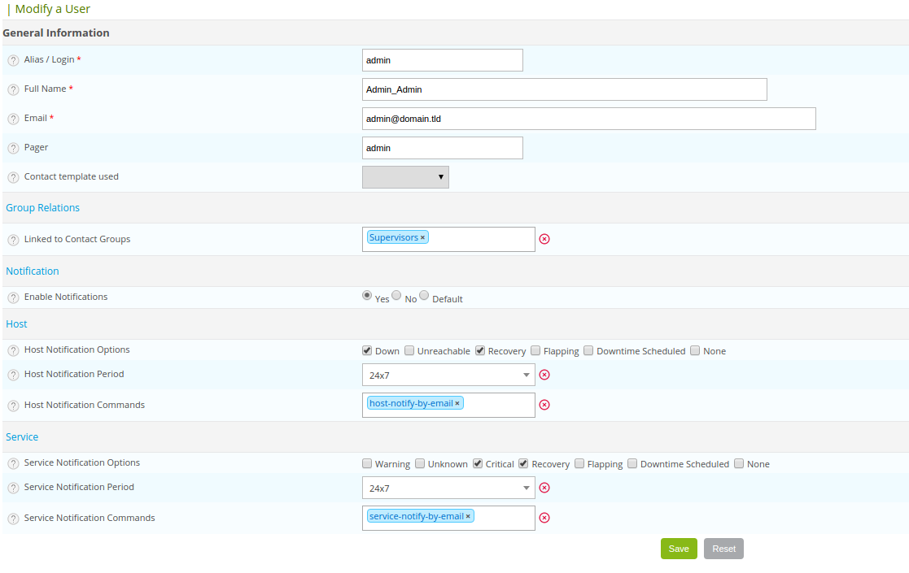

To create a user, go to **Configuration > Users > Contacts/Users**, then click **Add**.



To display the matrix of notifications for a user, click on **View contact notifications** next to the **Add** menu).

## General information

* The **Alias/Login** field defined the login to access the web interface.
* The **Full Name** field contains the name and first name of the user.
* The **Email** and **Pager** fields contain respectively the e-mail address and the telephone number of the user (in
  the case of a notification by SMS or call for instance).
* The **Contact template used** field allows us to link the contact to a Model of contact.
* The **Linked to Contact Groups** list associated the contact to one or more groups of contacts.
* The **Enable Notifications** field allows us to enable the sending of notifications to the user.
* The **Host / Service Notification Options** field serves to define the statuses to which notifications are sent.
* The **Host / Service Notification Period** field serves to choose the time period in which notifications are sent.
* The **Host / Service Notification Command** field serves to choose the notification command to a host or a service.

## Centreon authentication

* The **Reach Centreon Front-end** field serves to authorize the user to access the Centreon web interface.
* The **Password** and **Confirm Password** fields contain the user password.
* The **Default Language** field serves to define the language of the Centreon interface for this user.
* The **Admin** field defined if this user is the administrator of the monitoring platform or not.
* The **Autologin key** serves to define a connection key for the user. The user will no longer need to enter his / her
  login and password but will use this key to log in directly. Connection syntax:

```url
http://[IP_DU_SERVER_CENTRAL]/centreon/main.php?autologin=1&useralias=[login_user]&token=[value_autologin]
```

> The Possibility of automatic connection (auto login) should be enabled in the menu: **Administration \> Options**.

* The **Authentication Source** field specifies if the connection information comes from an LDAP directory or information stored locally on the server.
* The next 3 fields are for authorizing users to perform calls to our [API v1](../../api/rest-api-v1.md#api-calls) and [API v2](https://docs-api.centreon.com/api/centreon-web/23.04/) (note: our API documentation is written for developers familiar with HTTP requests and JSON).
- The **Configuration API** field only applies to the v2 API as only administrators can call this API using v1.
- The [**Realtime API**](../../api/rest-api-v1.md#realtime-information) can be called by a non-administrator user in both versions as long as this field is checked.
- Administrators are able to call both the **Configuration API** and the [**Realtime API**](../../api/rest-api-v1.md#realtime-information) even if these fields are not checked. This is true for both v1 and v2. They are also the only ones allowed to use [**CLAPI**](../../api/clapi.md) while others can only use the Rest API.
* The **Access list groups** field serves to define an access group to a user (group use for access control (ACL)).

> An Administrative user is never concerned by access control even linked to an access group.

## Additional information

* The **Address** fields allow us to specify the data of additional contacts (other e-mails, other telephone numbers, etc.).
* The **Status** and **Comment** fields serve to enable or disable the contact and to make comments on it.
