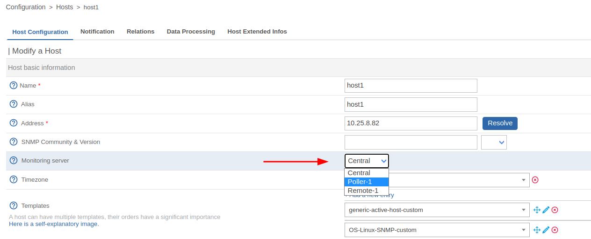
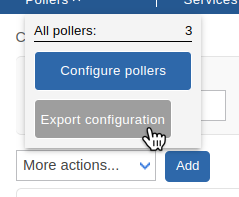
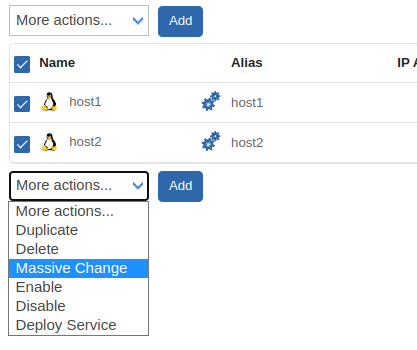
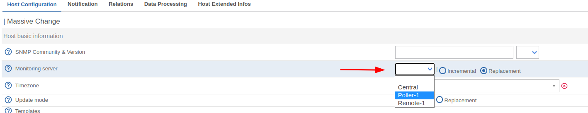

## Switch for one host

If you want that your host to be monitored by another poller than it is curently, you need to edit the host's configuration, and export the configuration to its new poller **AND the one it came from** :

1. Change the host configuration :

2. [Deploy](../monitoring-servers/deploying-a-configuration.md) the configuration to the pollers :

## Switch for multiple hosts

You can use the [massive change](../generic-actions.md#massive-change) feature in order to change the monitoring poller for multiple hosts :

1. Select the hosts and use the massive change function :

2. Change the configuration :

3. [Deploy](../monitoring-servers/deploying-a-configuration.md) the configuration to the pollers :

