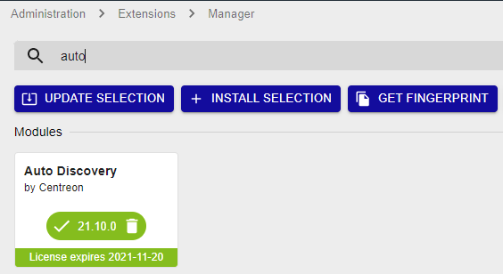

import Tabs from '@theme/Tabs';
import TabItem from '@theme/TabItem';

## Installing the Autodiscovery module

1. To install packages, execute the following command on the Central server:

<Tabs groupId="sync">
<TabItem value="Alma / RHEL / Oracle Linux 8" label="Alma / RHEL / Oracle Linux 8">

``` shell
dnf install -y centreon-auto-discovery-server
```

</TabItem>
<TabItem value="Alma / RHEL / Oracle Linux 9" label="Alma / RHEL / Oracle Linux 9">

``` shell
dnf install -y centreon-auto-discovery-server
```

</TabItem>
<TabItem value="Debian 11" label="Debian 11">

``` shell
apt update && apt install centreon-auto-discovery-server
```

</TabItem>
</Tabs>

2. Connect to the Centreon web interface using an account allowed to install
products and go to the **Administration > Extensions > Manager** menu.

3. Make sure that the **License Manager** and **Monitoring Connector Manager** modules are
 up-to-date before installing the **Auto Discovery** module.

4. Click on the installation icon corresponding to the **Auto Discovery** module.
    The module is now installed:

    

5. To get ready-to-use discovery rules, go to the **Configuration > Plugin
Packs** page and [install the Monitoring Connectors](../pluginpacks.md#pack-installation) for the 
discovery providers you want.
