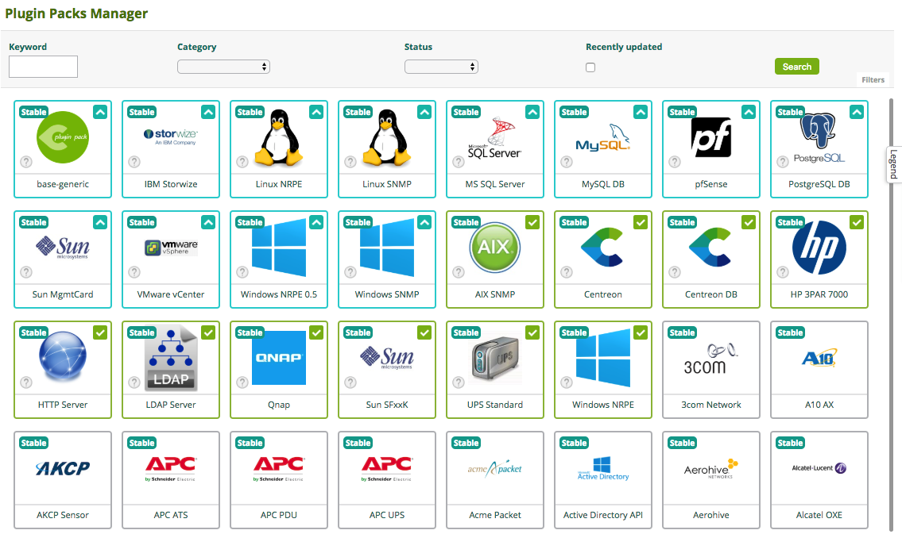
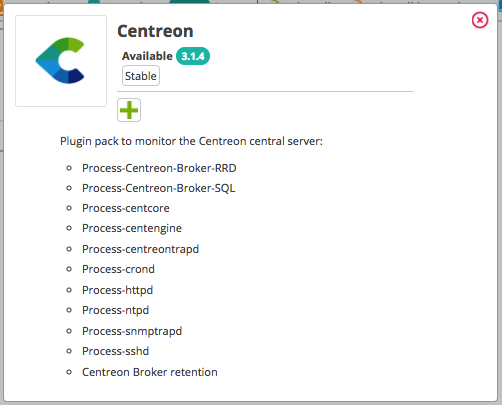
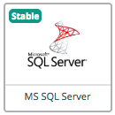
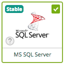
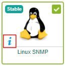
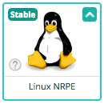
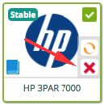
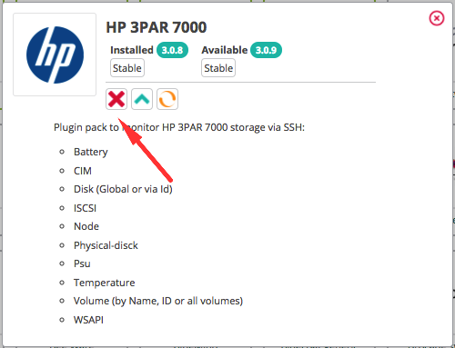

import Tabs from '@theme/Tabs';
import TabItem from '@theme/TabItem';

> As of April 2023, we're changing the name of some Centreon objects and attributes. "Monitoring Connectors" becomes the new name for Plugin Packs. We're making this change because users were often confused between two similar terms, Plugins and Plugin Packs, sometimes using one for the other. We're only changing the name! The functionalities and capabilities stay the same.

A Monitoring Connector is a downloadable package containing a set of configuration
templates that make it fast and easy to monitor your IT infrastructure.
Applying a template from a Monitoring Connector is the easiest way to monitor a host.

Monitoring Connectors consist of 2 elements, which are installed separately:

- A plugin that executes the monitoring commands from a poller. Plugins can be
installed using the command line interface, or automatically.

- A pack that contains commands, host templates and service templates. 
Packs are installed via the Centreon interface. For each type of equipment,
 the templates determine which indicators will be
monitored and set default warning and critical thresholds (these may be
fine-tuned later on).

  Some packs also contain [discovery rules](discovery/introduction.md).

To get an up-to-date list of all Monitoring Connectors with their respective monitoring
procedures, please refer to the section on [Monitoring Connectors](/pp/integrations/plugin-packs/getting-started/introduction).

## Prerequisites

### Centreon Monitoring Connector Manager

The **Centreon Monitoring Connector Manager** module can install, update or remove Plugin
Packs. It is installed by default. We recommend that you keep this module regularly updated.

To update this module, run the following command:

<Tabs groupId="sync">
<TabItem value="Alma / RHEL / Oracle Linux 8" label="Alma / RHEL / Oracle Linux 8">

```shell
dnf update centreon-pp-manager
```

</TabItem>
<TabItem value="Alma / RHEL / Oracle Linux 9" label="Alma / RHEL / Oracle Linux 9">

```shell
dnf update centreon-pp-manager
```

</TabItem>
<TabItem value="Debian 11" label="Debian 11">

```shell
apt upgrade centreon-pp-manager
```

</TabItem>
</Tabs>

### License

A [license](../administration/licenses.md) is required to access the full Monitoring Connectors catalog. Contact the
[Centreon support team](https://support.centreon.com) to get your license.

### Connectors

Some Monitoring Connectors also require a Connector (e.g. AS400, VMWare) or an agent
(e.g. Windows NRPE). In that case, it is explained in the monitoring procedure for the Monitoring Connector. The connectors are included in the Monitoring Connectors license.

| Connector  | Description                                                                           |
| ---------- | ------------------------------------------------------------------------------------- |
| NRPE       | NRPE server, packaged by Centreon, with patches required to comply with Plugins Packs |
| NSClient++ | NSClient++, packaged by Centreon, ready to use with embedded Centreon Plugins         |
| VMWare     | Perl daemon using VMware SDK to monitor VMware platforms                              |
| AS400      | Java-based connector allowing you to execute checks on an AS400                       |

## Installing a Monitoring Connector

Installing a Monitoring Connector is a 4-step process:

1. Accessing the Monitoring Connectors catalog.
2. Installing the pack.
3. Checking the monitoring procedure.
4. Installing the plugin.

### Accessing the Monitoring Connectors catalog

* If you have an online [license](../administration/licenses.md), the Monitoring Connectors catalog is already available on your platform, on page **Configuration > Monitoring Connectors Manager**.

* If you have an offline license:
    - install the Monitoring Connectors repository (go to the [Centreon support portal](https://support.centreon.com/hc/en-us/categories/10341239833105-Repositories) for its address)
    - install or update the Monitoring Connectors catalog from your Centreon Central server:

<Tabs groupId="sync">
<TabItem value="Alma / RHEL / Oracle Linux 8" label="Alma / RHEL / Oracle Linux 8">

```shell
dnf install centreon-pack-*
```

or:

```shell
dnf update centreon-pack-*
```
</TabItem>
<TabItem value="Alma / RHEL / Oracle Linux 9" label="Alma / RHEL / Oracle Linux 9">

```shell
dnf install centreon-pack-*
```

or:

```shell
dnf update centreon-pack-*
```

</TabItem>
<TabItem value="Debian 11" label="Debian 11">

```shell
apt install centreon-pack-*
```

or:

```shell
apt upgrade centreon-pack-\*
```

</TabItem>
</Tabs>

> Please note that although this command is called `install`, it only makes Monitoring Connectors available in the Centreon interface. It will not install the Monitoring Connectors themselves. Please follow the rest of the procedure.

### Installing the pack

You now have access to the Monitoring Connectors catalog, on page **Configuration > Monitoring Connectors Manager**:



To install a pack, hover over the icon with the mouse and click on the ``+``


You can also click on the Monitoring Connector to display more details and click on the ``+``



Once the pack is installed, it has a green outline and a green check mark.

| **Before installation**                                          | **After installation**                                          |
| ---------------------------------------------------------------- | --------------------------------------------------------------- |
|  |  |

### Managing dependencies

During installation, some objects in the pack may not be installed. These objects are often additional configuration
objects and are not required to deploy the configuration templates provided by the pack.

Most of the time, it is necessary to update your Centreon platform and then reinstall your pack.

In the following example, the "autodiscover" object is a discovery rule for the "Centreon Auto Discovery" module, but
this one is only available for Centreon in 18.10.x version:


### Checking the monitoring procedure

Some Monitoring Connectors require extra configuration steps. Read the monitoring procedure for each installed pack
to understand the contents of the pack and to find out about any prerequisites. Click on the ``i`` icon of each pack to access its documentation:



### Installing the plugin

Plugins can be installed from the command line or automatically.

#### Automatic installation

1. [Install the pack](#installing-the-pack).
2. [Check the monitoring procedure](#checking-the-monitoring-procedure) for extra configuration steps.
3. On page **Configuration > Monitoring Connectors Manager**, set **Automatic installation of plugins** to **ON**.
4. Use a template provided by the pack to monitor a host or a service.
5. [Deploy the configuration](../monitoring/monitoring-servers/deploying-a-configuration.md) for the pollers that monitor these hosts or services: the corresponding plugins will be automatically installed on these pollers.

#### Manual installation

The monitoring procedure contains an **Installation** section that explains how to install the plugin
(with an online or an offline license). Install the plugin on each poller that will execute the plugin checks.

The installation command looks like this:

<Tabs groupId="sync">
<TabItem value="Alma / RHEL / Oracle Linux 8" label="Alma / RHEL / Oracle Linux 8">

```shell
dnf install centreon-plugin-$PLUGIN-PACK$
```

</TabItem>
<TabItem value="Alma / RHEL / Oracle Linux 9" label="Alma / RHEL / Oracle Linux 9">

```shell
dnf install centreon-plugin-$PLUGIN-PACK$
```

</TabItem>
<TabItem value="Debian 11" label="Debian 11">

```shell
apt install centreon-plugin-$PLUGIN-PACK$
```

</TabItem>
</Tabs>

Where ``$PLUGIN-PACK$`` is the name of the pack. Example:


<Tabs groupId="sync">
<TabItem value="Alma / RHEL / Oracle Linux 8" label="Alma / RHEL / Oracle Linux 8">

```shell
dnf install centreon-plugin-Cloud-Aws-Ec2-Api
```

</TabItem>
<TabItem value="Alma / RHEL / Oracle Linux 9" label="Alma / RHEL / Oracle Linux 9">

```shell
dnf install centreon-plugin-Cloud-Aws-Ec2-Api
```

</TabItem>
<TabItem value="Debian 11" label="Debian 11">

```shell
apt install centreon-plugin-cloud-aws-ec2-api
```

</TabItem>
</Tabs>

## Using Monitoring Connectors

Apply a template from a Monitoring Connector to a host or service to start monitoring them:

1. Create the host/the service, and in the **Template(s)** field, choose the template for the Monitoring Connector you want.

2. [Deploy](monitoring-servers/deploying-a-configuration.md) the configuration.

## Updating Monitoring Connectors

> You need to update both the plugin and the pack.

### Updating one pack/all packs

**To update one pack:**

If an arrow appears on a Monitoring Connector it means that an update is available.



Hover over the Monitoring Connector and click on the arrow,


or click on the Monitoring Connector to display more details, then click on the arrow. 


Confirm the update.


Your pack is up to date. You can now [update the plugin](#updating-the-plugins).


**To update all packs:**

You can also update all packs in one go: when pack updates are available, an **Update all** button appears.
Note that you will still have to [update the plugins](#updating-the-plugins). 


### Updating the plugins

On page **Configuration > Monitoring Connectors Manager**, if **Automatic installation of plugins** is set to **ON**, plugins will be automatically updated when you deploy the configuration for a poller that monitors a host that uses these plugins.

If **Automatic installation of plugins** is set to **OFF**, use the following command to update the plugins:

1. Execute the following command on all pollers:

<Tabs groupId="sync">
<TabItem value="Alma / RHEL / Oracle Linux 8" label="Alma / RHEL / Oracle Linux 8">

```shell
dnf update centreon-plugin\*
```

</TabItem>
<TabItem value="Alma / RHEL / Oracle Linux 9" label="Alma / RHEL / Oracle Linux 9">

```shell
dnf update centreon-plugin\*
```

</TabItem>
<TabItem value="Debian 11" label="Debian 11">

```shell
apt-get --only-upgrade install centreon-plugin\*
```

</TabItem>
</Tabs>

2. [Deploy the configuration](monitoring-servers/deploying-a-configuration.md) for all pollers. The **Restart Monitoring Engine** 
option must be set to **Restart**.

3. Check that you do not have new errors while executing new plugins.

> It is your choice whether to install all the plugins on every poller, or just the required plugins. Keep in mind that
> you may encounter errors if you migrate a monitored host to a poller that happens to be missing the necessary plugins.
> If you update the plugins on the Centreon central server, be sure to also update them on each poller.

## Uninstalling Monitoring Connectors

As with installation, you can remove a pack either by hovering over the desired pack in the UI and clicking on the red
cross:



or by clicking first on the pack and then on the red cross:



Confirm the uninstallation.


Your Monitoring Connector is now uninstalled.


#### Managing dependencies

You will not be able remove a pack if host and service templates created by the Monitoring Connector are being used by any
monitored hosts and services.


To uninstall the pack you will need either to:

* delete the hosts and services linked to the templates provided by the Monitoring Connector,
* or unlink the hosts and services from the corresponding templates.

Attempting to uninstall a pack that is a dependency of another pack will cause the uninstallation process to stop if
the pack or its dependency is used by any hosts and services. Otherwise, the pack and its dependencies can be removed.
