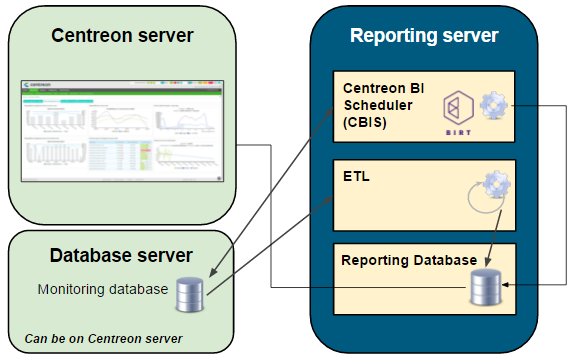

import Tabs from '@theme/Tabs';
import TabItem from '@theme/TabItem';


This chapter presents the software architecture of the **Centreon MBI** extension
and provides an overview of the integration of the extension with Centreon monitoring software.

This document is intended for administrators who will install or configure Centreon MBI.

Four main steps are required to install Centreon MBI:

- Check the system requirements.
- Install the Centreon MBI interface in the Centreon application (Centreon MBI Server).
- Install the reporting server (Centreon MBI Reporting Server).
- Configure the extraction, transformation and loading (ETL) in the Centreon MBI interface.

## Architecture

### A dedicated reporting server

The architecture and these requirements apply to:

- test
- pre-production
- production environments.

The diagram below highlights the main components of Centreon MBI:



*The monitoring database is not necessarily on the same server as the Centreon server*.

- **ETL**: Process that extracts, transforms and loads data into the reporting database.
- **CBIS**: The scheduler that manages the execution and publication of reports.
- **Reporting Database**: The MariaDB database that contains the reporting data and some raw data extracted from the monitoring database.

### Network Flow Tables

The table below shows the different types of flows, by default,
between the dedicated BI server, the Centreon server and the databases:

| **Application** | **Source**               | **Destination**                      | **Port** | **Protocol** |
|-----------------|--------------------------|--------------------------------------|----------|--------------|
| ETL/CBIS        | Reporting server         | Centreon database server             | 3306     | TCP          |
| SSH             | Reporting server         |  Centreon Server                     | 22       | TCP          |
| CBIS            | Reporting server         | Centreon Server                      | 80       | HTTP*        |
| CBIS            | Centreon                 | Reporting server                     | 1234     | TCP          |
| Widgets         | Centreon central server  | Reporting server                     | 3306     | TCP          |

*Only required for Host-Graph-v2 and Hostgroup-Graph-v2 reports that use the Centreon API to generate graphs.*

### Information about the packages

The Centreon MBI installation is based on two RPM packages:

- **Centreon-bi-server:** Installs the MBI interface integrated with the Centreon interface. The package is installed on the Centreon central server.
- **Centreon-bi-reporting-server**: Contains all the components needed to run the reporting server
  (report scheduler, ETL, standard reports). It must be installed on a server dedicated to reporting processes.

The installation of the database must be done at the same time. We strongly recommend installing the MariaDB database on the
reporting server for performance & isolation reasons.

## Prerequisites

### Central Centreon server


#### Software requirements

See the [software requirements](../installation/prerequisites.md#software).

You should install the MariaDB database at the same time. We highly recommend
installing the database on the same server for performance & isolation
considerations.


<Tabs groupId="sync">
<TabItem value="Alma / RHEL / Oracle Linux 8" label="Alma / RHEL / Oracle Linux 8">

- Centreon Web 23.04
- Check that `date.timezone` is correctly configured in the `/etc/php.d/50-centreon.ini`
  file (same as the one returned by the `timedatectl status` command).
- Avoid using the following variables in the configuration file `/etc/my.cnf`. They interrupt the
  execution of long queries and can stop ETL or report generation jobs:
  - wait_timeout
  - interactive_timeout

#### Users and groups

| User                 | Group                      |
|----------------------|----------------------------|
| centreonBI (new)     | apache,centreon,centreonBI |
| apache (existing)    | centreonBI                 |
  
</TabItem>
<TabItem value="Alma / RHEL / Oracle Linux 9" label="Alma / RHEL / Oracle Linux 9">

- Centreon Web 23.04
- Check that `date.timezone` is correctly configured in the `/etc/php.d/50-centreon.ini`
  file (same as the one returned by the `timedatectl status` command).
- Avoid using the following variables in the configuration file `/etc/my.cnf`. They interrupt the
  execution of long queries and can stop ETL or report generation jobs:
  - wait_timeout
  - interactive_timeout

#### Users and groups

| User                 | Group                      |
|----------------------|----------------------------|
| centreonBI (new)     | apache,centreon,centreonBI |
| apache (existing)    | centreonBI                 |
  
</TabItem>
<TabItem value="Debian 11" label="Debian 11">

- Centreon Web 23.04
- Check that `date.timezone` is correctly configured in the `/etc/php/8.1/mods-available/centreon.ini` file
  (same as the one returned by the `timedatectl status` command).
- Avoid using the following variables in the configuration file `/etc/mysql/mariadb.cnf`. They interrupt the
  execution of long queries and can stop ETL or report generation jobs:
  - wait_timeout
  - interactive_timeout

#### Users and groups

| User                 | Group                        |
|----------------------|------------------------------|
| centreonBI (new)     | www-data,centreon,centreonBI |
| apache (existing)    | centreonBI                   |
  
</TabItem>
</Tabs>

#### Description of users, umask and home directory

| User        | umask | home             |
|-------------|-------|------------------|
| centreonBI  | 0002  | /home/centreonBI |

### Dedicated reporting server

#### Hardware layer

<Tabs groupId="sync">
<TabItem value="Up to 500 hosts" label="Up to 500 hosts">

| Element                     | Value     |
| ----------------------------| --------- |
| CPU   | 4 vCPU    |
| RAM                         | 16 GB      |

This is how your MBI server should be partitioned:

| Volume group (LVM) | File system                | Description | Size                                                     |
|-| ----------------------------|-------------|----------------------------------------------------------|
| | /boot | boot images | 1 GB |
|  vg_root | /                          | system root            | 20 GB                                |
| vg_root | swap                       | swap | 4 GB                               |
| vg_root | /var/log                   | contains all log files | 10 GB                                |
| vg_data | /var/lib/mysql  | database | 233 GB                               |
| vg_data | /var/backup | backup directory | 10 GB |
| vg_data |   | Free space (unallocated) | 5 GB                               |

</TabItem>
<TabItem value="Up to 1,000 hosts" label="Up to 1,000 hosts">

| Element                     | Value     |
| ----------------------------| --------- |
| CPU   | 4 vCPU    |
| RAM                         | 16 GB      |

This is how your MBI server should be partitioned:

| Volume group (LVM) | File system                | Description | Size                                                     |
|-| ----------------------------|-------------|----------------------------------------------------------|
| | /boot | boot images | 1 GB |
|  vg_root | /                          | system root            | 20 GB                                |
| vg_root | swap                       | swap | 4 GB                               |
| vg_root | /var/log                   | contains all log files | 10 GB                                |
| vg_data | /var/lib/mysql  | database | 465 GB                               |
| vg_data | /var/backup | backup directory | 10 GB |
| vg_data |   | Free space (unallocated) | 5 GB                               |

</TabItem>
<TabItem value="Up to 2,500 hosts" label="Up to 2,500 hosts">

| Element                     | Value     |
| ----------------------------| --------- |
| CPU   | 4 vCPU    |
| RAM                         | 24 GB      |

This is how your MBI server should be partitioned:

| Volume group (LVM) | File system                | Description | Size                                                     |
|-| ----------------------------|-------------|----------------------------------------------------------|
| | /boot | boot images | 1 GB |
|  vg_root | /                          | system root            | 20 GB                                |
| vg_root | swap                       | swap | 4 GB                               |
| vg_root | /var/log                   | contains all log files | 10 GB                                |
| vg_data | /var/lib/mysql  | database | 1163 GB                               |
| vg_data | /var/backup | backup directory | 10 GB |
| vg_data |   | Free space (unallocated) | 5 GB                               |

</TabItem>
<TabItem value="Up to 5,000 hosts" label="Up to 5,000 hosts">

| Element                     | Value     |
| ----------------------------| --------- |
| CPU   | 8 vCPU    |
| RAM                         | 24 GB      |

This is how your MBI server should be partitioned:

| Volume group (LVM) | File system                | Description | Size                                                     |
|-| ----------------------------|-------------|----------------------------------------------------------|
| | /boot | boot images | 1 GB |
|  vg_root | /                          | system root            | 20 GB                                |
| vg_root | swap                       | swap | 4 GB                               |
| vg_root | /var/log                   | contains all log files | 10 GB                                |
| vg_data | /var/lib/mysql  | database | 2326 GB                               |
| vg_data | /var/backup | backup directory | 10 GB |
| vg_data |   | Free space (unallocated) | 5 GB                               |

</TabItem>
<TabItem value="Up to 10,000 hosts" label="Up to 10,000 hosts">

| Element                     | Value     |
| ----------------------------| --------- |
| CPU   | 12 vCPU    |
| RAM                         | 32 GB      |

This is how your MBI server should be partitioned:

| Volume group (LVM) | File system                | Description | Size                                                     |
|-| ----------------------------|-------------|----------------------------------------------------------|
| | /boot | boot images | 1 GB |
|  vg_root | /                          | system root            | 20 GB                                |
| vg_root | swap                       | swap | 4 GB                               |
| vg_root | /var/log                   | contains all log files | 10 GB                                |
| vg_data | /var/lib/mysql  | database | 4651 GB                               |
| vg_data | /var/backup | backup directory | 10 GB |
| vg_data |   | Free space (unallocated) | 5 GB                               |

</TabItem>
<TabItem value="Over 10,000 hosts" label="Over 10,000 hosts">

For very large amounts of data, contact your sales representative.

</TabItem>
</Tabs>

To check the free space, use the following command by replacing **vg_data** with the name of the group volume:

```shell
vgdisplay vg_data | grep -i free*
```

#### Firmware and software layer

- OS : RHEL / Oracle Linux / Alma 8 or 9, Debian 11
- SGBD : MariaDB 10.5
- Firewalld : Disabled ([look here](../installation/installation-of-a-central-server/using-packages.md#Configurer-ou-désactiver-le-pare-feu))
- SELinux : Disabled ([look here](../installation/installation-of-a-central-server/using-packages.md#Désactiver-SELinux))

> Make sure that the time zone of the reporting server is the same as that of the central server, otherwise report publications will fail (link to download missing).
> The same time zone must be displayed with the `timedatectl` command.
> You can change the time zone with this command:
>
>```shell
>timedatectl set-timezone Europe/Paris
>```

Be sure to optimize MariaDB on your reporting server.
You will need at least 12GB of RAM in order to use the [next file](../assets/reporting/installation/centreon.cnf).

Make sure you have a **tmp** folder in **/var/lib/mysql**.

> Do not set these MariaDB optimizations on your monitoring server.

Users and groups :

| User        | Group      |
|-------------|------------|
| centreonBI  | centreonBI |

Description of users, umask and user directory:

| User        | umask | home             |
|-------------|-------|------------------|
| centreonBI  | 0002  | /home/centreonBI |

## Install the extension on Centreon

The actions listed in this chapter must be performed on the **Centreon Central Server**.

1. Install the Business repository, you can find it on the [support portal](https://support.centreon.com/hc/en-us/categories/10341239833105-Repositories).

2. Then run the following commands:

<Tabs groupId="sync">
<TabItem value="Alma / RHEL / Oracle Linux 8" label="Alma / RHEL / Oracle Linux 8">

```shell
dnf install centreon-bi-server
```

</TabItem>
<TabItem value="Alma / RHEL / Oracle Linux 9" label="Alma / RHEL / Oracle Linux 9">

```shell
dnf install centreon-bi-server
```

</TabItem>
<TabItem value="Debian 11" label="Debian 11">

```shell
apt update && apt install centreon-bi-server
```

</TabItem>
</Tabs>

### Enable the extension

The menu **Administration > Extension > Manager** allows you to install the different extensions detected by Centreon. Click on the **Centreon MBI** tile to install it.

Then, download the license sent by the Centreon team to start configuring the general options.

### Configure the extension

Enter the following values in the Centreon general options
MBI menu, *Reports > Monitoring Business Intelligence > General Options* :


| Tabs                                                                                   | Option                     | Value                                                                                |
|----------------------------------------------------------------------------------------|----------------------------|--------------------------------------------------------------------------------------|
| Scheduler options                                                                      | CBIS Host                  | IP address of the reporting server                                                   |
| ETL options | Reporting engine uses a dedicated MySQL server                | Yes                        |                                                                                      |
| Reporting widgets                                                                      | Reporting MariaDB database | IP address of the reporting base (default = IP address of the reporting server)      |

\**The connection test will not work at this point in the installation*.

### Access to the Central database

Download the license sent by the Centreon team to start configuring the general options.

<Tabs groupId="sync">
<TabItem value="Monitoring database on the central server" label="Monitoring database on the central server">

The MariaDB monitoring database is hosted on the central monitoring server.

Run the command below to allow the reporting server to connect to the databases on the monitoring server.

Use the following option:

```shell
/usr/share/centreon/www/modules/centreon-bi-server/tools/centreonMysqlRights.pl --root-password=@ROOTPWD@
```

**@ROOTPWD@** : Root password of the MariaDB monitoring database.
If there is no password for the "root" user, do not specify the **root-password** option.

</TabItem>
<TabItem value="Monitoring database on a remote server" label="Monitoring database on a remote server">

The MariaDB monitoring database is hosted on a dedicated server.

Connect via SSH to the database server, and run the following commands:

```SQL
CREATE USER 'centreonbi'@'$BI_ENGINE_IP$' IDENTIFIED BY 'centreonbi';
GRANT ALL PRIVILEGES ON centreon.* TO 'centreonbi'@'$BI_ENGINE_IP$';
GRANT ALL PRIVILEGES ON centreon_storage.* TO 'centreonbi'@'$BI_ENGINE_IP$';
```

**$BI_ENGINE_IP$** : IP address of the reporting server.

</TabItem>
</Tabs>

If you use MariaDB replication for your **monitoring databases**, some views
are created during the installation of Centreon MBI.
You must exclude them from replication by adding the following line to the **my.cnf**
file of the slave server or mariadb.cnf on Debian 11.

```shell
replicate-wild-ignore-table=centreon.mod_bi_%v01,centreon.mod_bi_%V01
```

Then, create the views manually on the slave server:

1. Download [the following file](../assets/reporting/installation/view_creation.sql) to a temporary folder (in our example, **/tmp**), for instance using **wget**.

2. Run the following command (change the name of your temporary folder if necessary):

```bash
mysql centreon < /tmp/view_creation.sql
```

#### Debian 11 specific configuration

MariaDB must listen on all interfaces instead of listening on localhost/127.0.0.1 (default value). Edit the following file:

```shell
/etc/mysql/mariadb.conf.d/50-server.cnf
```

Set **bind-address** to **0.0.0.0** and restart **mariadb**.

```shell
systemctl restart mariadb
```

### Give rights to the cbis user

When you install Centreon MBI, a [user](../monitoring/basic-objects/contacts.md) named **cbis** is automatically created.
It allows the report generation engine to extract data from Centreon (using the APIs) in order to insert them in the report.
This user must [have access to all resources monitored by Centreon](../administration/access-control-lists.md) in order to extract the performance graphs for the following reports:

- Host-Graph-v2
- Hostgroup-Graph-v2.

To test the connection between the MBI reporting server and the Centreon API, use the following command to download a graph. Replace the graph parameters and timestamps, and replace XXXXXXXXX with the user's autologin token **cbis**:

```bash
curl -XGET 'https://IP_CENTRAL/centreon/include/views/graphs/generateGraphs/generateImage.php?akey=XXXXXXXXX&username=CBIS&hostname=<host_name>&service=<service_description>&start=<start_date>&end=<end_date>' --output /tmp/image.png

```

Example :

```bash
curl -XGET 'https://10.1.1.1/centreon/include/views/graphs/generateGraphs/generateImage.php?akey=otmw3n1hu03bvt9e0caphuf50ph8sdthcsk8ofdk&username=CBIS&hostname=my-poller&service=Cpu&start=1623016800&end=1623621600' --output /tmp/image.png
```

The result should look like the code below, and the desired graph image must have been uploaded to the `/tmp` directory:

```text
  % Total    % Received % Xferd  Average Speed   Time    Time     Time  Current
                                 Dload  Upload   Total   Spent    Left  Speed
100 18311  100 18311    0     0  30569      0 --:--:-- --:--:-- --:--:-- 30569
```

## Install the reporting server

### Install the packages

You must have the following information before proceeding with the installation process:

- IP/DNS of the monitoring database
- IP/DNS of the Centreon web interface
- IP/DNS of the reporting database (localhost strongly recommended)

- Access (user/password) to the reporting database
- Define and retrieve the ssh password of the centreonBI user, on the Central server (for the availability of the reports generated on the interface)

#### Procedure

1. Install the Centreon repository:

<Tabs groupId="sync">
<TabItem value="Alma / RHEL / Oracle Linux 8" label="Alma / RHEL / Oracle Linux 8">

```shell
dnf install -y dnf-plugins-core
dnf config-manager --add-repo https://packages.centreon.com/rpm-standard/23.04/el8/centreon-23.04.repo
dnf clean all --enablerepo=*
dnf update
```

</TabItem>
<TabItem value="Alma / RHEL / Oracle Linux 9" label="Alma / RHEL / Oracle Linux 9">

```shell
dnf install -y dnf-plugins-core
dnf config-manager --add-repo https://packages.centreon.com/rpm-standard/23.04/el9/centreon-23.04.repo
dnf clean all --enablerepo=*
dnf update
```

</TabItem>
<TabItem value="Debian 11" label="Debian 11">

To install the Centreon repository, execute the following command:

```shell
echo "deb https://packages.centreon.com/apt-standard-23.04-stable/ $(lsb_release -sc) main" | tee /etc/apt/sources.list.d/centreon.list
echo "deb https://packages.centreon.com/apt-plugins-stable/ $(lsb_release -sc) main" | tee /etc/apt/sources.list.d/centreon-plugins.list
```

Then import the repository key:

```shell
wget -O- https://apt-key.centreon.com | gpg --dearmor | tee /etc/apt/trusted.gpg.d/centreon.gpg > /dev/null 2>&1
apt update
```

</TabItem>
</Tabs>

2. Install the Business repository. You can find it on the [support portal](https://support.centreon.com/hc/en-us/categories/10341239833105-Repositories).

3. Ensure a version of Java 17 (or 18) is installed before you start the procedure.
   
   - If you need to check the Java version, enter the following command:
   
   ```shell
   java -version
   ```
   
   - If you need to upgrade the Java installation to Java 17 (or 18), go to the [Oracle official download](https://www.oracle.com/java/technologies/downloads/#java17) page.
   
   - If several Java versions are installed, you need to activate the right version. Display the installed versions using the following command and select the Java 17 (or 18) version:
   
   ```shell
   sudo update-alternatives --config java
   ```

4. Install the MariaDB repository:

<Tabs groupId="sync">
<TabItem value="Alma / RHEL / Oracle Linux 8" label="Alma / RHEL / Oracle Linux 8">

```shell
curl -LsS https://r.mariadb.com/downloads/mariadb_repo_setup | sudo bash -s -- --os-type=rhel --os-version=8 --mariadb-server-version="mariadb-10.5"
```

</TabItem>
<TabItem value="Alma / RHEL / Oracle Linux 9" label="Alma / RHEL / Oracle Linux 9">

```shell
curl -LsS https://r.mariadb.com/downloads/mariadb_repo_setup | sudo bash -s -- --os-type=rhel --os-version=9 --mariadb-server-version="mariadb-10.5"
```

</TabItem>
<TabItem value="Debian 11" label="Debian 11">

```shell
curl -LsS https://r.mariadb.com/downloads/mariadb_repo_setup | sudo bash -s -- --os-type=debian --os-version=11 --mariadb-server-version="mariadb-10.5"
```

</TabItem>
</Tabs>

5. Then run the following command:

<Tabs groupId="sync">
<TabItem value="RHEL 8" label="RHEL 8">

Install the **epel** repository :

```shell
dnf install -y https://dl.fedoraproject.org/pub/epel/epel-release-latest-8.noarch.rpm
```

Enable the **codeready-builder** repository:

```shell
subscription-manager repos --enable codeready-builder-for-rhel-8-x86_64-rpms
```

Then launch the installation:

```shell
dnf install centreon-bi-reporting-server MariaDB-server MariaDB-client
```

In the case of an installation based on a blank distribution, install the GPG key:

```shell
cd /etc/pki/rpm-gpg/
wget https://yum-gpg.centreon.com/RPM-GPG-KEY-CES

```

</TabItem>
<TabItem value="Oracle Linux 8" label="Oracle Linux 8">

Install the **epel** repository :

```shell
dnf install -y https://dl.fedoraproject.org/pub/epel/epel-release-latest-8.noarch.rpm
```

Enable codeready-builder repositories:

```shell
dnf config-manager --set-enabled ol8_codeready_builder
```

Then launch the installation:

```shell
dnf install centreon-bi-reporting-server MariaDB-server MariaDB-client
```

In the case of an installation based on a blank distribution, install the GPG key:

```shell
cd /etc/pki/rpm-gpg/
wget https://yum-gpg.centreon.com/RPM-GPG-KEY-CES

```

</TabItem>
<TabItem value="Alma 8" label="Alma 8">

Install the **epel** repository :

```shell
dnf install -y https://dl.fedoraproject.org/pub/epel/epel-release-latest-8.noarch.rpm
```

Enable powertools repositories:

```shell
dnf config-manager --set-enabled 'powertools'
```

Then launch the installation:

```shell
dnf install centreon-bi-reporting-server MariaDB-server MariaDB-client
```

In the case of an installation based on a blank distribution, install the GPG key:

```shell
cd /etc/pki/rpm-gpg/
wget https://yum-gpg.centreon.com/RPM-GPG-KEY-CES

```

</TabItem>
<TabItem value="RHEL 9" label="RHEL 9">

Install the **epel** repository :

```shell
dnf install -y https://dl.fedoraproject.org/pub/epel/epel-release-latest-9.noarch.rpm
```

Enable the **codeready-builder** repository:

```shell
subscription-manager repos --enable codeready-builder-for-rhel-9-x86_64-rpms
```

Then launch the installation:

```shell
dnf install centreon-bi-reporting-server MariaDB-server MariaDB-client
```

In the case of an installation based on a blank distribution, install the GPG key:

```shell
cd /etc/pki/rpm-gpg/
wget https://yum-gpg.centreon.com/RPM-GPG-KEY-CES

```

</TabItem>
<TabItem value="Oracle Linux 9" label="Oracle Linux 9">

Install the **epel** repository :

```shell
dnf install -y https://dl.fedoraproject.org/pub/epel/epel-release-latest-9.noarch.rpm
```

Enable codeready-builder repositories:

```shell
dnf config-manager --set-enabled ol9_codeready_builder
```

Then launch the installation:

```shell
dnf install centreon-bi-reporting-server MariaDB-server MariaDB-client
```

In the case of an installation based on a blank distribution, install the GPG key:

```shell
cd /etc/pki/rpm-gpg/
wget https://yum-gpg.centreon.com/RPM-GPG-KEY-CES

```

</TabItem>
<TabItem value="Alma 9" label="Alma 9">

Install the **epel** repository :

```shell
dnf install -y https://dl.fedoraproject.org/pub/epel/epel-release-latest-9.noarch.rpm
```

Run the following command:

```shell
dnf config-manager --set-enabled 'crb' 
```

Then launch the installation:

```shell
dnf install centreon-bi-reporting-server mariadb-server MariaDB-client
```

In the case of an installation based on a blank distribution, install the GPG key:

```shell
cd /etc/pki/rpm-gpg/
wget https://yum-gpg.centreon.com/RPM-GPG-KEY-CES

```

</TabItem>
<TabItem value="Debian 11" label="Debian 11">

Install the Centreon repository :

```shell
echo "deb https://packages.centreon.com/apt-standard-23.04-stable/ $(lsb_release -sc) main" | tee /etc/apt/sources.list.d/centreon.list
```

Install the prerequisite packages:

```shell
apt install lsb-release ca-certificates apt-transport-https software-properties-common wget gnupg2
```

Add the following external repository (for Java 8):

```shell
wget -qO - https://adoptopenjdk.jfrog.io/adoptopenjdk/api/gpg/key/public | apt-key add -
add-apt-repository --yes https://adoptopenjdk.jfrog.io/adoptopenjdk/deb/
apt update
```

In the case of an installation based on a blank distribution, install the GPG key:

```shell
wget -O- https://apt-key.centreon.com | gpg --dearmor | tee /etc/apt/trusted.gpg.d/centreon.gpg > /dev/null 2>&1
```

Then launch the installation:

```shell
apt update
apt install centreon-bi-reporting-server mariadb-server mariadb-client
```

</TabItem>
</Tabs>

Enable the **cbis** service:

```shell
systemctl enable cbis
```

Start and enable **gorgoned**:

```shell
systemctl start gorgoned && systemctl enable gorgoned
```

### Configure the reporting server

#### MariaDB Optimizations

<Tabs groupId="sync">
<TabItem value="Alma / RHEL / Oracle Linux 8" label="Alma / RHEL / Oracle Linux 8">

Make sure that the optimized configuration [file](../assets/reporting/installation/centreon.cnf) provided
in the prerequisites is present in `/etc/my.cnf.d/`, then restart the MariaDB service:

```shell
systemctl restart mariadb
```

It is necessary to change the limitation **LimitNOFILE**. Changing this
option in `/etc/my.cnf` will NOT work.

```shell
mkdir -p  /etc/systemd/system/mariadb.service.d/
echo -ne "[Service]\nLimitNOFILE=32000\n" | tee /etc/systemd/system/mariadb.service.d/limits.conf
systemctl daemon-reload
systemctl restart mariadb
```

If the MariaDB service fails to start, remove the files *ib_logfile*
(MariaDB must absolutely be stopped)and then restart MariaDB again:

```shell
rm -f /var/lib/mysql/ib_logfile*
systemctl start mariadb
```

If you are using a specific socket file for MariaDB, modify the file `/etc/my.cnf` and
in the [client] section, add :

```shell
socket=$PATH_TO_SOCKET$
```

</TabItem>
<TabItem value="Alma / RHEL / Oracle Linux 9" label="Alma / RHEL / Oracle Linux 9">

Make sure that the optimized configuration [file](../assets/reporting/installation/centreon.cnf) provided
in the prerequisites is present in `/etc/my.cnf.d/`, then restart the MariaDB service:

```shell
systemctl restart mariadb
```

It is necessary to change the limitation **LimitNOFILE**. Changing this
option in `/etc/my.cnf` will NOT work.

```shell
mkdir -p  /etc/systemd/system/mariadb.service.d/
echo -ne "[Service]\nLimitNOFILE=32000\n" | tee /etc/systemd/system/mariadb.service.d/limits.conf
systemctl daemon-reload
systemctl restart mariadb
```

If the MariaDB service fails to start, remove the files *ib_logfile*
(MariaDB must absolutely be stopped)and then restart MariaDB again:

```shell
rm -f /var/lib/mysql/ib_logfile*
systemctl start mariadb
```

If you are using a specific socket file for MariaDB, modify the file `/etc/my.cnf` and
in the [client] section, add :

```shell
socket=$PATH_TO_SOCKET$
```

</TabItem>
<TabItem value="Debian 11" label="Debian 11">

Make sure that the optimized configuration [file](../assets/reporting/installation/centreon.cnf)
provided in the requirements is present in `/etc/mysql/mariadb.conf.d/`.

Rename the file to `80-centreon.cnf` :

```shell
mv centreon.cnf 80-centreon.cnf
```

MariaDB should listen to all interfaces instead of localhost/127.0.0.1, which is the default.
Edit the following file:

```shell
/etc/mysql/mariadb.conf.d/50-server.cnf
```

Set the **bind-address** parameter to **0.0.0.0** and restart MariaDB.

```shell
systemctl restart mariadb
```

It is necessary to change the **LimitNOFILE** limitation. Changing this option in `/etc/mysql/mariadb.cnf` will not work.

```shell
mkdir -p  /etc/systemd/system/mariadb.service.d/
echo -ne "[Service]\nLimitNOFILE=32000\n" | tee /etc/systemd/system/mariadb.service.d/limits.conf
systemctl daemon-reload
systemctl restart mariadb
```

If the MariaDB service fails at the time of starting, remove the files *ib_logfile*
(MariaDB must absolutely be stopped)and then restart MariaDB again:

```shell
rm -f /var/lib/mysql/ib_logfile*
systemctl start mariadb
```

If you are using a specific socket file for MariaDB, edit the
file `/etc/mysql/mariadb.cnf` and in the [client] section, add :

```shell
socket=$PATH_TO_SOCKET$
```

</TabItem>
</Tabs>

### Secure the database

Since MariaDB 10.5, it is mandatory to secure the root access of the database before installing Centreon.
If you use a local database, execute the following command on the central server, otherwise on the database server:

```shell
mysql_secure_installation
```

- Answer **yes** to all questions except "Disallow root login remotely?"
- It is mandatory to define a password for the **root** user of the database. You will need this password during the [web-installation](../installation/web-and-post-installation.md).

> For more information, please see the [official MariaDB documentation](https://mariadb.com/kb/en/mysql_secure_installation/).

#### Start configuring

Make sure the MariaDB reporting system is started and then run the commands below and answer the commands below and answer the questions:

```shell
/usr/share/centreon-bi/config/install.sh
```

The script manages the exchange of SSH keys between the monitoring server and the reporting server, and configures the default SFTP publishing rule
in order to publish the reports on the Centreon web interface. Finally, it enables the backup and starts the CBIS service.

Once the installation is complete, continue to the next chapter to configure the ETL.

#### Problem with the SSH exchange key

In some cases, SSH key exchange fails.
To solve the problem, do the following manually:

Switch to the `centreonBI` user :

```bash
su - centreonBI
```

Generate the SSH key :

```bash
ssh-keygen -t ed25519 -a 100 -f ~/.ssh/id_ed25519 -P "" -q
```

And print the `centreonBI` public key (in order to authorize it then on Centreon) :

```bash
su - centreonBI
cat /home/centreonBI/.ssh/id_ed25519.pub
```

Now, **on the monitoring server** :

Create a `.ssh` folder that `centreonBI` will own, restrict permissions on this folder and paste into the `authorized_keys` file the contents of its public key on the reporting server (shown earlier) :

```bash
mkdir -p /home/centreonBI/.ssh/ && chown centreonBI: /home/centreonBI/.ssh/ && chmod 700 /home/centreonBI/.ssh/ && echo "@reporting pub key content@" > /home/centreonBI/.ssh/authorized_keys
```

The key exchange must then be validated by a first connection that will accept the SSH server signature.
As the `centreonBI` user **from the reporting server** :

```bash
ssh centreonBI@@MONITORING_SERVER@
```

Then exit the `centreonBI` session with `exit` or `Ctrl-D` on both servers.

To continue, run the installation script (`/usr/share/centreon-bi/config/install.sh`) as above and answer **Yes** when asked to proceed with the SSH key exchange.
You will get an error when creating the USER, because it already exists. This is not a blocking step.

### ETL : Configuration

Centreon MBI integrates an ETL that allows you to :

- Synchronize the raw data from the monitoring to the reporting server
- Feed statistical data to the reporting server databases statistical data
- Control the retention of data on the reporting server

Before proceeding to the next steps, it is necessary to read the
chapter on [best practices](concepts.md#best-practices-for-monitoring) to make sure that the configuration of
the objects in Centreon (groups, categories...) is in accordance with the expectations of Centreon MBI.

In the `Reporting > Monitoring Business Intelligence > General Options > ETL Options` tab, specify the following options the following options:

| **Options**                                                                            | **Values**                                                                                                                                                                                                                            |
|----------------------------------------------------------------------------------------|---------------------------------------------------------------------------------------------------------------------------------------------------------------------------------------------------------------------------------------|
| **General options**                                                                    |                                                                                                                                                                                                                                       |
| Reporting engine uses a dedicated dedicated MariaDB server                             | Yes. You **must** use a reporting server                                                                                                                                                                                              |
| Temporary file storage directory on reporting server                                   | Folder where dumps will be stored on the reporting server                                                                                                                                                                             |
| Type of statistics to build                                                            | Select “Availability only” if you only use availability reports. Select “Performance and capacity only” if you only want to use capacity and performance reports. Select “All” to calculate the statistics for both types of reports. |
| Use large memory tweaks (store MariaDB temporary tables in memory)                     | Activated only if your MariaDB configuration and allocated physical memory on the server permits.                                                                                                                                     |
| **Reporting perimeter selection**                                                      |                                                                                                                                                                                                                                       |
| Hostgroups                                                                             | Select only host groups for which you want to aggregate data.                                                                                                                                                                         |
| Hostcategories                                                                         | Select only host categories for which you want to aggregate data.                                                                                                                                                                     |
| Service categories                                                                     | Select only service categories for which you want to aggregate data.                                                                                                                                                                  |
| **Availability statistic calculation**                                                 |                                                                                                                                                                                                                                       |
| Live services for availability statistics calculation                                  | Select required time periods.                                                                                                                                                                                                         |
| **Performance and capacity statistic calculation**                                     |                                                                                                                                                                                                                                       |
| Granularity required for performance data statistics                                   | Select the level of granularity required to run the desired performance reports (1).                                                                                                                                                  |
| Live services for performance data statistics calculation                              | Select the required time periods.                                                                                                                                                                                                     |
| **Capacity statistic aggregated by month**                                             |                                                                                                                                                                                                                                       |
| Live services for capacity statistics calculation                                      | Select the “24x7” time period.                                                                                                                                                                                                        |
| Service categories related to capacity data monitoring                                 | Select the service categories that have been associated with capacity-type services.                                                                                                                                                  |
| Exclude metrics from service categories that do not return capacity USAGE information  | Concerns the metrics linked to services which return capacity data. Select the metrics that do not return capacity usage information. but a maximum or total value. (e.g., the metric “size”).                                        |
| **Centile parameters**                                                                 |                                                                                                                                                                                                                                       |
| Calculating centile aggregation by                                                     | Select the desired aggregation level. The standard percentile report provided with BI 2.1 uses Month data.                                                                                                                            |
| Select service categories to aggregate centile on                                      | Filter on relevant service categories for centile statistics (e.g., Traffic).                                                                                                                                                         |
| First day of the week                                                                  | Select the first day of the week for Week aggregation.                                                                                                                                                                                |
| Centile / Timeperiod combination                                                       | Create a new centile/timeperiod combination on which to perform the calculation.                                                                                                                                                      |

**(1)** Reports requiring data granularity by the hour are listed below. 
If you do not wish to use these reports, disable the calculation of hourly statistics:

- Hostgroup-Host-details-1

- Host-detail-v2
- Hostgroup-traffic-Average-Usage-By-Interface
- Hostgroup-traffic-by-Interface-And-Bandwith-Ranges

### ETL: Data retention

The reporting server contains tables of statistics specific to Centreon MBI in the "centreon_storage" database.
The storage space used by these tables is increasing every day.
It is possible to control the size of these tables by defining data retention rules.

Under **Reports > Monitoring Business Intelligence > General Options > Data Retention Options** menu,
data retention can be managed by :

- Type of data (availability, performance).
- Data granularity (raw data, hourly, daily or monthly values)

> Before enabling the data retention options, make sure that the reporting engine
> uses a dedicated MariaDB server, and the corresponding option is set to
> **Yes** in the menu **Reporting > Business Intelligence > General Options ETL Options**.

Enable data retention management by selecting **Yes**, then set the configuration options (example below).


To enable automatic purging of old data, edit the cron file **/etc/cron.d/centreon-bi-purge**
on the reporting server, then uncomment the following line:

```shell
#0 20 * * * root @CENTREON_BI_HOME@/*etl*/dataRetentionManager.pl >> @CENTREON_BI_LOG@/dataRetentionManager.log 2>&1
```

Avoid scheduled periods for statistical calculations with Centreon MBI ETL and report generation.
You can run this cron daily or weekly, depending on the batch execution time and the load generated on the server.

<Tabs groupId="sync">
<TabItem value="Alma / RHEL / Oracle Linux 8 / RHEL 7 / CentOS 7" label="Alma / RHEL / Oracle Linux 8 / RHEL 7 / CentOS 7">

Restart the cron service:

```shell
systemctl restart crond
```

</TabItem>
<TabItem value="Debian 11" label="Debian 11">

Restart the cron service:

```shell
systemctl restart cron
```

</TabItem>
</Tabs>

**BEST PRACTICES** : Select different retention periods depending on the granularity of the statistical data:

- Aggregated values per hour are used to analyze a metric over a short period of time, they take up a lot of disk space. You may not
  need to keep these statistics for more than two or three months.

- Beyond five or six months, you may only need to view the trend for availability or performance statistics.
  You could then retain daily aggregate data for up to six months, for example, and set up retention of monthly aggregate data for a period of several dozen months.

Please proceed to the next section to continue the installation.

### ETL : Execution

> Before continuing, make sure you have installed the MariaDB configuration file as described above in the prerequisites. Configure 
> and enable data retention so that only the required data is imported and calculated.

#### Reconstruction of statistics from historical data

Run the following command on the reporting server. This will:

- Delete all existing data from the reporting server.
- Import raw monitoring data from the monitoring server to the reporting server (depending on retention settings).
- Fill tables containing availability statistics for hosts and services.
- Fill in tables containing performance and capacity statistics for hosts and services.

```shell
/usr/share/centreon-bi/bin/centreonBIETL -r
```

#### Enable daily script execution

Once the data rebuilding process is complete, you can enable the calculation of statistics.
On the reporting server, edit the file **/etc/cron.d/centreon-bi-engine** and uncomment the following line:

```shell
#30 4 * * * root /usr/share/centreon-bi/bin/centreonBIETL -d >> /var/log/centreon-bi/centreonBIETL.log 2>&1
```

<Tabs groupId="sync">
<TabItem value="Alma / RHEL / Oracle Linux 8 / RHEL 7 / CentOS 7" label="Alma / RHEL / Oracle Linux 8 / RHEL 7 / CentOS 7">

Restart the cron service on the reporting server:

```shell
systemctl restart crond
```

</TabItem>
<TabItem value="Debian 11" label="Debian 11">

Restart the cron service on the reporting server:

```shell
systemctl restart cron
```

</TabItem>
</Tabs>

> Make sure that the **centreonBIETL** batch only starts after the **eventReportBuilder** 
> batch has finished on the monitoring server (check the **/etc/cron.d/centreon** cron file on the monitoring server).

The installation of Centreon MBI is now complete, see [the tutorial](../getting-started/analyze-resources-availability.md).
