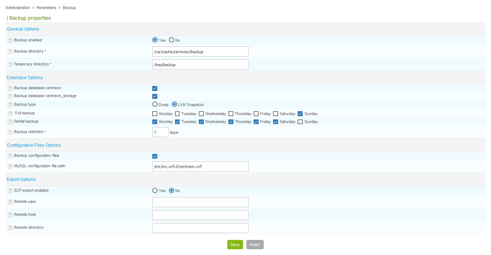

## How it works

### Daily execution

The backup script is executed on a daily basis with a cron job located in
**/etc/cron.d/centreon**:

```text
##########################
# Cron for Centreon-Backup
30 3 * * * root /usr/share/centreon/cron/centreon-backup.pl >> /var/log/centreon/centreon-backup.log 2&>1
```

Each day at 3:30 AM, the backup script checks if a backup is planned on the current day.

### Backup types

There are two types of backup: database and configuration files.

#### Database backup

Database backup will be processed on two databases: **centreon** and
**centreon\_storage**

There are two kinds of database backup:

  - MySQLdump: the mysqldump command is used to back up databases. Warning:
    mysqldump can take a long time on large databases.
  - LVM Snapshot: A binary copy of MariaDB files is done. You need to have a
    specific LV for MariaDB (i.e. /var/lib/mysql) and 1 GB of space in its VG.

Backup filename format:

  - YYYY-MM-DD-centreon.sql.gz
  - YYYY-MM-DD-centreon\_storage.sql.gz

#### Configuration files backup

All the configuration files for the central server can be saved: MariaDB, Apache, PHP,
SNMP, centreon, centreon-broker)

Backup filename format:

 - YYYY-MM-DD-centreon-engine.tar.gz (centreon-engine configuration files)
 - YYYY-MM-DD-central.tar.gz (other configuration files)

## Configuration

This part covers the configuration of the backup.

1.  Go to **Administration > Parameters > Backup**.

The following window is displayed:



  - **Backup enabled** Enable/Disable backup
  - **Backup directory** Directory where backup will be stored
  - **Temporary directory** Directory used during backup process
  - **Backup database centreon** Enable backup on centreon database
  - **Backup database centreon\_storage** Enable backup on centreon\_storage
    database
  - **Backup type** Type of backup (MySQLdump or LVM snapshot)
  - **Full backup** Period for full backup
  - **Partial backup** Period for partial backup (only available with LVM
    snapshot backup)
  - **Backup retention** Retention for backups (in days)
  - **Backup configuration files** Enable backup of configuration files
  - **MySQL configuration file path** Path for MariaDB configuration file
  - **SCP export enabled** Enable SCP export of backups
  - **Remote user** Remote user for SCP export
  - **Remote host** Remote host for SCP export
  - **Remote directory** Remote directory for SCP export

> **Temporary directory** cannot be a folder of the **Backup directory**.

## Restoring the Centreon central server

The restoration process is divided into two main steps:

  - Re-install the Centreon platform following the installation documentation.
    Remember to upgrade the system.
  - Restore Centreon-Engine configuration files and Centreon databases

### Configurations file restore

Before restoring the databases, you must first restore the configuration files:

```shell
cd /var/cache/centreon/backup/
tar -xvf YYYY-MM-DD-central.tar.gz
cd central/etc/centreon/
cp -r * /etc/centreon/
```

### Databases restore

Once the Centreon server is reinstalled (**same Centreon version**), unzip the **centreon** and the
**centreon\_storage** databases backup.

Start by recreating the databases with the following commands:

```sql
DROP DATABASE centreon;
DROP DATABASE centreon_storage;
CREATE DATABASE centreon;
CREATE DATABASE centreon_storage;
```

Then unzip and load the database dumps into newly created databases:

```shell
cd /var/cache/centreon/backup/
gzip -d YYYY-MM-DD-centreon.sql.gz
mysql centreon < YYYY-MM-DD-centreon.sql
gzip -d YYYY-MM-DD-centreon_storage.sql.gz
mysql centreon_storage < YYYY-MM-DD-centreon_storage.sql
```

This may take a while due to the size of "centreon\_storage" databases.

> The password is stored in the previously restored configuration files. For example
> **$mysql\_passwd** field in the file "/etc/centreon/conf.pm".

> The default configuration does not define any password for the mysql root user.
> That's why we can connect to the database using just the "mysql" command.

### SSH keys restore

This step is to restore the SSH key linked to user **centreon** and
**centreon-engine** within a distributed environment. Restoration must be done
manually. We must therefore initially extract this archive into a temporary
directory and move the files one by one according to their location:

```shell
cd /var/cache/centreon/backup/
tar -xvf YYYY-MM-DD-centreon-engine.tar.gz
cd central/ssh/
mkdir -p /var/spool/centreon/.ssh/
chmod 700 /var/spool/centreon/.ssh/
cp -p id_rsa /var/spool/centreon/.ssh/
cp -p id_rsa.pub /var/spool/centreon/.ssh/
```

Connection test from central to poller:

```shell
su - centreon
ssh <poller_ip_address>
```

Answer "Yes" to the question. This is about adding the poller SSH fingerprint
on the central server.

> You need to perform this operation only if you work with a distributed environment.

### Plugins restore

Plugins have been backed up in the archive: "YYYY-MM-DD-centreon-engine.tar.gz."
Restoration must be done manually. We must therefore initially extract this
archive into a temporary directory and move the files one by one according to
their location.

Proceed as follows on each poller:

```shell
cd /var/cache/centreon/backup/
tar -xvf YYYY-MM-DD-centreon-engine.tar.gz
cd central/plugins
cp -pRf * /usr/lib64/nagios/plugins/
```

### Init script restore

Some checkpoints of Oracle or SAP entail modifying the init script scheduler to
add environment variables. If you changed the init script of your scheduler, you
will have to restore it. Extract the archive into a temporary directory and move
the files according to their location:

```shell
cd /var/backup
tar -xvf YYYY-MM-DD-centreon-engine.tar.gz
cd backup
cp init_d_centengine /etc/init.d/centengine
```

### Monitoring agent restore

If you are using NRPE or NSCA agents, you must reinstall and then restore the
configuration:

```shell
cd /var/backup
tar -xvf YYYY-MM-DD-centreon-engine.tar.gz
cd backup/etc
cp nrpe.cfg /etc/centreon-engine/
cp nsca.cfg /etc/centreon-engine/
```

> You must do this only if you are using the monitoring agents.

### Generate Centreon-Engine configuration files within centreon

The last step is to generate the Centreon-Engine configuration files from
within the Centreon UI.

### Graphs rebuild

Once your monitoring platform is restored and all is doing well, you can rebuild
RRD files in order to restore all performance graphs.

To rebuild performance graphs, go to `Administration > Parameters >
Data`. On this page, you must select all the services. Click the 
**More actions...** drop-down menu and select the option **Rebuild RRD Database**.

**Your server is now restored.**
