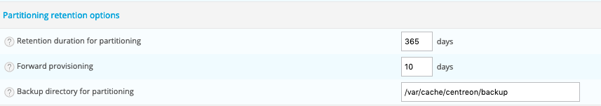
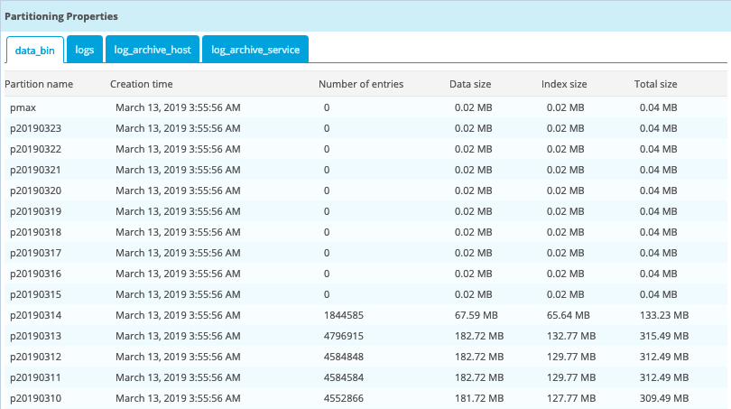
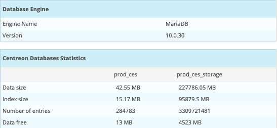

## Overview

Some tables in the 'centreon\_storage' database are partitioned to:

- Optimize the execution time of several queries,
- Optimize data purges,
- Minimize the reconstruction of the tables with an error during a crash of the
DBMS.

One partition per day is created for the following tables:

- **data\_bin**: performance data
- **logs**: event logs from the supervision engine collection.
- **log\_archive\_host**: availability data concerning hosts.
- **log\_archive\_service**: availability data concerning services.

> There are some limitations:
>
> - The maximum number of partitions (for a MariaDB table) is 1024
> - Foreign keys are not supported

More details about MariaDB partitioning
*[here](https://mariadb.com/kb/en/library/partitioning-overview/)*.

## Prerequisites

The following packages are required:

- php-mysql
- Pear-DB
- MariaDB (\>= 10.1)

The MariaDB **open\_files\_limit** parameter must be set to 32000 in the \[server\]
section:

```text
[server]
open_files_limit = 32000
```

> If you install Centreon on your RedHat Linux version, you will be
> able to do it manually. Remember to restart the mariadb processes if you change
> this value in my.cnf.

If you use systemd, you need to create the
**/etc/systemd/system/mariadb.service.d/mariadb.conf** file:

```text
[Service]
LimitNOFILE=32000
```

Then reload systemd and MariaDB:

```shell
systemctl daemon-reload
systemctl restart mariadb
```

## Configuration

The data retention time is programmed in the `Administration > Parameters >
Options` menu:



The setting is as follows:

- **Retention duration for partitioning**: retention time for partitioned
tables, by default **365 days**.
- **Forward provisioning**: number of partitions created in advance, by
default **10 days**.
- **Backup directory for partitioning**: partition backup directory, by
default **/var/cache/centreon/backup**.

## Operation

Partitioning uses XML files in the **/usr/share/centreon/config/partition.d/**
directory to create the necessary partitions.

Every day, a script launched by a cron creates missing tables
or creates new tables in advance:

```text
0 4 * * * centreon /bin/php /usr/share/centreon/cron/centreon-partitioning.php >> /var/log/centreon/centreon-partitioning.log 2>&1
```

Sample partitioning **partitioning-data\_bin.xml** file:

```xml
<?xml version="1.0" encoding="UTF-8"?>
<centreon-partitioning>
    <table name="data_bin" schema="centreon_storage">
        <activate>1</activate>
        <column>ctime</column>
        <type>date</type>
        <createstmt>
CREATE TABLE IF NOT EXISTS `data_bin` (
    `id_metric` int(11) DEFAULT NULL,
    `ctime` int(11) DEFAULT NULL,
    `value` float DEFAULT NULL,
    `status` enum('0','1','2','3','4') DEFAULT NULL,
    KEY `index_metric` (`id_metric`)
) ENGINE=InnoDB DEFAULT CHARSET=utf8;
        </createstmt>
    </table>
</centreon-partitioning>
```

## Migrating unpartitioned tables

The command line performs the following procedure:

- Rename existing table (‘xxx’ will be ‘xxx\_old’)
- Create an empty partitioned table
- Migrate data into the partitioned table (with ‘SELECT INSERT’ statement)

You need to check a few things before:

- Enough space on the MariaDB Server (at least twice the size of the table.
Indexes and Data)
- No data in the future (time is used for the partitioning)
- Enough memory on the database server

> The ‘SELECT INSERT’ statement will lock the table and maybe your production in
> some points (for example table migration of ‘logs’).

To perform table migration, use the **-m** option and specify the
name of the table to migrate:

```shell
/bin/php /usr/share/centreon/bin/centreon-partitioning.php -m data_bin
```

If the table migration is ok, the old table can be deleted with the following
commands:

```sql
DROP TABLE centreon_storage.data_bin_old;
```

## Monitoring of partitioning operation

The **Centreon Database** Monitoring Connector allows you to check that the number of
partitions created in advance is sufficient. It is recommended that you install and
deploy this Monitoring Connector.

It is also possible to view the partitioned tables and the consumption
associated with each partition via the `Administration > Platform Status >
Databases` menu:



More general information on the state of health of the databases is also
present:


